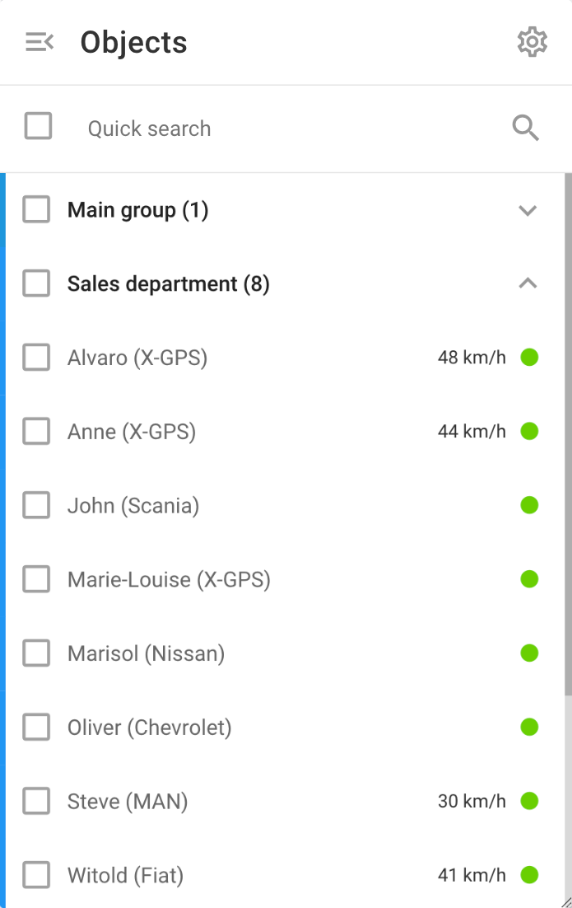

# Liste des objets

La liste des objets de la plateforme fournit une vue d'ensemble de tous les actifs suivis, ce qui permet aux utilisateurs de contrôler efficacement leurs actifs.

## Caractéristiques de la liste d'objets

* **Les groupes :** Les objets peuvent être organisés en groupes pour faciliter la gestion. Cette organisation peut représenter la structure de votre entreprise en termes d'unités commerciales régionales ou de groupes de véhicules spécialisés.
* **Recherche rapide :** Utilisez la barre de recherche rapide pour trouver rapidement des objets spécifiques en tapant leur nom ou d'autres informations d'identification telles que [Tags](../../compte/tags.md) ou l'IMEI.
* **Visibilité de l'objet :** Les propriétaires peuvent voir tous les objets de l'organisation du compte. Un utilisateur de l'équipe de l'organisation ne peut voir que les objets qu'il a créés personnellement ou qu'il a créés en tant que propriétaire. [celles attribuées par le propriétaire](../../compte/utilisateurs-et-roles/restreindre-lacces.md).

### **Objets de la liste**

* **Étiquette de l'objet :** Chaque objet doit être étiqueté pour faciliter son identification, en indiquant le nom de l'objet et toute autre information pertinente.
* **Indicateurs d'état :** Le point situé à droite de la liste des objets indique l'état de l'appareil. Pour plus d'informations, voir [ici](etat-de-la-connexion.md).
* **Détails de l'objet :**
  * **Cliquer sur un objet** concentre la carte sur l'objet.
  * **Cliquer sur l'icône d'information ("i")** à côté d'un objet en survolant la liste des objets de Navixy affiche une vue détaillée de l'objet sélectionné.
  * **Menu du clic droit ("⋮") :** permet de partager rapidement l'emplacement de l'objet, de modifier son icône, d'ouvrir des règles d'alerte, d'accéder aux paramètres de l'appareil et de consulter les rapports relatifs à l'objet.

