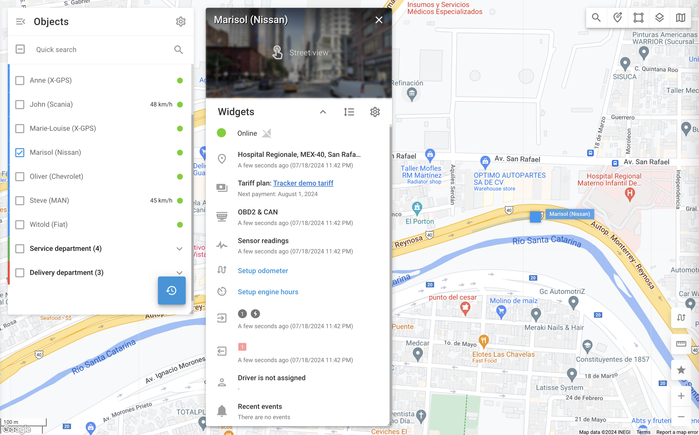

# Vue détaillée de l'objet

La vue détaillée de l'objet vous donne un aperçu approfondi de vos actifs, ce qui permet d'améliorer la surveillance et la gestion. En offrant des informations complètes telles que l'emplacement, l'état, les données des capteurs et les activités récentes, cette fonction vous permet de prendre des décisions éclairées et de réagir rapidement en cas de problème.

Pour accéder à la vue détaillée d'un objet spécifique, double-cliquez sur l'objet dans la liste ou passez la souris dessus et cliquez sur le bouton apparu 

icône.

Vous trouverez ci-dessous une explication des différents composants disponibles dans la vue détaillée de l'objet.

* **En-tête :** Nom de l'objet et option Street View si disponible.
* **Widgets affichant les données GPS et télématiques des véhicules** - Les informations disponibles dépendent de la fonctionnalité et de la configuration de l'appareil GPS / du capteur :
  * [État de la connexion](etat-de-la-connexion.md): Indique la connectivité de l'appareil à la plate-forme
  * Informations sur l'emplacement : Affiche la dernière position connue avec une adresse (ou des coordonnées GPS) et un horodatage.
  * Plan : Affiche le plan actuel de l'appareil et la prochaine date de paiement.
  * Données OBD2 et CAN : Affiche les dernières données reçues du système de diagnostic embarqué du véhicule et du bus CAN s'il est configuré.
  * Relevés de capteurs : Affiche les relevés récents des capteurs et leurs horodatages.
  * Compteur kilométrique : Permet aux utilisateurs de visualiser et de corriger les données du compteur kilométrique.
  * Heures moteur : Permet aux utilisateurs de visualiser et de corriger les données relatives aux heures de fonctionnement du moteur.
  * Entrées : Indique l'état de l'allumage et d'autres capteurs (par exemple, le capteur de porte du véhicule).
  * Sorties : Permet de contrôler les dispositifs connectés à un traceur GPS (par exemple, un dispositif d'immobilisation du véhicule à distance).
* **Widgets présentant des informations supplémentaires sur l'objet** - en fonction de votre configuration :
  * Affectation du conducteur : Indique si un pilote est affecté à l'objet.
  * Événements récents : Liste les alertes récentes liées à l'objet.
