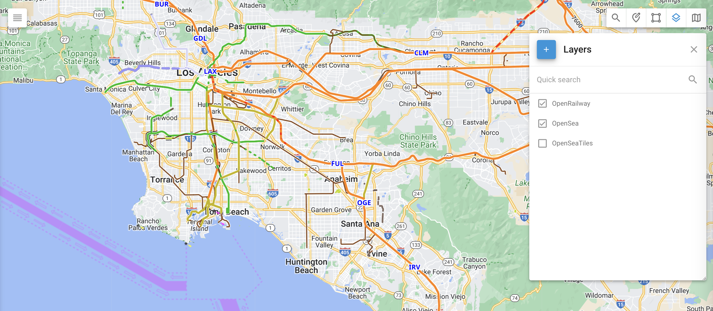

# Couches

## Vue d'ensemble

Les couches de carte vous permettent d'ajouter des superpositions de données personnalisées à votre carte, améliorant ainsi la visualisation de zones spécifiques qui ne sont pas incluses dans la vue cartographique standard. Cette fonction est particulièrement utile pour afficher des détails géographiques uniques, tels que les quartiers, les zones de responsabilité, les itinéraires personnalisés et d'autres cartes spécialisées. En utilisant des couches cartographiques, vous et votre équipe pouvez mieux comprendre les emplacements et les situations de vos véhicules ou de vos actifs.

Voici quelques applications pratiques des couches cartographiques :

* Marquer des lieux spécifiques et les mettre en évidence graphiquement.
* Chargement de trains, de bateaux ou d'itinéraires agricoles personnalisés.
* Affichage de cartes spécialisées, telles que le relief, la profondeur des océans ou la densité des forêts, qui ne sont pas disponibles dans la liste des cartes standard et qui sont créées par des entreprises spécialisées.

## Comment créer une couche KML

Il existe plusieurs outils pour créer des couches KML, allant des logiciels SIG professionnels aux services de cartographie en ligne accessibles. Google My Maps et Google Earth sont deux options conviviales pour créer des couches KML, tandis que les outils plus avancés comprennent ArcGIS et QGIS.

La création de couches KML se fait à l'aide de Google Earth

1. Ouvrir Google Earth
2. Recherchez le site pour lequel vous souhaitez créer le KML
3. Sélectionnez Ajouter un polygone, Ajouter un repère ou Dessiner un chemin.
4. Nommez votre polygone, votre chemin ou votre repère.
5. Définir la couleur du contour et rendre la forme transparente
6. Tracer les limites du site en cliquant sur les points d'angle
7. Appuyez sur OK pour finaliser les limites du site
8. Cliquez avec le bouton droit de la souris sur le nom du site dans la fenêtre Lieux à gauche.
9. Sélectionnez Enregistrer le lieu sous, choisissez une destination pour l'enregistrement du fichier.
10. Enregistrer le fichier en tant que KML

## Comment ajouter une couche cartographique à votre compte Navixy ?

1. **Outil d'ouverture des calques**: Sélectionnez l'outil "Couches" dans les outils de la carte dans le coin supérieur droit de la carte.
2. **Ajouter une nouvelle couche KML**: Cliquez sur le grand bouton plus pour ajouter une nouvelle couche KML.
3. **Préciser les détails de la couche**: Saisissez le nom de la couche, choisissez le fichier KML que vous avez créé et enregistrez-le.

Une fois que vous avez ajouté une couche de carte, vous pouvez l'afficher en cliquant sur la case à cocher située à gauche du nom de la couche.
