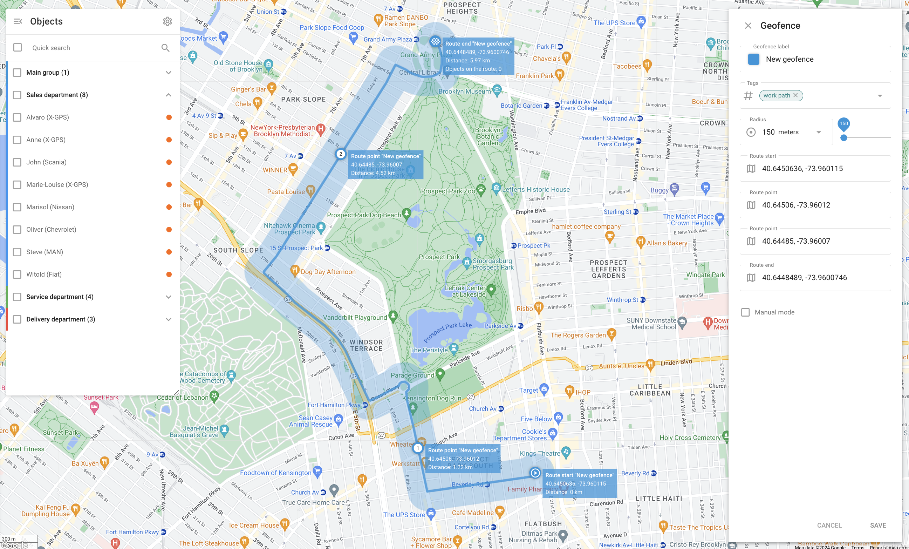

# Les géofences

## Vue d'ensemble

Les géofences sont des périmètres virtuels qui permettent au système de contrôler si un objet a franchi la limite de la géofence ("in" ou "out"). Ces événements sont enregistrés, ce qui permet aux utilisateurs de générer des rapports sur les géofences et des rapports sur la sécurité. [recevoir des alertes](../../regles-et-notifications/surveillance-des-mouvements/entree-ou-sortie-de-la-geofence.md). Les géofences peuvent également être liées à des [règles pour les manifestations](../../regles-et-notifications.md) dans des zones particulières, par exemple en recevant des alertes d'excès de vitesse uniquement dans une ville ou le long d'un itinéraire.

### Voir les détails de la géofence

Lorsque vous appuyez sur l'icône "i" (information) à côté d'une géofence, des informations détaillées sur la géofence sélectionnée s'affichent.

* **Tags**: Les étiquettes associées à la géofence, telles que "central", permettent de classer et d'organiser les géofences pour en faciliter l'identification et la gestion.
* **Localisation**: L'emplacement géographique de la géofence. Par exemple : Comté de Queens, New York, États-Unis d'Amérique.
* **Objets**: Liste des appareils situés à l'intérieur du périmètre.

### Objets suivis à l'intérieur d'un périmètre

En cliquant avec le bouton gauche de la souris sur une géofence sur la carte, les utilisateurs peuvent voir le nombre d'objets suivis à l'intérieur de cette géofence. Pour accéder à l'outil Géofences, cliquez sur l'icône Polygone dans la barre d'outils de la carte. Vous pouvez y créer, importer ou modifier des géofences et afficher les géofences souhaitées sur la carte en cochant les cases correspondantes.

## Types de géofences

Il existe trois principaux types de géofences :

### Géofence circulaire

Une géofence circulaire est une zone géographique avec un centre donné et une forme circulaire d'un rayon minimum de 50 mètres. Les utilisateurs peuvent définir le rayon et le centre du cercle.

### Géofence polygonale

Une géofence polygonale est une zone définie par un polygone arbitraire à plusieurs sommets (jusqu'à 500), ce qui permet de créer des formes complexes. Ce type de géofence est particulièrement utile pour définir avec précision des zones de forme irrégulière, telles que des quartiers, des parcs ou toute autre zone spécifique qui ne correspond pas à une simple limite circulaire.

### Route geofence

Une géofence d'itinéraire crée un périmètre virtuel entre deux ou plusieurs points. Ce type de géofence est particulièrement utile pour surveiller [le respect des itinéraires prévus](../../regles-et-notifications/planification-et-repartition/deviation-de-litineraire.md) et de s'assurer que les véhicules ne s'écartent pas de la trajectoire prévue. La géofence d'itinéraire est définie par une série de points qui créent un itinéraire continu, avec un rayon spécifié qui détermine l'écart autorisé par rapport à l'itinéraire.

## Comment créer une géofence

1. Localisez la zone souhaitée sur la carte à l'aide de l'outil "Recherche d'adresse".
2. Choisissez l'outil "Geofences" en cliquant sur le bouton **Carré** dans le coin supérieur droit de la carte.
3. Cliquez sur le bouton "Ajouter une géofence" et sélectionnez le type de géofence.
4. Dessinez la géofence sur la carte :

* **Cercle**: Déplacez le cercle à l'aide de la souris, en appuyant sur le centre. Modifiez la taille en faisant glisser le bord.
* **Polygone**: Commencez par un pentagone et ajustez-le en faisant glisser les sommets ou en en ajoutant de nouveaux.
* **Route**: Sélectionnez les points de départ et d'arrivée. Le système construit l'itinéraire. Ajoutez des points en faisant glisser l'itinéraire et ajustez la taille du voisinage.

5. Spécifiez le nom de la géofence et enregistrez-la. Les géofences créées peuvent être modifiées ou supprimées.

Création d'un corridor de géofence

Procédez comme suit pour créer une géofence de couloir :

1. **Ouvrir les paramètres de Geofence** dans l'interface web de suivi.
2. **Sélectionnez l'option "Nouvelle géofence".** pour commencer à créer un nouvel itinéraire géofence.
3. **Nommez votre géofence** et ajouter des étiquettes pertinentes pour faciliter l'identification.
4. **Définir le rayon** de l'itinéraire. Ce rayon détermine la distance à laquelle un véhicule ou un bien peut s'écarter de la trajectoire avant qu'une déviation de l'itinéraire ne soit détectée.
5. **Définir les points d'itinéraire**: Ajouter le point de départ, plusieurs points intermédiaires et le point d'arrivée de l'itinéraire. Chaque point est défini par ses coordonnées géographiques.
6. **Mode manuel**: Si nécessaire, vous pouvez ajuster les points manuellement pour un contrôle précis de la trajectoire de l'itinéraire.

Création de géofences polygonales

Pour créer une géofence polygonale :

1. Localisez la zone souhaitée sur la carte.
2. Choisissez l'outil "Geofences" en cliquant sur l'icône carrée dans le coin supérieur droit de la carte.
3. Cliquez sur le bouton "Ajouter une géofence" et sélectionnez "Polygone" comme type de géofence.
4. Initialement, la géofence se présente sous la forme d'un pentagone. Ajustez la forme en faisant glisser les sommets ou en en ajoutant de nouveaux pour qu'elle corresponde à la zone souhaitée.
5. Nommez votre géofence et enregistrez-la. Vous pouvez modifier ou supprimer les géofences créées si nécessaire.

## Modifier les détails de la géofence

Pour localiser la fonctionnalité de modification, cliquez sur l'icône en forme de crayon à côté de la géofence que vous souhaitez modifier dans l'outil Géofences. Lorsque vous modifiez une géofence, vous pouvez personnaliser divers éléments afin d'améliorer l'organisation et la surveillance :

* **Label Geofence**: Attribuez ou modifiez le nom de la géofence pour faciliter son identification.
* **Tags**: Ajouter ou modifier des balises pour classer et organiser les géofences. Les balises telles que "central" et "ouest" permettent de trier et de gérer plusieurs géofences.
* **Couleur**: Modifier la couleur de la géofence pour une meilleure visualisation sur la carte. Cette fonction est particulièrement utile lorsque l'on gère plusieurs géofences, car des couleurs différentes permettent de différencier rapidement les différentes zones. L'outil de sélection des couleurs permet de choisir une couleur spécifique et de visualiser son code HEX.

## Importation de géofences

Lorsque vous devez ajouter un grand nombre de géodonnées, il est plus rapide de les importer à partir d'un fichier plutôt que de les créer manuellement. Vous pouvez importer des géoréférences à partir de fichiers Excel ou KML.

### Importation de géofences circulaires à partir d'Excel

1. Choisissez l'outil "Geofences".
2. Appuyez sur le bouton "Importation de géofences circulaires".
3. Téléchargez l'exemple de fichier fourni.
4. Ajoutez des informations sur vos géofences au fichier comme indiqué dans l'exemple.
5. Téléchargez le fichier modifié vers le service de surveillance.
6. Si votre fichier comporte des en-têtes, activez l'option "Utiliser les en-têtes du fichier".
7. Vérifiez les champs de l'en-tête et cliquez sur Suivant.
8. Vérifiez les enregistrements et cliquez sur Continuer.
9. Une fois l'importation terminée, les nouvelles géofences apparaissent dans la liste.

### Importation de géofences polygonales à partir de KML

1. Choisissez l'outil "Geofences".
2. Cliquez sur le bouton "Importation de géofences à partir de KML".
3. Cliquez sur le bouton "Parcourir" pour sélectionner le fichier KML nécessaire sur votre ordinateur.
4. Modifiez le rayon par défaut si nécessaire.
5. Cliquez sur "Télécharger".
6. Une fois l'importation terminée, les nouvelles géofences apparaissent dans la liste. Notez que le rayon par défaut n'est utilisé que pour les géofences d'itinéraire. Pour les autres types, cette étape peut être ignorée.

> \[!INFO] Nous vous recommandons d'utiliser Google Earth et d'exporter vos géofences dans un fichier KML. Veuillez noter qu'il y a une limite de 500 points par géofence.
