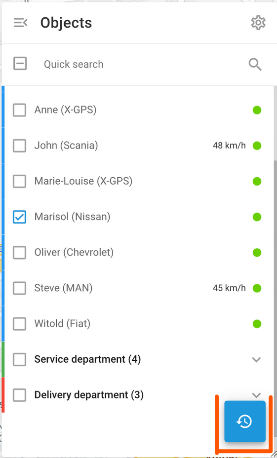

# Historique du voyage

L'historique des trajets dans Navixy vous permet de revoir les activités passées et les itinéraires empruntés par les véhicules de votre flotte. Cette fonction fournit un journal détaillé des trajets, y compris les horodatages, les lieux, les distances et la durée, ce qui vous aide à surveiller l'activité des véhicules et à optimiser la gestion de la flotte.

Pour consulter l'historique des déplacements dans Navixy, sélectionnez les objets qui vous intéressent et cliquez sur le bouton Historique. Vous serez invité à choisir une période et une date. Sélectionnez la plage de dates souhaitée pour continuer.

## Voyages Bref historique

Après avoir sélectionné une plage de dates, la vue Historique affiche un résumé des déplacements et des événements pour les objets choisis. Chaque entrée de voyage comprend des détails clés :

* **Horodatage**: Indique l'heure de début du voyage.
* **Distance parcourue**: Indique la distance totale parcourue pendant le trajet.
* **Duration**: Affiche la durée totale du trajet.

L'historique succinct vous permet d'obtenir rapidement une vue d'ensemble de l'activité et de l'historique des déplacements de votre flotte pour la période sélectionnée.

## Historique détaillé des voyages

Lorsque vous cliquez sur une entrée de voyage dans l'aperçu de l'historique des voyages, vous obtenez une description détaillée du voyage. Il s'agit des éléments suivants

* **Heures de début et de fin**: Les heures exactes du début et de la fin du voyage.
* **Distance parcourue**: La distance totale parcourue pendant le voyage.
* **Duration**: La durée totale du voyage.
* **Arrêts**: Informations détaillées sur chaque arrêt, y compris le lieu et la durée de l'arrêt.

Chaque segment du trajet est répertorié avec des adresses et des horodatages précis, ce qui vous permet d'analyser en profondeur les déplacements et les arrêts de votre flotte au cours de la période sélectionnée. Cette vue détaillée permet de contrôler l'activité des véhicules, de comprendre le comportement des conducteurs et d'optimiser les itinéraires.

## Caractéristiques pratiques

| Fonctionnalité                                        | Description                                                                                                                                                                                                                                                                                                                                                                                                                                                                                                                                            |
| ----------------------------------------------------- | ------------------------------------------------------------------------------------------------------------------------------------------------------------------------------------------------------------------------------------------------------------------------------------------------------------------------------------------------------------------------------------------------------------------------------------------------------------------------------------------------------------------------------------------------------ |
| **Méthodes d'agencement des couleurs**                | 
Vous pouvez choisir différentes combinaisons de couleurs pour visualiser les données relatives aux déplacements :  - Couleur manuelle : Attribuer manuellement des couleurs aux différents trajets. - Colorier en fonction des trajets : Code couleur automatique pour les trajets en fonction de leur trace. - Colorier en fonction du statut : Différencier les trajets en fonction de leur état, par exemple en mouvement ou à l'arrêt. - Couleur par vitesse : Visualisez les trajets en fonction des variations de vitesse.
 |
| **Modifier la couleur du segment de voyage**          | Personnalisez la couleur des segments de trajet spécifiques afin de les mettre en évidence pour une meilleure analyse visuelle.                                                                                                                                                                                                                                                                                                                                                                                                                        |
| **Animer la lecture des trajets**                     | Utilisez le bouton de lecture pour animer les déplacements sur la carte, en montrant le mouvement des objets au fil du temps. Ajustez la vitesse de lecture avec des options telles que x1, x3, x10, x30, x100 et x300. Cette fonction est utile pour comprendre les schémas et les durées de déplacement.                                                                                                                                                                                                                                             |
| **Télécharger les trajets sous forme de fichier KML** | Télécharger les données sur les déplacements sous forme de fichiers KML pour les utiliser dans d'autres applications SIG, ce qui permet d'effectuer des analyses plus poussées et de les partager.                                                                                                                                                                                                                                                                                                                                                     |
| **Imprimer les trajets sélectionnés**                 | Imprimez des rapports de voyage détaillés directement à partir de l'interface pour la documentation ou le partage avec les membres de l'équipe.                                                                                                                                                                                                                                                                                                                                                                                                        |
| **Passer de la vue réduite à la vue détaillée**       | Passez d'une vue synthétique à une vue détaillée des déplacements pour obtenir plus ou moins d'informations selon vos besoins.                                                                                                                                                                                                                                                                                                                                                                                                                         |
| **Régler la largeur de la voie**                      | Ajuster la largeur des traces affichées sur la carte. Cette fonction est utile dans des applications telles que l'agriculture pour visualiser plus clairement la couverture des champs par les traces de tracteur.                                                                                                                                                                                                                                                                                                                                     |
| **Autres paramètres d'affichage**                     | Les paramètres supplémentaires comprennent l'affichage des arrêts, les données LBS, le regroupement des points de données pour plus de clarté, l'utilisation de filtres intelligents pour réduire le bruit et la division des trajets par arrêt pour une analyse détaillée.                                                                                                                                                                                                                                                                            |

## Types de voies

Il existe différents types de suivi en fonction de la technologie utilisée pour déterminer les emplacements et du mode de suivi défini dans la configuration de l'appareil.

* **Pistes continues**: Il s'agit des pistes les plus courantes, généralement utilisées dans les applications de suivi de véhicules. Elles sont représentées par des polylignes dont les points de départ et d'arrivée sont clairement définis.
* **Pistes d'intervalles**: Pour les traceurs GPS autonomes, la localisation est souvent mise à jour à des intervalles relativement longs, par exemple une fois par heure ou une fois par jour. Ces traces sont représentées par des points de repère numérotés (1, 2... N). Pour faciliter la visualisation, elles sont reliées par des lignes grises transparentes, qui peuvent ne pas représenter avec précision la trajectoire réelle.
* **Emplacements des AFB**: Lorsque les données de localisation sont déterminées à l'aide de technologies LBS alternatives telles que les signaux GSM ou Wi-Fi, elles peuvent manquer de précision. Ces emplacements sont représentés par des cercles, dont le rayon indique la précision.
* **Points de repère groupés**: Lorsqu'un actif reste au même endroit pendant une période prolongée, de nombreux intervalles ou messages LBS peuvent encombrer la carte. Pour améliorer la lisibilité, le serveur consolide ces messages en un seul point de repère groupé, qui n'apparaît qu'en un seul point sur la carte. L'heure de début et de fin ainsi que la durée seront ajoutées à la note de ce point de repère.
