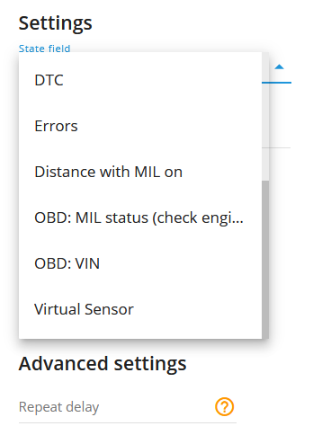

# Valeur du champ État

## Description

Le type d'alerte "Valeur du champ d'état" est conçu pour surveiller l'état de divers objets, tels que les portes, le frein à main, l'airbag, ainsi que les états d'événements spéciaux tels que les systèmes avancés d'aide à la conduite (ADAS), les codes de diagnostic (DTC) et les erreurs. Lorsque la plate-forme reçoit la valeur attendue dans le champ d'état pour un état particulier, l'utilisateur reçoit une notification.

En utilisant l'alerte "Valeur du champ d'état", les utilisateurs peuvent rester informés des états critiques des objets et des événements en temps réel. Cette fonctionnalité améliore les processus de sûreté, de sécurité et de maintenance, en garantissant une action rapide en cas de détection d'états ou d'événements spécifiques.

Les utilisateurs peuvent générer des rapports d'événements qui résument les occurrences d'états ou d'événements spécifiques sur une période définie. Par exemple, ils peuvent analyser la fréquence d'ouverture des portes, les cas de déploiement des airbags ou l'occurrence des activations de l'ADAS. Ces rapports permettent d'identifier des modèles, des tendances ou des anomalies dans les données, ce qui facilite la planification de la maintenance, les évaluations de sécurité et les améliorations opérationnelles.

# Paramètres

Pour une configuration rapide de la notification de changement d'état :

- Choisissez le champ d'état nécessaire et définissez une valeur attendue pour celui-ci. Par exemple, champ d'état = coffre, valeur attendue = ouvert.
- N'activez pas l'option "Autoriser la répétition" et laissez le champ "Délai de répétition" vide. Dans ce cas, vous ne serez informé que si la valeur change.

Pour une configuration rapide de la notification de changement d'événement :

- Choisissez le champ d'état nécessaire et définissez une valeur attendue pour celui-ci. Par exemple, champ d'état = code\_événement, valeur attendue = 7 (alarme de dépassement de vitesse pour les appareils de Howen Technologies). Pour chaque code d'événement, une règle de champ d'état distincte doit être créée. Toutes les valeurs attendues peuvent être trouvées sur le site web du fabricant de l'appareil ou peuvent être obtenues directement auprès du fabricant par le biais d'une demande à son équipe d'assistance.
- Activez la fonction de répétition pour recevoir des notifications pour les mêmes valeurs et définissez le délai de répétition (fréquence à laquelle les mêmes valeurs entrantes déclencheront la notification de l'événement de la règle). Par exemple, si vous souhaitez recevoir des notifications d'excès de vitesse toutes les 30 minutes au maximum, réglez le délai de répétition sur 1 800 secondes.

**Champ de l'État :**

L'utilisateur spécifie ici le champ à surveiller. Dans notre exemple, il s'agit du coffre. Ainsi, lorsque le coffre est ouvert, comme nous le définissons dans le sélecteur de valeur attendue, la plateforme génère un événement de notification. La case à cocher "Autoriser la répétition" affecte également le comportement, mais ce paramètre est décrit plus loin dans cet article.

**Valeur attendue :**

Les champs d'état standard (par exemple, coffre, porte, ceinture de sécurité, etc.) ont des variantes de valeur intuitivement attendues. Il s'agit généralement de Ouvert/Fermé ou Verrouillé/Déverrouillé. Toutefois, si vous souhaitez recevoir une notification de champ d'état concernant un événement particulier, l'utilisateur doit connaître le code de l'événement envoyé par l'appareil afin que la plate-forme sache à quoi s'attendre dans le champ entrant event\_code.

Par exemple, une clé matérielle a une valeur personnalisée que la plateforme attendra et notifiera à l'utilisateur lorsque la valeur A1DD3FC3452904D arrivera dans le champ hardware\_key.

**Permettre la répétition :**

Si la case n'est pas cochée, l'événement ne sera déclenché de manière répétée que si une autre valeur entrante a été reçue avant la valeur actuellement attendue ET si la valeur attendue est reçue mais dans un nouveau paquet de données. Par exemple, si la case n'est pas cochée, chaque fois que nous recevons la clé matérielle de l'exemple ci-dessus (A1DD3FC3452904D), la plate-forme ne déclenche pas la notification de l'événement tant qu'une autre valeur de clé matérielle n'est pas arrivée ET que la valeur attendue n'arrive pas à nouveau.

C'est ainsi que fonctionne l'option "Autoriser la répétition" si elle n'est pas sélectionnée :

- 09:00 AM La dernière clé reçue A1DD3FC3452904D
- 09:15 AM La plate-forme reçoit un paquet de données avec la même valeur de clé matérielle (A1DD3FC3452904D). Aucune notification n'est déclenchée
- 09:20 AM Une nouvelle valeur hardware\_key est arrivée. Par exemple, B99978233FDD1. Aucune notification n'est générée car cette valeur n'est pas attendue. Mais le commutateur interne est maintenant prêt à produire une notification lorsque la clé A1DD3FC3452904D arrive.
- 09:30 AM La plate-forme reçoit un paquet de données avec la valeur de la clé matérielle A1DD3FC3452904D. La notification est déclenchée maintenant.

En bref, les notifications ne seront générées qu'en cas de changement, mais si la valeur attendue arrive après une autre valeur.

Si l'option est sélectionnée, le scénario sera le suivant :

- 09:00 AM La dernière clé reçue A1DD3FC3452904D
- 09:15 AM La plate-forme a reçu un paquet de données avec la même valeur de clé matérielle (A1DD3FC3452904D). La notification est déclenchée cette fois-ci.
- 09:25 AM La plate-forme a reçu un paquet de données avec la même valeur de clé matérielle (A1DD3FC3452904D). La notification est déclenchée cette fois encore.
- 09:34 AM Une nouvelle valeur hardware\_key est arrivée. Par exemple, B99978233FDD1. Aucune notification n'est déclenchée, car la clé B99978233FDD1 n'est pas celle attendue.
- 09:45 AM La plate-forme a reçu un paquet de données avec la valeur hardware\_key attendue (A1DD3FC3452904D). La notification est déclenchée cette fois-ci.

En bref, si la valeur attendue dans le champ d'état défini précédemment arrive sur la plateforme, celle-ci génère l'événement de notification.

Veuillez noter que si l'option "Autoriser la répétition" est sélectionnée, l'événement ne se produira pas plus souvent que le délai de répétition ne le permet. Pour le type de règle de la valeur du champ d'état, le délai de réinitialisation par défaut est de 5 minutes et peut être ajusté à l'aide du champ "Délai de répétition".

**Lier la zone à la règle :**

Active la liaison des règles de géofence.

**Bouton de carte :**

Affiche les géofences délimitées sur la carte.

**Répéter le délai :**

Définit un délai de réinitialisation personnalisé en secondes pour les notifications d'événements. Par exemple, si vous souhaitez être notifié au maximum une fois toutes les 30 minutes, définissez le champ sur 1800 (secondes).

**Travailler avec des capteurs virtuels :**

La règle du champ d'état permet de sélectionner non seulement les champs d'état mais aussi les capteurs virtuels.  
En sélectionnant le capteur virtuel approprié et en spécifiant l'événement souhaité dans le tableau des capteurs virtuels, les utilisateurs peuvent recevoir des notifications et inclure l'événement dans les rapports. Les entreprises peuvent ainsi personnaliser et contrôler les événements dont elles souhaitent être informées, en adaptant le système de surveillance à leurs besoins spécifiques. Cette flexibilité améliore la capacité à suivre et à gérer les événements critiques ou personnalisés, en fournissant des informations précieuses et en facilitant la prise de décisions fondées sur des données pour diverses opérations commerciales. Tous les événements, à partir des valeurs attendues, sont personnalisés et peuvent être créés en fonction des besoins des utilisateurs. Pour plus d'informations sur les capteurs virtuels, veuillez vous référer à la page d'accueil du site web de l'Agence européenne pour la sécurité et la santé au travail. [Capteurs virtuels](https://www.navixy.com/docs/user/web-interface-docs/devices-doc/sensors-and-buttons/virtual-sensors/) article.

## Notifications

**Notification d'urgence :**

est utilisée pour les événements importants. Un message à l'écran et le signal sonore ne peuvent être désactivés qu'en cliquant sur la notification. Veuillez noter que certains navigateurs peuvent bloquer le son de la notification jusqu'à ce que l'activité de l'utilisateur soit enregistrée sur la page.

**Notifications push :**

Recevoir des notifications push sur l'application mobile et l'interface web.

**Ajouter le nom de la géofence à la notification :**

Ajoute les noms des géofences spécifiées au texte de la notification. Cette option n'est disponible que lorsque le bouton radio "Inside" geofence binding est sélectionné dans l'onglet "Settings".

**Notifications par SMS :**

Liste des destinataires des notifications par SMS lorsque l'événement se produit.

**Notifications par courrier électronique :**

Liste des destinataires des notifications par courrier électronique lorsque l'événement se produit.

## Calendrier

Définissez un calendrier pour l'exécution de la règle. Si votre calendrier indique que l'événement ne doit pas être exécuté pendant un certain jour ou une certaine période, il n'apparaîtra pas en tant que notification dans l'interface utilisateur et les notifications par SMS ou par courriel ne seront pas envoyées. En outre, vous pouvez choisir un modèle par défaut pour une planification rapide.

## Les spécificités de la plate-forme :

- L'alerte "Champ d'état" est assortie d'un délai de réinitialisation de 5 minutes, ce qui signifie que l'événement d'alerte ne se produira pas plus d'une fois toutes les 5 minutes. Si ce type d'événement se produit alors que la règle attend la réinitialisation, cet événement sera omis par la plate-forme, y compris dans les rapports.
- La règle ne prend en charge qu'un seul dispositif par règle. Cela est dû au fait que plusieurs sources différentes de champs d'état ne peuvent pas être recoupées avec plusieurs traqueurs.