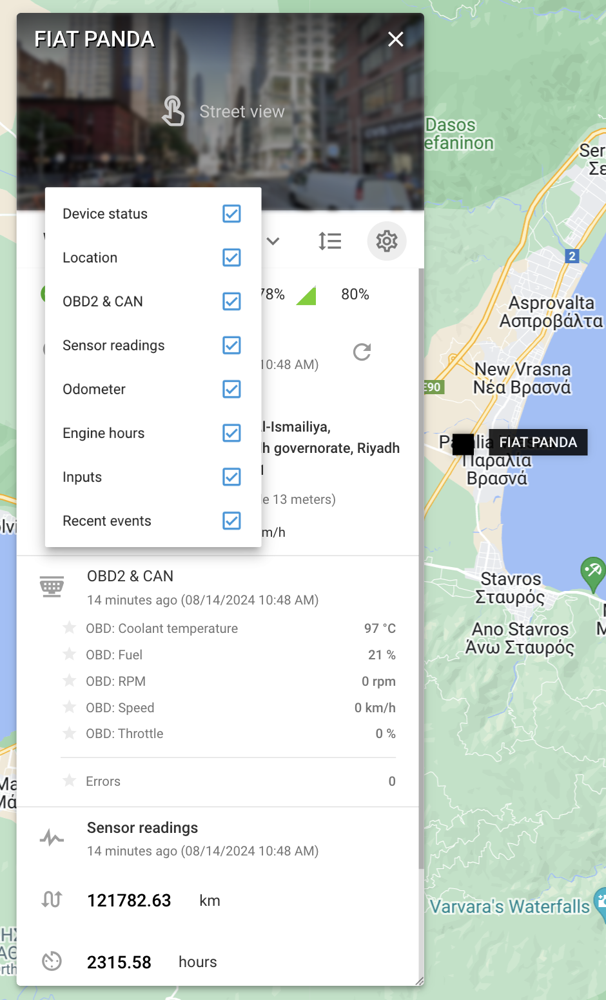

# Widget objet

Dans la plateforme Navixy, le widget objet est un hub qui fournit des informations détaillées et des outils pour gérer les objets et les dispositifs et capteurs GPS associés.

Pour accéder à ce panneau, il suffit d'appuyer sur le bouton "info" ou de double-cliquer sur un appareil dans la liste des appareils. [Liste d'objets](/wiki/pages/createpage.action?spaceKey=USERDOCSOLD&title=Object%20list). Une fois ouvert, le panneau affiche des données complètes sur l'objet sélectionné, y compris l'état actuel, la position GPS et les données de télémétrie. En outre, il offre divers outils de gestion opérationnelle en fonction de l'appareil, le tout commodément regroupé en un seul endroit.

## Personnalisation des widgets

La liste des widgets du panneau de contrôle de l'appareil est hautement personnalisable pour répondre à vos besoins. Vous pouvez facilement développer ou réduire tous les widgets pour obtenir une vue complète ou compacte. Pour ce faire, utilisez le bouton "Afficher tout" pour développer tous les widgets et le bouton "Cacher tout" pour les réduire. Vous pouvez personnaliser les widgets affichés en cliquant sur l'icône en forme de roue dentée et en décochant les cases situées à côté des widgets que vous souhaitez masquer. Si vous préférez un ordre différent pour vos widgets, cliquez sur le bouton "Modifier l'ordre" situé à côté de l'icône en forme de roue dentée pour les faire glisser et les réorganiser comme bon vous semble.

Widgets - vue détaillée (exemple)

### Explication des principaux widgets

- **État de l'appareil**: Affiche des détails importants tels que le modèle de l'appareil, l'ID, l'état de la connexion, l'état des mouvements, le niveau de la batterie, la puissance du signal GSM, etc. Ce widget indique également si l'appareil est en mode itinérant.
- **Localisation**: Fournit des informations détaillées sur l'emplacement actuel du traceur, notamment l'adresse, la latitude, la longitude, la vitesse et l'altitude.
- **OBD2 ET CAN**: Si le traceur est connecté au bus CAN ou au connecteur OBD2 du véhicule et que les capteurs sont créés, ce widget affichera des données telles que le niveau de carburant, le régime moteur, la température du liquide de refroidissement et les codes de diagnostic (DTC).
- **Lecture des capteurs**: Si les capteurs sont intégrés, ce widget affiche les données des capteurs configurés dans les paramètres de l'appareil, tels que la température ou les niveaux de carburant. Ce widget vous permet également de marquer vos capteurs préférés pour un accès rapide.
- **Compteur kilométrique**: Affiche le kilométrage de l'appareil. Vous pouvez ajuster manuellement le kilométrage en cliquant sur le bouton "Modifier".
- **Heures de fonctionnement du moteur**: Indique la durée totale de fonctionnement du moteur. Comme le compteur kilométrique, les heures de fonctionnement du moteur peuvent être ajustées en cliquant sur le bouton "Modifier".
- **Entrées et sorties**: Affiche l'état des capteurs connectés et vous permet de contrôler les sorties, telles que l'allumage, en envoyant des commandes directement à partir du widget.
- **Conducteur**: Fournit des informations sur le conducteur assigné et vous permet de changer de conducteur directement à partir du widget.
- **Statuts de travail**: Affiche et permet de modifier l'état attribué à l'appareil, tel que "En transit" ou "Au repos".
- **Evénements récents**: Affiche les alertes récentes et permet de masquer des événements spécifiques.
- **Cadenas électronique**: Pour les appareils dotés d'une fonction de verrouillage intelligent, ce widget vous permet de gérer l'état de verrouillage, y compris le verrouillage ou le déverrouillage à distance de l'appareil.

En utilisant ces widgets, vous pouvez entièrement personnaliser et contrôler la façon dont vous interagissez avec vos appareils GPS, en veillant à ce que toutes les données et commandes pertinentes soient à portée de main. Ce niveau de personnalisation et d'accessibilité vous aide à gérer votre flotte de manière plus efficace et plus précise.