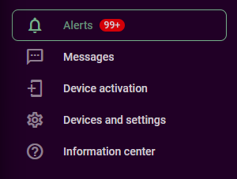

# Historique des événements

L'onglet Événement de la vue Historique fournit un journal détaillé de tous les événements liés aux objets sélectionnés au cours d'une période donnée. Ces événements varient en fonction du type de traceur et des activités surveillées, offrant ainsi une vue d'ensemble de l'état opérationnel de votre flotte et de tout problème lié aux actifs suivis.

Pour consulter l'historique des événements d'un appareil spécifique, sélectionnez les objets que vous souhaitez examiner et cliquez sur le bouton Historique (la flèche circulaire en bas à droite de la liste des objets). Vous serez invité à sélectionner une plage de dates et d'heures. Après avoir choisi la plage souhaitée, passez à la boîte de dialogue Historique et sélectionnez l'option **"Événements"** tabulation.

Pour afficher les événements de tous les appareils, cliquez sur l'onglet Alertes dans la barre latérale :

## Event list

La liste des événements affiche une séquence chronologique des événements pour chaque objet. Chaque entrée comprend

- **Notification d'événement**: Le message de notification créé dans les paramètres d'alerte. Il doit fournir des détails sur l'événement en question.
- **Horodatage**: La date et l'heure de l'événement.
- **Localisation**: Lieu où l'événement s'est produit, le cas échéant.
- **Détails de l'événement :** Informations supplémentaires en fonction du type d'événement surveillé, par exemple un seuil de température.

## Types d'événements

Les types d'événements affichés sont déterminés par les événements surveillés. Navixy peut détecter et enregistrer une large gamme d'événements, depuis les notifications de base de mouvement et d'arrêt jusqu'aux alertes plus complexes des capteurs et aux rappels de maintenance. Pour plus de détails sur la configuration et la gestion de ces événements, reportez-vous à la section [Règles et notifications](../../../guide-de-lutilisateur/regles-et-notifications.md) section.

## Actions avec événements

- **Examiner les détails de l'événement**: Faites défiler la liste des événements pour obtenir des informations détaillées sur chacun d'entre eux.
- **Filtrer les événements**: Appliquer des filtres pour réduire les types d'événements ou se concentrer sur des objets spécifiques.