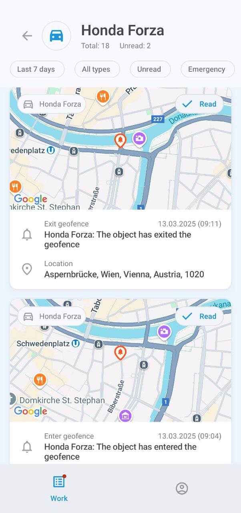

# Informações do ativo

A tela de informações do ativo exibe informações detalhadas sobre o ativo, incluindo sua localização no mapa, histórico de viagens e eventos, lembretes, unidades vinculadas, dispositivo GPS atribuído, etiquetas e outros dados.

### Mapa

Por padrão, o mapa aparece na parte superior da tela de informações. Toque e segure o endereço para copiá-lo, ou toque na imagem para alternar para a visualização em tela cheia. O mapa segue automaticamente a rota do ativo se ele estiver em movimento. Você também pode ampliar e reduzir o zoom e centralizar o mapa nas suas próprias coordenadas GPS.

Toque em 

 para exibir o menu de opções do mapa, onde você pode selecionar lugares, geocercas e tipo de mapa. Observe que a seleção do tipo de mapa está atualmente disponível apenas em dispositivos Android.

### Viagens

Toque em **Viagens** para exibir a lista de viagens realizadas pelo seu ativo. Toque em qualquer viagem para ver seus detalhes, incluindo quaisquer POIs e geocercas visitados. Você também pode visualizar o histórico de uma ou várias viagens no mapa em tela cheia.

Para filtrar a exibição de viagens, como por período de tempo e outros parâmetros, toque em 

 e abra o **Intervalo de datas e configurações**:

### Eventos

Toque em **Eventos** para visualizar o histórico de eventos do ativo, como sair ou entrar em uma geocerca, ficar ocioso, excesso de velocidade, conclusão de tarefas, acidentes, desvios da rota, chegada a um ponto de verificação e muito mais.

O menu abaixo do nome do ativo mostra seus filtros atuais, todos os quais podem ser configurados: período de tempo, veículos ou funcionários específicos e tipos de eventos. O filtro **Não lidos** exibirá apenas notificações não lidas, enquanto **Emergência** restringirá sua pesquisa a eventos urgentes.

Toque em um evento para exibir seus detalhes. Você também pode tocar no mapa na parte superior da tela para visualizá-lo em tela cheia. O botão 

 permite alternar entre diferentes mapas.

> [!WARNING]
> A seleção do tipo de mapa está atualmente disponível apenas em dispositivos Android.

### Lembretes

O botão **Lembretes** é exibido apenas quando há questões pendentes, como uma carteira de motorista ou seguro de veículo prestes a expirar ou já expirado. Toque nele para saber mais sobre o problema.

### Sensores

Toque no botão **Sensores** para ver as leituras fornecidas pelo dispositivo ou dispositivos GPS do ativo, incluindo horas do motor, nível de combustível, temperatura e entradas e saídas personalizadas.

As saídas permitem enviar comandos de controle para dispositivos, como parar o motor. Para enviar um comando, toque em 

 e escolha **Enviar** no prompt de confirmação.

Os sensores do veículo são configurados através da plataforma principal Navixy. Para saber mais sobre eles, leia a [Documentação do Usuário Navixy](https://squaregps.atlassian.net/wiki/spaces/UDOCPT/pages/3025245254/Sensores+de+ve+culos?atlOrigin=eyJpIjoiYzIyMDM3YmIyZGRiNDE1YzlhY2E3ZmQxYjRkMzJkNzMiLCJwIjoiYyJ9).

### Unidades vinculadas

Toque no nome ou etiqueta na entrada **Unidades vinculadas** para acessar a tela de informações da unidade vinculada ao ativo, como o motorista ou o veículo conduzido.

### Dispositivo GPS

Toque na etiqueta do dispositivo na entrada **Dados GPS** para exibir seus detalhes, incluindo o ID, modelo, status de conexão e movimento, localização, velocidade e outros dados técnicos.

