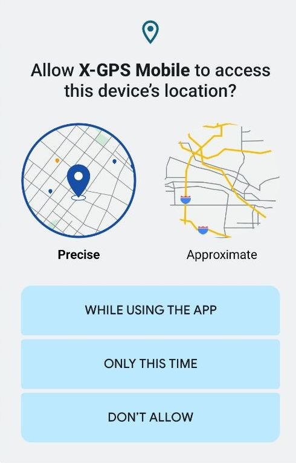

# Início rápido do X-GPS Mobile

Siga estas etapas para aprender como trabalhar com o X-GPS Mobile.

### Etapa 1. Baixe o aplicativo

1. Abra o Google Play ou App Store e digite X-GPS Mobile no campo de busca.
2. Selecione-o e toque em **Instalar**.

### Etapa 2. Faça login

1. Abra o aplicativo.
2. Digite seu nome de usuário e senha e toque em **Entrar**.
3. Se necessário, insira a URL do servidor (por padrão, o servidor Navixy é utilizado). Alternativamente, use um código QR para evitar inserir a URL e configurar automaticamente suas configurações.

> [!INFO]
> Se você esqueceu sua senha, toque no botão correspondente e digite seu endereço de e-mail. Você receberá um e-mail com um link para redefinir sua senha.

### Etapa 3. Configure as permissões

Permita que o aplicativo envie notificações e acesse a localização do dispositivo durante o uso do aplicativo. Observe que você receberá notificações push para todos os ativos em sua frota.

### Etapa 4. Abra a tela principal

A tela principal exibe seus ativos: veículos, funcionários e objetos (unidades que representam dispositivos GPS) com ícones indicando seu status de movimento.

Você pode filtrá-los por categoria ou status (em movimento, estacionado, etc.) e ordená-los por nome ou status.

Para ordenar ou filtrar a lista de ativos e acessar as ferramentas de monitoramento, toque nos ícones no canto superior direito: 

|     |     |
| --- | --- |
|  | Abre o [registro de eventos](https://squaregps.atlassian.net/wiki/spaces/~7120201a6252f8d34242e3bdb7409b5d34d953/pages/3182821465/new+Assets+list#events-list) para todas as unidades |
|  | Permite inserir uma consulta de pesquisa |
|  | Abre o menu de [filtragem e ordenação](https://squaregps.atlassian.net/wiki/spaces/~7120201a6252f8d34242e3bdb7409b5d34d953/pages/3182821465/new+Assets+list#sorting-and-filtering) |
|  | Abre a [tela do mapa](https://squaregps.atlassian.net/wiki/spaces/~7120201a6252f8d34242e3bdb7409b5d34d953/pages/3182821465/new+Assets+list#map-fullscreen) |

Use o painel inferior para alternar entre a tela principal e seu perfil.

### Etapa 5. Comece a trabalhar

Toque em um ativo para visualizar sua localização, status, histórico de viagens e eventos, sensores, lembretes, detalhes do dispositivo GPS e outras informações.

