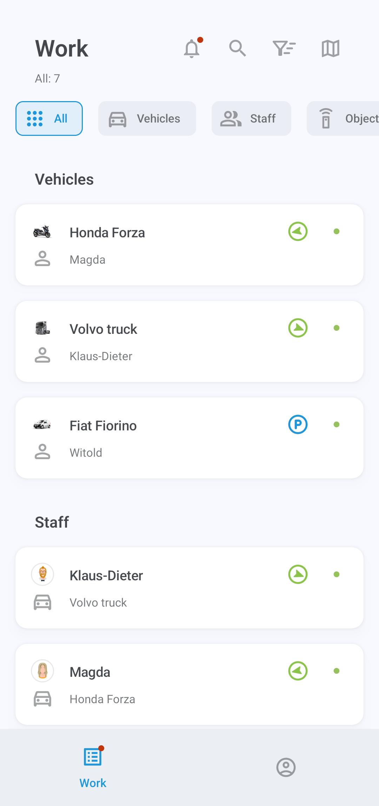
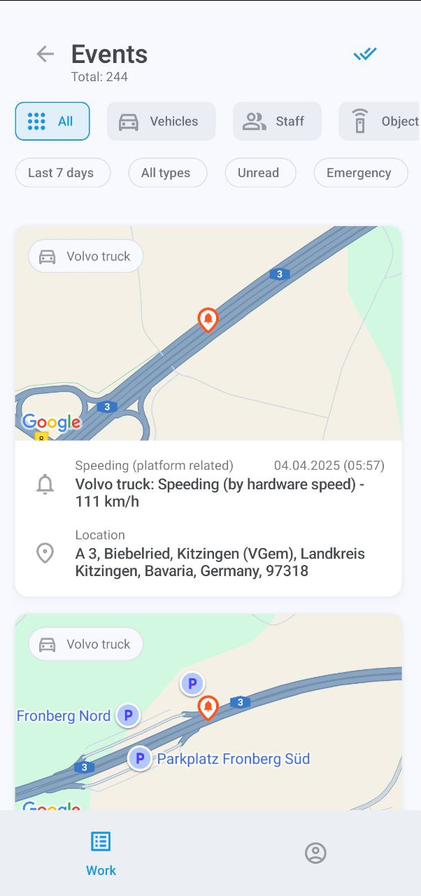
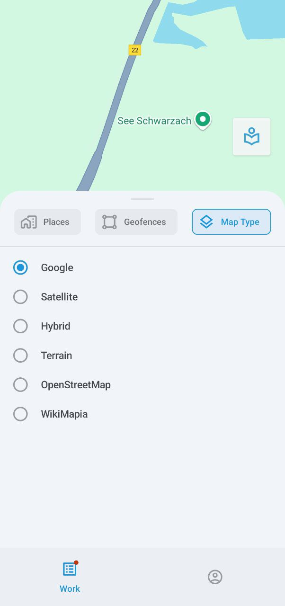

# Lista de ativos

Esta tela exibe todos os seus ativos: veículos, funcionários e objetos (dispositivos GPS não atribuídos). Para visualizar mais informações sobre qualquer um dos seus ativos, simplesmente toque na entrada. Para encontrar um ativo específico, toque em 

 e digite o nome.

O ícone à direita de cada ativo indica seu status de movimento, como em movimento ou estacionado.

### Eventos

Toque em 

 para visualizar os eventos.

Esta tela mostra vários eventos que ocorrem com seus ativos, como sair ou entrar em uma geocerca, ficar em marcha lenta, excesso de velocidade, conclusão de tarefas e muito mais. Para filtrar por tipo de categoria, toque em **Todos**, **Veículos**, **Funcionários** ou **Objetos**.

O segundo menu mostra seus filtros atuais, todos os quais podem ser configurados: período de tempo, veículos ou funcionários específicos e tipos de eventos. O filtro **Não lidos** exibirá apenas as notificações não lidas, enquanto **Emergência** restringirá sua busca a eventos urgentes.

### Mapa

Toque em 

 para abrir um mapa interativo exibindo seus ativos.

Você pode ampliar e reduzir o zoom e centralizar o mapa nas suas próprias coordenadas GPS. Toque no ícone do veículo para seguir sua rota e visualizar seu status e localização atuais. Toque em 

 novamente para abrir os detalhes do veículo.

Toque em 

 para exibir o menu de opções do mapa:

Aqui, você pode selecionar lugares (como locais de clientes para entrega), geocercas e tipo de mapa. Observe que a seleção do tipo de mapa está atualmente disponível apenas em dispositivos Android.

### Classificação e filtragem

A lista tem dois métodos de filtragem: por categoria e por status.

Para filtrar por categoria, toque em **Todos**, **Veículos**, **Funcionários** ou **Objetos**.

Para filtrar por status (em movimento, parado, estacionado, em marcha lenta e offline), toque em 

 para abrir o menu **Filtro e Classificação**. Além da filtragem, este menu também permite classificar ativos por nome.

