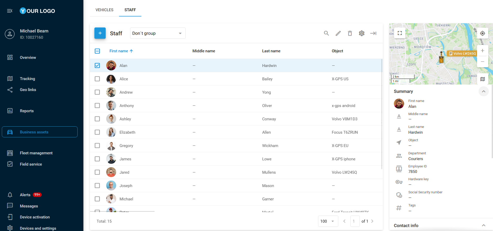

# Empregados

A página **Empregados** foi desenvolvida para gerenciar sua equipe de trabalho. Ela permite visualizar e editar informações detalhadas sobre seus motoristas. Ao manter registros completos dos condutores, é possível otimizar as operações da frota, melhorar a responsabilidade individual e aumentar o desempenho geral da frota.

## Lista de empregados

A lista de empregados oferece uma forma rápida e prática de gerenciar sua equipe. As informações são apresentadas em formato de tabela, complementadas por uma barra lateral à direita da tela. Aqui, é possível adicionar pessoal, editar seus dados, atribuí-los a departamentos específicos e vinculá-los a dispositivos GPS ativados.

## Adição de empregados

Para adicionar um novo empregado, siga estas etapas:

1. Clique em 
.
2. Preencha os campos obrigatórios:
  1. Nome
  2. Dispositivo GPS atribuído (**Objeto**)
3. Preencha quaisquer campos opcionais, como departamento, número de identificação do funcionário ou chave de hardware.
4. Opcionalmente, selecione um ícone ou envie uma foto para facilitar a identificação.
5. Clique em **Salvar**.

## Importação de empregados

Se for necessário adicionar vários empregados de uma vez, é possível carregá-los por meio de um arquivo Excel (XLS, XLSX ou CSV).

### Importar empregados

1. Acesse a aba **Empregados** na página de **Ativos de negócio**, passe o cursor sobre 
 e clique em 
.
2. Na janela de importação, será exibido um exemplo de arquivo XLS que pode ser usado como modelo.
3. Certifique-se de que as colunas do seu arquivo correspondam aos campos corretos do sistema de rastreamento, preenchendo os cabeçalhos apropriados. Isso pode ser feito antes da importação ou durante o processo.
4. No arquivo carregado, insira informações essenciais como nome, e-mail, número da carteira de motorista, etc.
5. Após completar o formulário, salve o arquivo no seu computador.

### Enviar o arquivo para a plataforma

1. Clique no botão **Procurar**, localize o arquivo e clique em **Continuar**. Se o seu arquivo incluir cabeçalhos, certifique-se de marcar a opção **Usar cabeçalhos do arquivo**.
2. Você será solicitado a revisar os campos de cabeçalho. Se tudo estiver correto, clique novamente em **Continuar**.
3. Caso algum campo esteja incorreto, o sistema solicitará a correção. Informações obrigatórias ausentes não serão importadas.
4. Após a correção dos dados, a importação será concluída e os novos empregados aparecerão na lista de empregados.