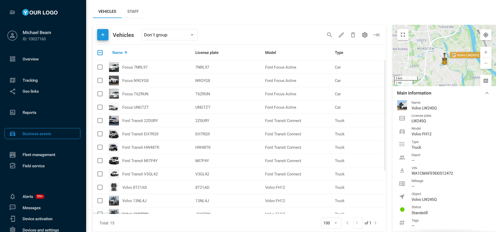

# (new)Veículos

**Veículos** são um elemento fundamental dos ativos de negócio, pois geralmente estão equipados com um dispositivo GPS, permitindo monitorar diversos aspectos como localização, consumo de combustível, cronogramas de manutenção e desempenho geral da frota, promovendo operações mais eficientes e uma melhor tomada de decisões.

### Lista de veículos

Esta aba apresenta uma visão detalhada de todos os veículos da sua frota que fazem parte dos ativos de negócio. As informações estão organizadas em formato de tabela, complementadas por uma barra lateral à direita da tela. Aqui, é possível adicionar ou editar facilmente os dados dos veículos, associá-los a depósitos específicos e vinculá-los a dispositivos GPS ativados.

### Adição de um veículo

Para adicionar um novo veículo, siga estas etapas:

1. Clique em 
.
2. Preencha os campos obrigatórios:
  1. **Nome**
  2. Dispositivo GPS atribuído (**Objeto**)
  3. **Placa**
  4. **Tipo**
3. Preencha quaisquer campos opcionais nas quatro abas descritas abaixo.
4. Opcionalmente, selecione um ícone ou carregue uma foto do veículo para facilitar a identificação.
5. Clique em **Salvar**.

O perfil do veículo contém os seguintes campos organizados em quatro abas principais:

- **Principal**: Informações essenciais sobre o veículo, incluindo o **Objeto** atribuído (dispositivo GPS), placa, modelo, cor, garagem, VIN, tipo e subtipo, tags e informações relevantes.
- **Especificações**: Especificações detalhadas, como dimensões, capacidade de carga e passageiros, configuração dos eixos, velocidade permitida, presença de reboque, números de chassi e estrutura, e ano de fabricação.
- **Combustível**: Informações relacionadas ao combustível, como tipo, qualidade e custo, capacidade do tanque e taxa média de consumo.
- **Seguro**: Detalhes do seguro do veículo, incluindo número da apólice e data de validade.

Fuel consumption in the vehicle profile and its role in fuel reports

No Navixy, configurar o campo de **consumo de combustível** no perfil do veículo é uma etapa essencial para estimar o uso de combustível da frota com base na quilometragem percorrida, sem depender de dados OBDII ou sensores de combustível especializados.

Esse parâmetro é normalmente definido em litros por 100 quilômetros (L/100 km) ou milhas por galão (MPG), dependendo da preferência regional.

Para saber mais sobre medição de combustível no Navixy, consulte [Alteração do nível de combustível](https://squaregps.atlassian.net/wiki/spaces/UDOCPT/pages/3025243110/Altera+o+do+n+vel+de+combust+vel?atlOrigin=eyJpIjoiZjkwOWU2MWY4NzY4NDk5OGFlOGViMzFiZmViNzdkNzIiLCJwIjoiYyJ9)**.**

#### Casos de uso do consumo de combustível

1. **Estimativa de consumo de combustível**  
O valor de consumo inserido no perfil do veículo serve como base para estimar o uso de combustível em determinada distância. Por exemplo, se o consumo for definido como 10 L/100 km, o sistema estimará que o veículo consome 10 litros a cada 100 quilômetros percorridos.
2. **Cálculo dos custos esperados de combustível**  
O Navixy utiliza a taxa de consumo configurada junto com o registro de quilometragem para calcular os custos esperados com combustível. Ao inserir o preço por litro ou galão nas configurações, o sistema pode gerar relatórios que estimam quanto deve ser gasto com combustível, auxiliando no planejamento financeiro.
3. **Comparação com dados reais de combustível**  
Quando combinado com dados de sensores de nível de combustível, o Navixy pode comparar o consumo estimado com o consumo real. Essa comparação ajuda a identificar discrepâncias, como fraudes de combustível, condução ineficiente ou problemas mecânicos que possam levar a um consumo acima do esperado.

### Importação de veículos

Se você possui uma frota grande e precisa criar perfis para vários veículos, pode optar por importar todas as informações de uma só vez usando um arquivo Excel (XLS, XLSX ou CSV), em vez de criar os perfis individualmente.

Para importar perfis de veículos:

1. Acesse a aba **Veículos** da página de **Ativos de negócio**, passe o cursor sobre 
 e clique 
.
2. Na janela de importação, você encontrará um exemplo de arquivo XLS que pode ser usado como modelo.
3. Certifique-se de que as colunas do seu arquivo correspondam corretamente aos campos do sistema de rastreamento, inserindo os cabeçalhos apropriados. Isso pode ser feito antes ou durante o processo de importação.
4. No arquivo carregado, insira informações essenciais como nome, placa, modelo, etc.
5. Após completar o formulário, salve o arquivo no seu computador.

### Para enviar o arquivo à plataforma:

1. Clique no botão **Procurar**, selecione o arquivo e clique em **Continuar**. Se o arquivo contiver cabeçalhos, certifique-se de marcar a opção **Usar cabeçalhos do arquivo**.
2. Você será solicitado a revisar os campos de cabeçalho. Se estiverem corretos, clique novamente em **Continuar**.
3. Se houver campos incorretos, o sistema solicitará a correção. Informações obrigatórias ausentes não serão importadas.
4. Uma vez que os dados estiverem corretos, a importação será concluída e os novos perfis aparecerão na lista de **Veículos**.