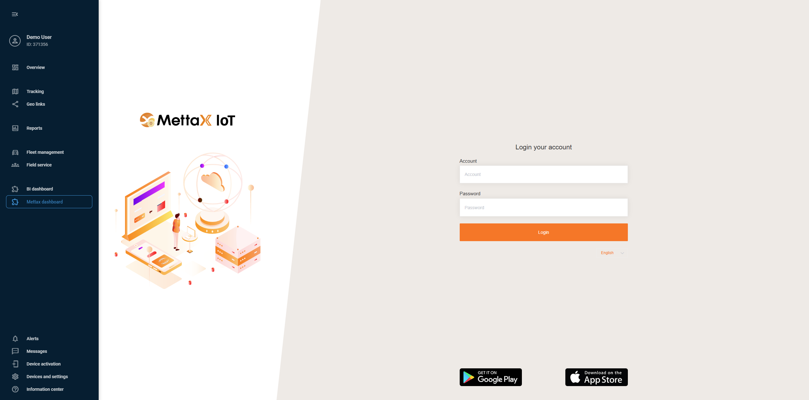

# Integração Mettax para telemática de vídeo

A telemática de vídeo é uma funcionalidade vital para muitas empresas. Existem soluções proprietárias que lidam com feed de vídeo de dashcams, mas oferecem possibilidades limitadas para leituras telemáticas de tais dispositivos. Por essa razão, ampliamos nossa abordagem às integrações para que nossos clientes possam fazer uso de aplicações de terceiros existentes para vídeo e se beneficiar dos recursos telemáticos estendidos da Navixy ao mesmo tempo.

Mettax é um ótimo exemplo deste cenário. Vamos ver como é fácil integrar com suas capacidades diretamente dentro da interface do Navixy.

## 1\. Estabelecendo a integração

Primeiro, você precisa fazer as preparações necessárias no lado do Mettax.

> [!WARNING]
> No Mettax, os dados do dispositivo são armazenados sob contas de usuário individuais. Se sua organização usa uma estrutura de conta pai, **você precisará executar os seguintes passos para cada conta de usuário que possui dispositivos**. Embora isso possa exigir fazer login e logout de diferentes contas, garante cobertura abrangente e direcionada em toda sua frota de dispositivos.

1. Faça login em uma conta de usuário que contenha dispositivos reais.
2. Ative o modo **Developer** para habilitar as configurações necessárias para nossa integração:
  1. Clique no nome da sua conta no canto superior direito da janela.
  2. Vá para **Customer Settings**.
  3. Abra a aba **App Settings**.
  4. Habilite a opção **Developer**.
3. Instale **Webhooks** para estabelecer uma conexão entre as duas soluções:
  1. Clique no ícone de aplicativos e selecione **Developer**.
  2. Vá para **Details**.
  3. Abra a aba **WEBHOOK**.
  4. Encontre estes três webhooks, você precisará editá-los:
    1. **pushDeviceInfo**
    2. **pushAlarm**
    3. **pushGpsInfo**
  5. Clique em **Edit** na linha do webhook necessário para abrir seus parâmetros.
  6. Preencha o campo URL com o endereço da sua instância Navixy, dependendo da região:
    1. EU - https://mettax-tracker.navixy.com
    2. US - https://mettax-tracker.us.navixy.com
  7. Repita o passo da URL para todos os 3 webhooks.
4. (opcional) Repita os passos acima para todas as contas de usuário necessárias.

> [!TIP]
> Sua conta Mettax está pronta para a integração!

## 2\. Adicionando um dispositivo Mettax ao Navixy

A plataforma Navixy lida com a funcionalidade GPS de dispositivos de vídeo e suas capacidades telemáticas. Para aproveitar ao máximo a integração, você precisa adicionar seu dispositivo Mettax à plataforma, seguindo o procedimento usual:

1. Vá para **Ativação de dispositivo**.
2. Selecione seu dispositivo Mettax da lista.
3. Selecione a opção **Cartão SIM comprado separadamente** e vá para o próximo passo.
4. Digite um **ID do Dispositivo** correto
5. Complete a configuração do dispositivo

Para instruções detalhadas sobre como ativar um dispositivo no Navixy, consulte [Ativar o dispositivo GPS](https://squaregps.atlassian.net/wiki/spaces/UDOCPT/pages/3025240148/Ativar+o+dispositivo+GPS?atlOrigin=eyJpIjoiNzYzNTBjNTM3NjFkNDQyM2FlMjE4MGEwZTY2MjQ1YmUiLCJwIjoiYyJ9).

> [!TIP]
> Seu dispositivo e conta Navixy estão prontos para a integração!

## 3\. Incorporando Mettax na interface do Navixy

Neste passo, realizamos a integração real.  
O Navixy oferece funcionalidade de [Aplicativos de usuário](https://squaregps.atlassian.net/wiki/spaces/UDOCPT/pages/3025240815/Aplicativos+de+usu+rio?atlOrigin=eyJpIjoiMDNhZDM4NTJiNTE2NDkxYjkxYWNjOGEyMWNlYTkzZjIiLCJwIjoiYyJ9) que permite incorporar aplicativos de terceiros diretamente na interface da plataforma. Usaremos isso para incorporar o Mettax.

> [!NOTE]
> **Navegação**
> A seção **Aplicações do usuário** é acessível aos **Proprietários** da conta na seção **Configurações da Conta**. Para encontrá-la:
> 1. Clique no ícone de perfil no canto superior esquerdo da tela para abrir as configurações da sua conta
> 2. Na barra lateral de configurações, selecione **Aplicações do usuário**

1. Crie uma nova aplicação  
Comece clicando no botão 
 na lista **Aplicações do usuário**.
2. Configure a nova aplicação
  1. Coloque [https://www.mettaxiot.com/#/dashboard](https://www.mettaxiot.com/#/dashboard) no campo **URL do App**.
  2. Digite um **Rótulo** para a aplicação (ex.: Mettax dashboard).
  3. Selecione **Embedded** no campo **Mostrar como** para exibir a funcionalidade do Mettax dentro do Navixy.
3. Clique em **Salvar** para completar a configuração.

> [!TIP]
> Sua nova aplicação aparece automaticamente na barra lateral esquerda do Navixy. Abra-a e faça login com suas credenciais do Mettax.
> 