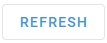

# Criação de novos aplicativos de usuário

Ao configurar um novo **Aplicativo do usuário**Na plataforma, você trabalhará com várias configurações importantes que determinam como seu aplicativo externo se integra à plataforma. Vamos explorar cada componente essencial.

Comece clicando no botão 

 no botão **Aplicativos de usuário** lista. No formulário de configuração exibido, prossiga com as etapas a seguir:

### 1\. Configurar o URL

Especifique o URL do aplicativo - o endereço onde o aplicativo está hospedado, que serve como base para a integração.

> [!INFO]
> **Important**
> - Verifique se o URL é válido, usa uma conexão HTTPS, leva a um recurso confiável e não contém mais de 1.000 caracteres.
> - Certifique-se de que o aplicativo tenha a configuração iFrame ativada, caso contrário não será possível abri-lo na interface da plataforma.

### 2\. Configurar parâmetros básicos

Para personalizar seu aplicativo, você pode incluir vários parâmetros no URL. Você pode adicionar parâmetros manualmente no campo do URL ou usar uma de nossas sugestões: idioma, ID de usuário ou fuso horário. Clique em uma sugestão de parâmetro para adicioná-lo ao final do URL. Expanda a descrição abaixo para saber mais sobre os parâmetros sugeridos e exemplos.

Compreensão dos parâmetros de URL sugeridos

Sugerimos alguns parâmetros básicos para personalização

1. `?locale={locale_code}`  
Parâmetro de idioma que corresponde automaticamente ao idioma da plataforma do usuário.
  - Exemplo: `https://your-app.com/dashboard?locale=en`
2. `?user_id={user_identifier}`  
Parâmetro de contexto do usuário que passa a identidade do usuário para filtrar informações personalizadas.
  - Exemplo: `https://your-app.com/dashboard?user_id=12345`
3. `?timezone={timezone}`  
Parâmetro de horário que corresponde automaticamente ao fuso horário da plataforma do usuário.
  - Exemplo: `https://your-app.com/dashboard?timezone=UTC+1`

Você pode editar o nome do parâmetro sugerido ou especificar um determinado valor para ele.

> [!NOTE]
> Teste sua configuração para garantir que o aplicativo seja carregado corretamente. Clique em 
> 
>  para exibir uma visualização.

### 3\. Ajustar a aparência

Crie uma identidade reconhecível para o seu aplicativo para facilitar o acesso a ele. As configurações a seguir o ajudarão a fazer isso:

- **Rótulo** - Adicione um nome exclusivo e descritivo para seu aplicativo (até 24 caracteres). Ele será exibido na barra lateral da plataforma.
- **Descrição** - Adicione uma breve explicação com detalhes sobre a funcionalidade do aplicativo ou destaque informações importantes (até 50 caracteres). Uma descrição informativa ajudará seus usuários a entender melhor a finalidade do aplicativo.
- **Ícone** - Selecione um ícone que represente a função do seu aplicativo para uma navegação ainda mais nativa.

### 4\. Selecione o método de exibição

Decida como seu aplicativo será aberto escolhendo uma das duas opções na seção **Abrir em** lista suspensa:

- **Incorporado** - O aplicativo aparece na interface da plataforma
- **Nova guia** - O aplicativo abre em uma guia separada do navegador

> [!NOTE]
> Nossa plataforma usa iFrame para incorporação. Como nem todos os URLs podem ser processados com sucesso com essa tecnologia, certifique-se de visualizar o resultado da incorporação. Se você encontrar algum problema com esse método de exibição, considere usar **Nova guia**.

### 5\. Configurar a autenticação (opcional)

Configure a autenticação se o seu aplicativo depender da API da plataforma. Nesse caso, a plataforma fornecerá os dados de autenticação diretamente ao aplicativo quando ele for aberto, eliminando a necessidade de implementar uma funcionalidade de login adicional no aplicativo.  
Você pode escolher um dos dois métodos de autenticação:

- **Chave da API**
  - Esse método é para aplicativos em que o gerenciamento de funções ou as permissões de usuário não são necessários.
  - A chave de API corresponde ao nível de acesso do proprietário da conta. Isso significa que fornecer a um usuário comum uma chave de API pode conceder a ele acesso a **todos os dados** disponíveis para o usuário principal.  
Por exemplo, se o seu aplicativo trabalha com rastreadores para os quais um usuário tem direitos limitados ou nenhum acesso, o uso da chave de API ainda exporá todos os rastreadores da conta principal.
- **Chave da sessão**
  - Esse método é recomendado quando o gerenciamento de funções está envolvido.
  - Transmite a chave de sessão do usuário atual para o aplicativo.

> [!NOTE]
> Selecionando o **Chave da API** desabilitará automaticamente o método **Chave da sessão** e vice-versa. Somente um método pode ser usado por vez.

Quando a autenticação está ativada, a plataforma anexa o `?session_key=` no URL do seu aplicativo.

- Se você selecionou um **Chave da API**o valor do parâmetro conterá essa chave.
- Se você optou por um **Chave da sessão**o valor do parâmetro incluirá a chave da sessão do usuário atual a partir da qual o aplicativo está sendo acessado.

Certifique-se de que o aplicativo seja capaz de ler e usar esse parâmetro.

### 6\. Salve o novo aplicativo

Clique no botão **Salvar** botão. Seu aplicativo aparecerá na seção **Aplicativos de usuário** e na barra lateral da plataforma. Os aplicativos habilitados ficam automaticamente disponíveis para os usuários da conta.

Dicas rápidas de solução de problemas

Se o aplicativo não for exibido corretamente quando incorporado, tente:

- Em vez disso, abra-o em uma nova guia
- Verificação de que seu URL está correto e acessível
- Verificar se todos os parâmetros estão formatados corretamente

Os aplicativos criados permanecem totalmente configuráveis após serem salvos. Você pode ajustar seus parâmetros e aparência a qualquer momento. Para saber mais sobre o gerenciamento de aplicativos, consulte [Gerenciar aplicativos de usuário existentes](gerenciar-aplicativos-de-usuario-existentes.md).