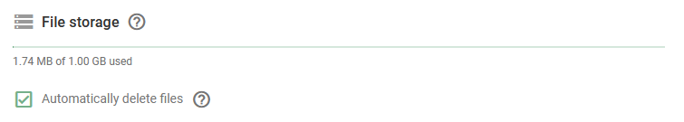

# Armazenamento de arquivos

Cada conta de usuário recebe 1 GB de armazenamento de arquivos, que é projetado para suportar funções essenciais dentro da plataforma Navixy. Isso pode ser encontrado em **Account Settings → Profile → General Settings**.

**Objetivo:**

- **Arquivos de foto e vídeo:** Armazene imagens e vídeos capturados por dispositivos telemáticos de veículos habilitados para câmera, ajudando-o a monitorar e gerenciar as operações da frota com eficiência.
- **Anexos de tarefas e formulários:** Gerencie fotos e anexos associados a tarefas e formulários no aplicativo X-GPS Tracker, garantindo que toda a documentação relevante esteja facilmente acessível.

### Exclusão automática de arquivos

Para usuários que lidam frequentemente com grandes volumes desses arquivos, o recurso "Automatically delete files" (Excluir arquivos automaticamente) está disponível para ajudar a gerenciar seu armazenamento de forma eficiente. Esse recurso substitui automaticamente os arquivos antigos por novos, garantindo que você permaneça dentro dos limites de armazenamento sem perder o acesso aos dados mais recentes e relevantes.