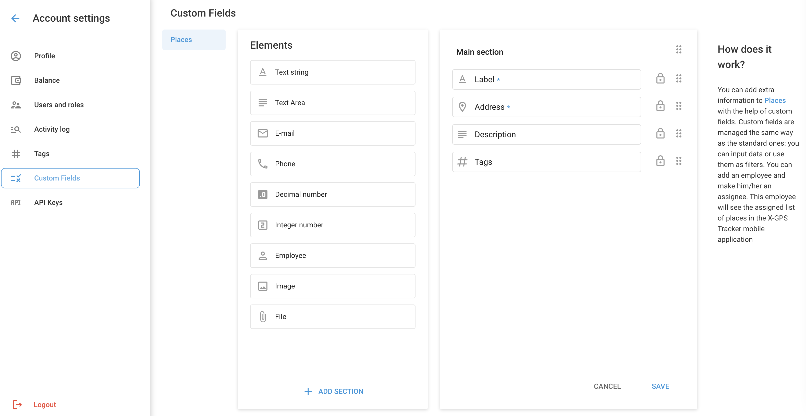

# Campos personalizados

Os campos personalizados permitem que você adicione informações personalizadas à descrição dos locais. Os campos personalizados funcionam da mesma forma que os campos padrão, permitindo que você armazene dados valiosos que podem ser usados para filtrar e melhorar a eficiência operacional.

**Exemplos:**

- No Field Service Management, os campos personalizados podem complementar as informações sobre os locais visitados. Um funcionário de campo que usa a função [Rastreador X-GPS](https://x-gps.app/) O aplicativo móvel pode exibir e editar informações detalhadas sobre o Places, como detalhes do cliente e requisitos de serviço, aprimorando a conclusão da tarefa. [Leia mais no blog](https://www.navixy.com/blog/custom-fields-navixy/)

## Tipos de campos personalizados

| **Tipo de campo** | **Descrição** |
| --- | --- |
| **Cadeia de texto** | Comprimento de até 700 caracteres, permite qualquer caractere. |
| **Área de texto** | Comprimento de até 20.000 caracteres. |
| **E-mail** | Somente para endereços de e-mail. |
| **Telefone** | Somente para números de telefone. |
| **Número decimal** | Para valores decimais. |
| **Número inteiro** | Para valores inteiros. |
| **Funcionário** | Permite a atribuição de um membro da equipe responsável, tornando o local visível no aplicativo X-GPS Tracker para o funcionário em questão. |
| **Imagem** | Permite adicionar uma imagem. |
| **Arquivo** | Permite anexar um arquivo. |

### Como adicionar e editar campos personalizados

Para adicionar um novo campo personalizado, navegue até **Account Settings → Custom Fields (Configurações da conta → Campos personalizados)**.

1. **Selecione o tipo de campo:** Escolha o tipo de campo na lista Elementos à esquerda.
2. **Arrastar e soltar:** Arraste o tipo de campo selecionado para a seção Principal, à direita.
3. **Especifique as informações:**
  - **Nome do campo:** Digite o nome do campo.
  - **Descrição:** Forneça uma descrição para o campo.
  - **Necessário:** Indique se o campo é obrigatório. Ao adicionar um novo local, ele não poderá ser salvo até que todos os campos obrigatórios sejam preenchidos.

### Ações adicionais para campos personalizados

- **Adicionar seção:** Distribua os campos personalizados em diferentes seções para melhor organização.
- **Reordenar:** Arraste e solte campos e seções para organizá-los na ordem que preferir.
- **Excluir:** Para excluir um campo, selecione-o e clique no ícone da lixeira. Observe que os campos primários marcados com um ícone de cadeado não podem ser excluídos.

#### Observações importantes

- **Máximo de campos personalizados:** Você pode adicionar até 50 campos personalizados.
- **Atualizações automáticas:** Ao editar campos, as alterações em seu nome, descrição e ordem serão automaticamente refletidas em todos os locais criados.
- **Exclusão:** A exclusão de um campo personalizado o removerá de todos os locais permanentemente, sem a possibilidade de recuperação.

## Perguntas frequentes e solução de problemas

- **Os campos personalizados podem ser adicionados a outros objetos além de lugares?** Atualmente, os campos personalizados só podem ser adicionados a locais, com planos de expandir essa funcionalidade no futuro.
- **Como os campos personalizados podem ser preenchidos a partir de sistemas CRM por meio da API da Navixy?** Sim, você pode preencher campos personalizados na Navixy fazendo chamadas de API para sincronizar dados do seu CRM. Isso permite a transferência de dados e atualizações contínuas, garantindo que todas as informações estejam atualizadas e acessíveis em ambos os sistemas. Leia mais na seção [Documentação da API da Navixy](https://developers.navixy.com/backend-api/how-to/work-with-POIs/).