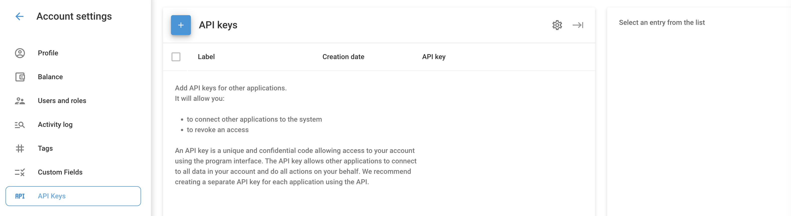

# Chaves de API

As chaves API são códigos exclusivos e confidenciais que permitem o acesso à sua conta e aos dados da Navixy por meio da interface do programa aplicativo. Elas permitem que aplicativos pessoais ou de terceiros se conectem à sua conta, acessem dados e executem ações em seu nome.

## Como visualizar e criar chaves de API

Navegue até **Configurações da conta** → **Chaves de API** no menu.

1. **Exibição de chaves de API existentes:** Na seção API Keys (Chaves de API), você verá uma lista de chaves existentes com os seguintes detalhes:
  - **Label:** O nome da chave de API.
  - **Data de criação:** Quando a chave da API foi criada.
  - **Chave de API:** A própria chave exclusiva.
2. **Criação de uma nova chave de API:**
  - Clique no botão **"+"** para adicionar uma nova chave de API.
  - Digite um rótulo para a nova chave.
  - Clique em **Salvar**.

## Como excluir chaves de API

1. **Exclusão de uma única chave de API:**
  - Passe o mouse sobre a tecla que deseja excluir.
  - Clique no ícone da lixeira que aparece à direita.
2. **Exclusão de várias chaves de API:**
  - Marque as caixas de seleção ao lado das teclas que deseja excluir.
  - Clique no ícone da lixeira no canto superior direito para remover as chaves selecionadas.

## Dicas de segurança

- **Não publique chaves de API:** Mantenha suas chaves de API confidenciais para evitar acesso não autorizado. Essas chaves podem executar praticamente qualquer ação em sua conta.
- **Chaves separadas para cada aplicativo:** Recomenda-se criar uma chave de API separada para cada aplicativo ou serviço de terceiros para aumentar a segurança e gerenciar o acesso com mais eficiência.