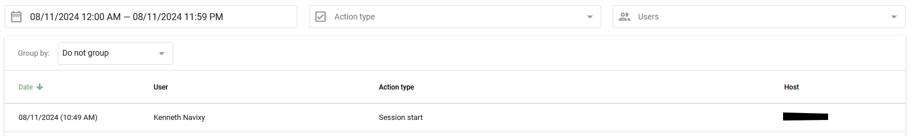

# Registro de atividades

Usando o Registro de atividades, o proprietário da conta pode rastrear a atividade de todos os [usuários da equipe](usuarios-e-funcoes.md) adicionados por meio da seção "Usuários e funções". Esse recurso fornece informações detalhadas sobre as ações dos usuários, ajudando a monitorar e gerenciar o uso do sistema de forma eficaz.

Navegue até **Account Settings → Activity Log**.

## Tipo de ações

O registro de atividades rastreia uma variedade de ações realizadas pelos usuários:

- **Início da sessão:** Quando um usuário faz login em uma conta sem usar a autorização
- **Autorização:** Quando um usuário faz login usando seu nome de usuário e senha
- **Fim da sessão:** Quando um usuário se desconecta do sistema de monitoramento
- **Faça login na conta do proprietário:** Quando um cliente faz login a partir da conta principal
- **Geofence criada/editada/excluída**
- **POI criado/editado/excluído**
- **Regra criada/editada/excluída**
- **Objeto vinculado à regra:** Quando um objeto é especificado para a regra
- **Objeto excluído da regra:** Quando um objeto é removido das configurações de regra
- **Substituição do dispositivo**
- **Chave de API exibida/criada/excluída**
- **Dispositivo: atualização de saída/atualização de saída em lote/execução de comando:** Quando as saídas são gerenciadas

## Obtendo o registro de atividades

1. Digite o **Registro de atividades** seção
2. **Especificar parâmetros:** Selecionar tipos de ação e usuários
3. **Definir intervalos de tempo:** Defina os períodos de tempo e clique no botão **Aplicar** botão

### Agrupamento e filtragem de listas

Use o agrupamento e a filtragem para estruturar a lista de acordo com seus critérios:

- **Até a data:** Agrupar registros por data
- **Por usuário:** Obter uma lista de usuários que fizeram login na conta
- **Por tipo de ação:** Veja os tipos de ações realizadas na conta