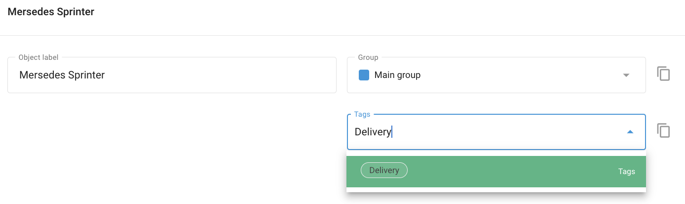

# Tags

A **"Tag"** é uma etiqueta que permite a busca rápida e conveniente das informações desejadas. Na Navixy, as etiquetas o ajudam a localizar rapidamente informações relacionadas a Locais, Funcionários, Veículos e Tarefas. Você pode criar etiquetas personalizadas de acordo com suas necessidades, e um único objeto pode ter várias etiquetas.

## Uso de tags para pesquisa

Para localizar objetos com a mesma tag:

- Digite o nome da tag na caixa de pesquisa.
- O sistema exibirá todos os resultados de pesquisa associados a essa tag.

Aqui estão alguns exemplos:

- **Veículos.** Para encontrar veículos com etiquetas específicas, como "Caminhão basculante" ou "Alugado", digite o nome da etiqueta correspondente na caixa de pesquisa da lista de veículos.
- **Funcionários.** Se você tiver marcado os funcionários com base em suas funções ou projetos, digite a tag relevante, como "Project Alpha" ou "Field Technician", na caixa de pesquisa para ver todos os funcionários associados a essa tag.
- **Localizando uma tarefa.** Para tarefas marcadas com "Urgente" ou "Manutenção", inserir essas tags na caixa de pesquisa o ajudará a acessar rapidamente todas as tarefas marcadas como urgentes ou relacionadas à manutenção.

## Criação e atribuição de tags

É possível criar um número ilimitado de tags para atender às suas necessidades organizacionais; no entanto, você pode atribuir no máximo 5 tags a cada dispositivo ou objeto GPS.

### Método 1. No contexto

Para criar ou atribuir uma tag a um objeto, basta digitar o rótulo da tag no campo **Tags** campo. Se já existirem tags com entradas iniciais semelhantes, elas aparecerão em uma lista suspensa na qual você poderá selecionar.

### Método 2. No diretório de tags

Navegue até **Account Settings → Tags**:

- Clique no botão **"+"** para adicionar uma nova tag.
- Digite o nome da tag desejada.
- Opcionalmente, atribua uma cor à tag para melhor diferenciação visual.

## Gerenciamento de tags

Para gerenciar suas tags, navegue até **Account Settings → Tags**. Isso o levará à tela Tag Management (Gerenciamento de tags), onde é possível visualizar, criar, editar e excluir tags.

Quando você exclui uma tag, ela remove o link do objeto associado, mas não exclui o objeto em si.