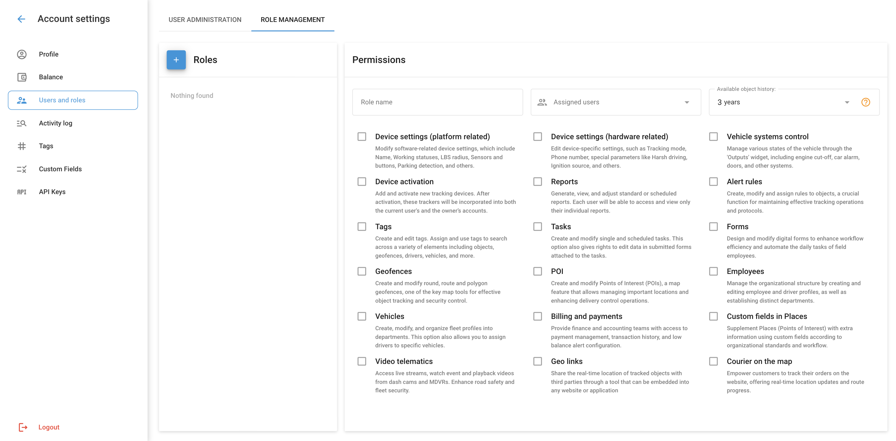

# Gerenciamento de funções

Uma Função de Usuário na Navixy é um conjunto de permissões e direitos de acesso atribuídos a um usuário, definindo o que ele pode visualizar e gerenciar dentro da plataforma. As funções de usuário são personalizáveis e permitem que o Proprietário controle o nível de acesso que cada usuário tem a diferentes recursos e dados. As funções determinam a capacidade de um usuário de:

- Gerenciar veículos, funcionários e ativos
- Visualizar dados telemáticos de dispositivos e sensores GPS
- Trabalhar com cercas geográficas e pontos de interesse (POIs)
- Gerar relatórios, usar plug-ins e ferramentas de aplicativos específicos

Ao atribuir funções, o Proprietário pode garantir que os usuários tenham o acesso adequado necessário para realizar suas tarefas sem comprometer a segurança ou a integridade dos dados e das operações comerciais. Cada função pode incluir direitos básicos disponíveis para todos os usuários, bem como direitos adicionais adaptados às necessidades e responsabilidades específicas de diferentes usuários.

## Adição e gerenciamento de funções

Para adicionar uma nova função, navegue até Account Settings → Users and roles (Configurações da conta → Usuários e funções) e selecione a guia "Role management" (Gerenciamento de funções). Clique no botão Adicionar função (o botão com o sinal "+").

2. **Criar uma nova função**:

- Pense em um nome para a função.
- Selecione os direitos de acesso necessários para essa função.
- Pressione "Salvar" para criar a função.

### Tipos de direitos

Todos os direitos são divididos em três categorias: Proprietário, Básico e Adicional.

#### Direitos do proprietário

Os direitos do proprietário estão disponíveis apenas para o proprietário da conta (usuário principal) e não podem ser atribuídos a outras funções. Esses direitos incluem:

- Adicionar e editar usuários
- Gerenciar grupos de objetos
- Configurar o encaminhamento de dados
- Plano de modificação

**Direitos básicos**

Os direitos básicos estão disponíveis para todas as funções e não podem ser desativados. Esses direitos incluem:

- Ferramentas de mapas (camadas, planejamento de rotas, etc.)
- Histórico de viagens e eventos
- Operações de serviço
- Widgets interativos (alterar o status do trabalho, alterar os estados de saída, etc.)
- Acesso a dados vinculados (tarefas atribuídas, regras de controle, etc.)

**Direitos adicionais**

Os direitos adicionais são configurados individualmente para cada função. Esses direitos incluem:

- **Configurações do dispositivo (lado do software)**: Modifique as configurações do dispositivo relacionadas ao software, incluindo nome, status de trabalho, raio LBS, sensores e botões, detecção de estacionamento e muito mais.
- **Configurações do dispositivo (lado do hardware)**: Edite as configurações de dispositivos específicos, como modo de rastreamento, número de telefone, parâmetros especiais, como direção severa, fonte de ignição e outros.
- **Controle de sistemas de veículos**: Controle vários estados do veículo por meio do widget "Outputs" (Saídas), incluindo desligamento do motor, alarme do carro, portas e outros sistemas.
- **Ativação do dispositivo**: Adicionar e ativar novos dispositivos de rastreamento. Após a ativação, os rastreadores serão ativados tanto para a conta do usuário atual quanto para a conta do proprietário.
- **Relatórios**: Criar, visualizar e configurar relatórios padrão ou programados. Cada usuário só pode visualizar seus relatórios individuais.
- **Regras de alerta**: Criar, modificar e atribuir regras a objetos para manter operações eficientes e protocolos de rastreamento.
- **Tags**: Crie e edite tags. Atribua e use tags para pesquisar vários elementos, incluindo objetos, cercas geográficas, motoristas, veículos e muito mais.
- **Tarefas**: Criar e modificar tarefas individuais e agendadas. Essa opção também concede o direito de editar dados em formulários anexados às tarefas.
- **Cercas geográficas**: Crie e edite cercas geográficas circulares, de rota e poligonais - uma ferramenta de mapeamento essencial para rastrear objetos e garantir a segurança.
- **Locais**: Crie e edite pontos de interesse (POI) - uma função de mapa que permite gerenciar locais importantes e melhorar as operações de controle de entrega.
- **Funcionários**: Gerencie a estrutura organizacional, crie e edite perfis de funcionários e motoristas e crie departamentos.
- **Veículos**: Criar, modificar e distribuir perfis de frota por departamento. Essa opção também permite atribuir motoristas a veículos específicos.
- **Faturamento e pagamentos**: Forneça aos grupos financeiros e contábeis acesso ao gerenciamento de pagamentos, histórico de transações e configurações de alerta de saldo baixo.
- **Telemática por vídeo**: Acesse transmissões ao vivo, visualize eventos e reproduza vídeos de DVRs e MDVRs, aumentando a segurança nas estradas e na frota.
- **Weblocator**: Compartilhe a localização em tempo real de objetos rastreados com terceiros por meio de um plug-in que pode ser incorporado em um site ou aplicativo.
- **Courier no mapa**: Permita que os clientes rastreiem seus pedidos no site, oferecendo atualizações de localização em tempo real e o progresso da rota do correio.