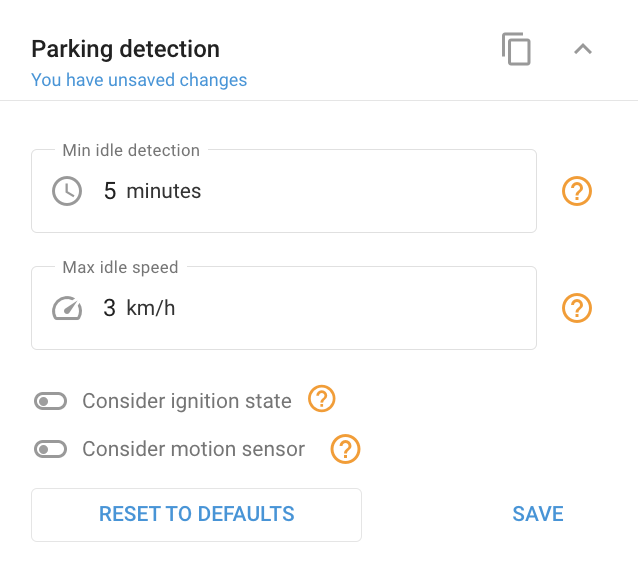

# Widget de detecção de estacionamento

A detecção de estacionamento identifica quando um objeto está parado por um período de tempo especificado e dentro de um limite de velocidade definido, usando dados de GPS.

**Parâmetros para detecção de estacionamento:**

- **Tempo mínimo de detecção de inatividade** (`min_parking`): Esse é o tempo mínimo que um objeto deve permanecer parado antes de ser considerado estacionado.
- **Velocidade máxima de marcha lenta** (`min_speed`): Esse é o limite de velocidade abaixo do qual o objeto deve permanecer para ser detectado como estacionado.

Por padrão, esses parâmetros são definidos como 5 minutos e 3 km/h, respectivamente.

**Condições de detecção de estacionamento:**

- **Por velocidade e tempo**:  
O status de estacionamento é detectado quando a velocidade do objeto cai abaixo do valor definido de `min_speed` e permanece lá por mais tempo do que `min_parking`. Paradas mais curtas que `min_parking` não são considerados como estacionamento e não interrompem a viagem.
- **Considerando a ignição**:
  - A viagem começa se a velocidade for maior ou igual a `min_speed` e a ignição está ligada.
  - A viagem termina se a velocidade cair abaixo de `min_speed` e o tempo decorrido exceder `min_parking` ou a ignição está desligada.
- **Considerando o sensor de movimento**:
  - A viagem começa se a velocidade for maior ou igual a `min_speed` e o sensor de movimento detecta movimento.
  - A viagem termina se a velocidade cair abaixo de `min_speed` ou o sensor de movimento não detecta nenhum movimento e o tempo decorrido excede `min_parking`.
- **Considerando o movimento e a ignição**:
  - O status da ignição tem precedência sobre o sensor de movimento.
  - A viagem começa se a velocidade for maior ou igual a `min_speed`e o sensor de movimento detecta movimento e a ignição está ligada.
  - A viagem termina se a velocidade cair abaixo de `min_speed` ou o sensor de movimento não detecta nenhum movimento e o tempo decorrido excede `min_parking` com a ignição desligada.

Essas configurações permitem o ajuste fino da detecção de estacionamento para refletir com precisão o comportamento do veículo no mundo real, minimizando falsas detecções e melhorando a precisão do rastreamento da viagem.