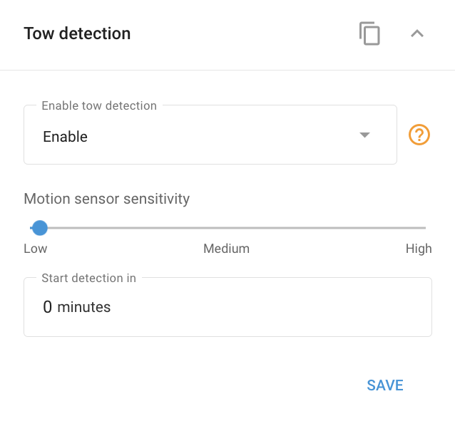

# Widget de detecção de reboque

O **Recurso de detecção de reboque**O sensor de movimento, disponível em muitos dispositivos GPS para veículos, foi projetado para detectar movimentos não autorizados com base em sinais do sensor de movimento integrado. Quando a ignição do veículo é desligada, o sensor entra no modo ativo, monitorando continuamente vibrações, impactos ou movimentos. Se qualquer um deles for detectado, uma notificação é enviada imediatamente para a plataforma a partir do dispositivo e pode ser informada ao usuário, conforme configurado em [Regras e notificações](../../regras-e-notificacoes/seguranca/movimentacao-nao-autorizada.md).

No software Navixy, você pode configurar essa função acessando a seção **"Detecção de reboque"** no widget **"Dispositivos e configurações"** seção. Esse painel permite ajustar a sensibilidade do sensor de movimento e especificar o atraso de tempo antes do início da detecção.

