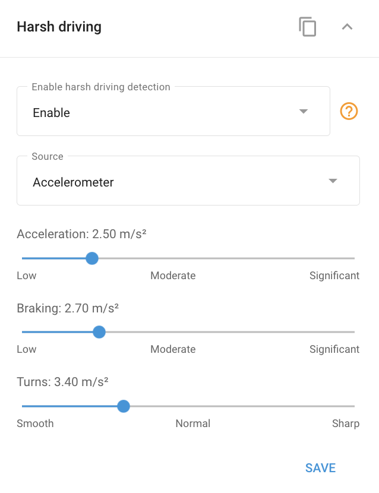

# Widget de direção severa

Muitos dispositivos avançados de GPS para veículos apresentam um **Detector de direção severa**. Esse detector monitora continuamente os valores de aceleração durante a aceleração, a frenagem e as curvas. Quando esses valores excedem os limites predefinidos, o sistema gera um evento correspondente de "Direção severa". Esses eventos podem ser rastreados e analisados usando o [Notificações](../../regras-e-notificacoes/safety/direcao-severa.md) e [Relatórios de direção ecológica](../../gerenciamento-de-frotas/conducao-ecologica.md)permitindo uma avaliação detalhada do comportamento ao dirigir.

## Configuração dos limites do detector de condução severa

Como os veículos variam em suas características técnicas - como a capacidade de um sedan acelerar mais rápido do que um ônibus - os valores críticos de aceleração também diferem. A Navixy permite que você personalize os parâmetros de condução severa dos dispositivos GPS de acordo com o tipo específico de veículo que você está monitorando.

Para acessar o **Widget de direção severa** na Navixy, navegue até a seção **Dispositivos e configurações** selecione o dispositivo desejado e, em seguida, expanda o widget "Harsh driving" para ajustar as configurações.

No widget, é possível ajustar os valores de limite para aceleração, frenagem e curvas. A ultrapassagem desses limites acionará diferentes tipos de eventos, que podem ser analisados posteriormente por meio de relatórios de eventos ou relatórios de direção ecológica. Essa personalização garante que o sistema reflita com precisão as condições de direção e os requisitos de segurança de sua frota.