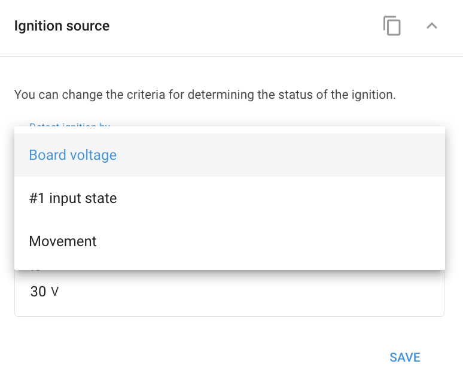

# Widget de fonte de ignição

Muitos dispositivos GPS avançados oferecem a flexibilidade de determinar a **Status da ignição** não apenas com uma conexão direta do cabo de ignição, mas também usando um **fonte de ignição virtual** com base nas leituras do sensor de movimento ou da tensão de bordo do veículo.

## Opções de fonte de ignição virtual

- **Detecção de ignição baseada em tensão**: Quando o motor está funcionando, o gerador do veículo fornece energia em uma tensão mais alta do que a da bateria para mantê-la carregada. Ao monitorar esse aumento de tensão, o dispositivo pode determinar com precisão quando a ignição está ligada.
- **Detecção de ignição baseada em sensor de movimento**: Essa opção é útil quando o dispositivo não está conectado ao sistema elétrico do veículo. O status da ignição é inferido a partir do movimento do veículo. No entanto, observe que esse método também pode detectar a ignição quando o veículo estiver sendo rebocado, mesmo que o motor não esteja funcionando.

## Configuração da fonte de ignição virtual

Para configurar a fonte de ignição no Navixy, use a opção **Widget de fonte de ignição** no aplicativo "Dispositivos e configurações":

1. Selecione a fonte de ignição desejada na lista suspensa do widget "Ignition source" (Fonte de ignição).
2. Se estiver usando a tensão de bordo do veículo, especifique a faixa de tensão dentro da qual a ignição é considerada "ligada".

Essa configuração permite o monitoramento flexível e preciso do status da ignição do veículo, adaptando-se a diferentes cenários de instalação.

#### Exemplo de configuração

A captura de tela abaixo ilustra as opções disponíveis para selecionar a fonte de ignição na plataforma Navixy.

O widget "Ignition source" (Fonte de ignição) permite que os usuários escolham os critérios para determinar o status da ignição. Você pode selecionar entre as seguintes opções:

1. **Tensão da placa**: Detecta a ignição com base na tensão de bordo do veículo, útil quando a tensão aumenta à medida que o motor funciona.

2. **#1 estado da entrada**: Usa o status de uma entrada específica, normalmente um cabo de ignição, para determinar se a ignição está ligada ou desligada.

3. **Movimento**: Detecta a ignição com base no movimento do veículo, ideal para cenários em que o dispositivo não está diretamente conectado ao sistema elétrico do veículo. No entanto, esse método também pode registrar a ignição durante o reboque ou outros movimentos não relacionados ao motor.