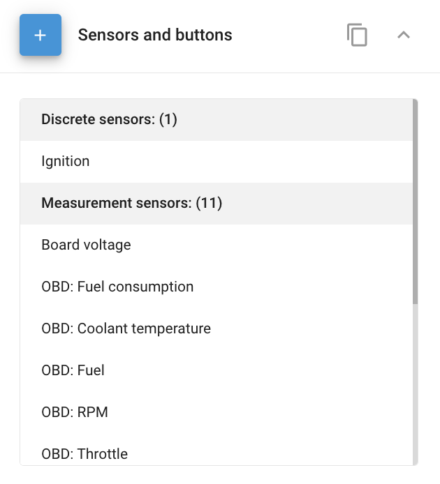

# Sensores de veículos

O **Sensores e botões** widget na Navixy permite gerenciar e configurar vários sensores conectados aos seus dispositivos GPS do ponto de vista da plataforma. Esse recurso é essencial para monitorar vários parâmetros do veículo, como níveis de combustível, temperatura e diagnósticos do motor, diretamente por meio da plataforma.

## Visão geral

O **Sensores e botões** está localizado no widget **Dispositivos e configurações** que pode ser acessada clicando no item correspondente no menu principal da interface da Web.

O widget fornece uma visão geral do número de sensores já conectados ao dispositivo selecionado. A expansão do painel permite que você adicione novos sensores ou edite os existentes.

O número e o tipo de sensores que você pode conectar dependem do modelo do dispositivo GPS. Por exemplo, alguns dispositivos permitem configurar parâmetros de dados transmitidos pelo barramento CAN ou pelo conector de diagnóstico OBDII.

## Adição e edição de sensores

Para gerenciar seus sensores, você pode usar os seguintes botões:

- **Adicionar**: Permite que você adicione um novo sensor.
- **Editar**: Permite que você modifique os parâmetros de um sensor existente.
- **Excluir**: Remove o sensor selecionado do sistema.

### Tipos de sensores

A Navixy suporta vários tipos de sensores, incluindo:

- [**Sensores discretos**](sensores-de-veiculos/sensores-discretos.md): Usado para entradas binárias, como status da ignição, porta aberta/fechada, etc.
- [**Sensores de medição**](sensores-de-veiculos/measurement-sensors.md): Esses sensores medem e informam valores contínuos, como temperatura, nível de combustível ou RPM do motor.
- [**Sensores de agregação**](sensores-de-veiculos/sensores-de-agregacao.md): Combine dados de várias fontes em um único valor relatável.
- [**Sensores virtuais**](sensores-de-veiculos/sensores-virtuais.md): Derivado de dados calculados ou valores combinados de sensores.

### Cópia das configurações do sensor

Para simplificar a configuração, você pode copiar as configurações do sensor de um dispositivo para outro, desde que os dispositivos sejam do mesmo modelo. Isso é particularmente útil ao gerenciar grandes frotas com tipos de veículos semelhantes.

**Etapas para copiar as configurações do sensor:**

1. Clique no botão de cópia (📋).
2. Selecione os dispositivos aos quais você deseja aplicar as configurações copiadas.
3. Clique em **Aplicar**.

**Observação:** A cópia das configurações do sensor substituirá as configurações atuais nos dispositivos selecionados. Certifique-se de selecionar apenas os dispositivos que deseja atualizar.