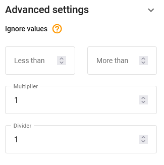

# Measurement sensors

# Measurement sensor

To add a measurement sensor click 

 and select "Measurement sensor" in the pop-up menu.

Specify the necessary parameters of the sensor:

- **Label** – specify the name of the sensor in the system. It can be any name of your choice.
- **Parameter** – choose the input to which the sensor is connected (number and types of inputs available are determined by device model).
- **Sensor type** – choose the type of the sensor
- **Units** – choose the measurement units. You can select available units from the drop-down list or specify custom ones.
- **Additional parameters** – only appear when the specific type of sensor is chosen. For example, for a fuel sensor, the accuracy and thresholds parameters can be adjusted to be used for drain detection.

### Adding calibration data

After all parameters are set, it is necessary to put calibration data to the table.

You first need to get a list of the correspondence between the raw values of the measuring sensor (e.g. volts) and the actual value that the sensor is measuring (e.g. liters). For more information, [see this tutorial](https://docs.navixy.com/eco-fleet/fuel-level-sensors).

To add rows to the table, click 

.

In the created line, fill in the "Sensor value" field with the obtained value, and the "Quantity" field with the corresponding measured quantity.

To delete a row, click 

.

To upload the calibration table file, click 

.

For more precise setting, click "Advanced settings" button 

. These settings are **Ignore values** and **Multiplier**.

- **Ignore values –** this setting allows you to adjust a "valid" range of raw measurement values. Any values above and below the range will be omitted. For example, this can be used for skipping zero values of fuel sensor when the vehicle ignition is off.
- **Multiplier –** used to correct raw data values from the sensor by multiplying them by some number.

#### Filtering order:

Please keep in mind that the "**less than**" and "**more than**" restrictions are  
applied before the "**Multiplier**". The entire order of filtering:

1. Ignore values (**less than** & **more than**)
2. **Multiplier**
3. **Calibration table**

E.g.: Incoming raw value - 1000, boundaries are 3000 and 100, multiplier equals 0.2.

In this case, the value passes through the min/max filter, is multiplied by 0.2 and becomes 200. And this is where calibration table applies. Calibration table takes 200 as the "Sensor value" (source value) and converts it into the target "Quantity" value to be displayed in the user interface facilities. If an incoming data packet contains the sensor data with a value more than 3000, the value will not pass the boundaries, it is discarded, therefore, no multiplication and no calibration apply.

The numbers here are for example and you may have other settings but the principle remains.

#### Graph:

As you enter data into the table, the graph will be plotted.

To confirm your changes, click **Save**.

#### Raw sensor data storage:

Raw sensor data is stored on the platform by default. This allows users to re-calibrate represented sensor data of the tracker sensor history for the past. Whenever the multiplier, maximum ("less than"), minimum ("more than"), or calibration table data are changed, the platform recalculates the history and represents the data according to the new settings. The advantage of this approach is that the user can always re-calibrate the table, change the sensor settings and build a report based on the recalculated data "on the fly".

