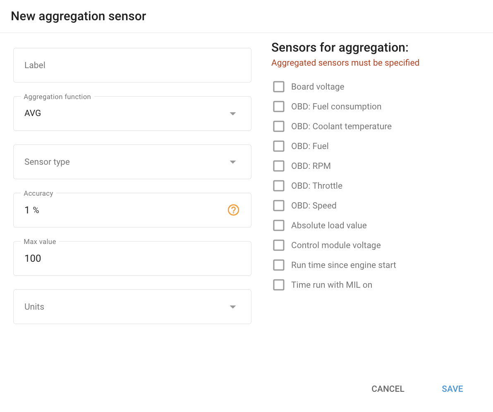

# Sensores de agregação

O **Sensor de agregação** widget na Navixy é uma ferramenta poderosa que permite combinar dados de vários sensores e processá-los usando uma função de agregação. Essa funcionalidade é particularmente útil em cenários em que vários sensores são usados para monitorar parâmetros semelhantes, como os níveis de combustível em um veículo.

## Opções de função de agregação

#### As duas funções de agregação disponíveis são **Média (AVG)** e **Total (SUM)**.

- **AVG (Média)**: Essa função calcula o valor médio dos sensores selecionados. Ela é útil quando você deseja suavizar as leituras de vários sensores, fornecendo um valor mais estável e representativo.

- **SUM**: Essa função soma os valores dos sensores selecionados. É ideal quando o valor total de um parâmetro precisa ser monitorado, como o nível de combustível combinado de dois tanques.

## Exemplos práticos: vários sensores de combustível em um veículo

1. **Tanque único com dois sensores de nível de combustível**:
  - **Cenário**: Você tem um grande tanque de combustível com dois sensores posicionados em pontos diferentes dentro do tanque.
  - **Meta**: Para obter uma leitura mais precisa do nível geral de combustível, calculando a média das leituras de ambos os sensores.
  - **Configuração**:
    - **Função de agregação**: Selecione **AVG**.
    - **Sensores para agregação**: Escolha os dois sensores de nível de combustível.
    - **Resultado**: O sistema exibirá o nível médio de combustível, fornecendo uma leitura equilibrada que compensa quaisquer discrepâncias entre os dois sensores.
2. **Dois tanques com sensores separados**:
  - **Cenário**: Você tem dois tanques de combustível separados, e cada tanque tem seu próprio sensor de nível de combustível.
  - **Meta**: Para monitorar o total de combustível disponível em ambos os tanques.
  - **Configuração**:
    - **Função de agregação**: Selecione **SUM**.
    - **Sensores para agregação**: Escolha os sensores de ambos os tanques.
    - **Resultado**: O sistema somará os níveis de combustível de ambos os tanques, fornecendo o total de combustível disponível.

## Configuração do sensor de agregação

1. **Rótulo**: Digite um nome para seu sensor de agregação que identifique claramente sua finalidade.
2. **Função de agregação**: Selecione **AVG** (para calcular a média) ou **SUM** (para soma), dependendo de suas necessidades.
3. **Tipo de sensor**: Escolha o tipo de sensor (por exemplo, nível de combustível).
4. **Precisão**: Especifique a margem de erro aceitável. Por exemplo, se a precisão for definida como 5% e o valor máximo for 100 litros, as alterações de 5 litros ou menos serão ignoradas.
5. **Valor máximo**: Defina o limite superior para o valor agregado. Isso evita que a leitura agregada ultrapasse um determinado limite.
6. **Unidades**: Especifique a unidade de medida (por exemplo, litros).
7. **Sensores para agregação**: Selecione os sensores individuais cujos dados você deseja agregar.
8. **Salvar**: Após configurar o sensor, clique em **Salvar** para aplicar as configurações.

Essa configuração permite monitorar e gerenciar com eficiência os dados de várias fontes, aumentando a precisão e a utilidade das suas soluções de gerenciamento de frota e telemática.