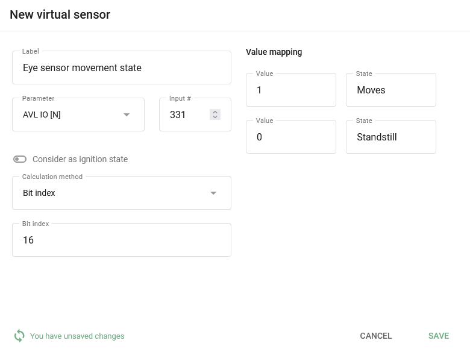
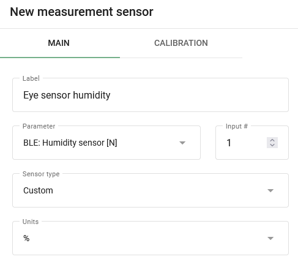
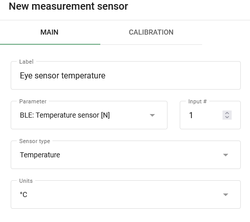
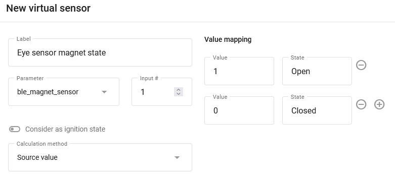

# Configuração do sensor ocular

# Configuração do sensor ocular

Como um exemplo adicional do uso de sensores virtuais, gostaríamos de apresentar a você [Sensores oculares Teltonika](https://teltonika-gps.com/products/accessories/sensors-beacons/eye)que são capazes de registrar dados valiosos, como temperatura, umidade, movimento e condição do ímã. As informações sobre o estado do movimento, em particular, não estavam disponíveis anteriormente, mas agora podem ser acessadas por meio do uso de sensores virtuais. Se tiver interesse em saber mais sobre esses sensores e como configurá-los para obter informações importantes, teremos prazer em fornecer instruções detalhadas.

## Configuração do sensor em um dispositivo

Para configurar a transmissão de dados do sensor para a plataforma, recomendamos o uso da opção [Configurador Teltonika](https://wiki.teltonika-gps.com/view/Teltonika_Configurator_Introduction). Certifique-se de que [Faça o download da versão](https://wiki.teltonika-gps.com/view/Teltonika_Configurator_versions) que corresponde ao firmware atual e ao modelo do dispositivo. Depois de fazer o download e iniciar o configurador, navegue até as configurações do sistema e selecione o protocolo de dados Codec 8 Extended.

Ativação do Codec 8 Extended no configurador Teltonika.

Na seção Bluetooth 4.0, recomendamos desativar o recurso Non-Stop Scan e definir a "Update Frequency" (Frequência de atualização) e a "Scan Duration" (Duração da varredura) para cada 30 segundos. Ao ajustar essas configurações, você obterá resultados ideais para a varredura BLE, garantindo uma coleta de dados confiável e precisa.

Frequência de varredura para sensores BLE.

Em seguida, selecione a Conexão # e defina o modo de operação como Avançado. Isso fornecerá acesso a configurações detalhadas do sensor. Procure os botões localizados no canto superior direito e selecione a lista Preset (Predefinições). Isso permitirá que você simplifique o processo de configuração do sensor.

Configuração do modo Avançado para o sensor e a localização do botão da lista de predefinições.

Quando você clicar no botão da lista de predefinições, uma nova janela será aberta exibindo uma seleção de sensores disponíveis. Basta escolher o que está sendo usado no momento, como o EYE SENSOR. Essa tabela definirá automaticamente todas as configurações necessárias. Depois disso, navegue até a guia I/O para configurar a transmissão de dados desses sensores nos pacotes do dispositivo.

Para configurar a transmissão de dados desses sensores nos pacotes do dispositivo, navegue até a guia I/O. Aqui, você precisará definir os parâmetros apropriados para as configurações desejadas. Por exemplo, se o número de conexão do sensor for 1, configure os parâmetros com o mesmo número. Na maioria dos casos, é melhor definir a prioridade como Baixa para os parâmetros que precisam ser monitorados na plataforma. Também é importante garantir que todas as outras configurações sejam deixadas em seus valores padrão, a menos que você tenha alterado algo anteriormente. Nesses casos, as configurações recomendadas são as seguintes:

- Prioridade = Baixa
- Nível baixo = 0
- Nível alto = 0
- Somente evento = Não
- Operando = Monitoramento

Configuração do envio de dados de sensores em pacotes de dispositivos.

## Configuração na plataforma

### Sensor de status de movimento

A leitura desse sensor é totalmente configurável com sensores virtuais com [O método de cálculo do índice de bits](https://squaregps.atlassian.net/wiki/spaces/UDOCPT/pages/3025245578/Virtual+sensors#Bit-index). Os dados do estado de movimento vêm no bit 16 do campo BLE 1 Custom 1. A configuração do estado de movimento exigirá as seguintes etapas:

1. Crie um sensor virtual e especifique seu nome.
2. Selecione o [ID AVL apropriada](https://wiki.teltonika-mobility.com/view/Full_AVL_ID_List#BLE_Sensor_I.2FO_elements) como entrada. Por exemplo, para o BLE 1 Custom 1, use o número 331.
3. Defina o número do bit que corresponde aos dados de estado de movimento. Nesse caso, o bit 16 do campo BLE 1 Custom 1 deve ser selecionado.
4. Defina os nomes dos estados conforme necessário. Por exemplo, "Standstill" e "Moves" podem ser usados.
5. Especifique os valores correspondentes, em que 0 indica nenhum movimento e 1 indica movimento registrado pelo sensor.

Configuração do sensor virtual para ler o status de movimento do sensor Eye.

Nesse ponto, você recuperou com êxito o estado de movimento atual. No entanto, lembre-se de que as informações só podem ser obtidas em relatórios e regras se o estado de movimento estiver definido como ignição.

No momento, não há suporte para a obtenção de relatórios e regras para sensores virtuais sem ignição.

### Sensores de temperatura e umidade

A configuração desses sensores é semelhante à configuração de sensores padrão [sensores de medição](../measurement-sensors.md). Vamos dar uma olhada em um exemplo de configuração para cada um desses sensores:

A umidade é transmitida pelo dispositivo em %.

- Especifique o nome do sensor desejado.
- Selecione a entrada apropriada BLE: Umidade \[N\] e especifique seu número.
- Selecione o tipo de sensor Custom (Personalizado).
- Especifique a unidade de medida em %.
- Não são necessárias outras configurações.

Configuração do sensor de umidade BLE.

A temperatura é transmitida pelo dispositivo em °C.

- Especifique o nome do sensor desejado.
- Selecione a entrada apropriada BLE: Temperature \[N\] e especifique seu número.
- Selecione o tipo de sensor Temperature (Temperatura).
- Especifique a unidade de medida em °C.
- Não são necessárias outras configurações.

Configuração do sensor de temperatura BLE.

Usando as leituras do sensor, você pode gerar um relatório de Sensores de Medição que fornece informações úteis sobre os dados coletados pelo sensor. Além disso, você pode rastrear as leituras configurando alertas usando a regra "Parameter in Range" (Parâmetro na faixa), que permite receber notificações quando parâmetros específicos ficam fora de faixas predeterminadas.

Além disso, é possível criar sensores virtuais e fornecer nomes compreensíveis para receber valores de sensores em widgets. Para isso, use [o método de cálculo Value in Range](https://squaregps.atlassian.net/wiki/spaces/UDOCPT/pages/3025245578/Virtual+sensors#Value-in-range). Isso permitirá que você personalize os dados do sensor que estão sendo exibidos e facilitará a interpretação das informações apresentadas pelo sensor.

### Sensor de estado magnético

A configuração dos sensores de estado magnético é um processo simples e direto. De fato, não é necessária nenhuma configuração adicional além da conexão dos sensores à plataforma. Os dados do estado do ímã são transmitidos para a plataforma como campos de status e são exibidos assim que são recebidos do dispositivo conectado.

Uso de sensores virtuais com o [Método de cálculo do valor de origem](https://squaregps.atlassian.net/wiki/spaces/UDOCPT/pages/3025245578/Virtual+sensors#Source-Value)Se você quiser que os valores do campo de status sejam exibidos como "aberto" ou "fechado", poderá personalizá-los e dar-lhes nomes facilmente reconhecíveis.

Ao configurar a regra "Status Field Value", você pode rastrear os campos de status e receber alertas quando ocorrerem eventos específicos.

Exemplo de configuração do sensor de estado do ímã com seus valores e nome.

Você obteve com sucesso as informações do sensor Eye e agora elas estão na ponta dos dedos. Agora você está equipado para rastrear facilmente esses dados valiosos.