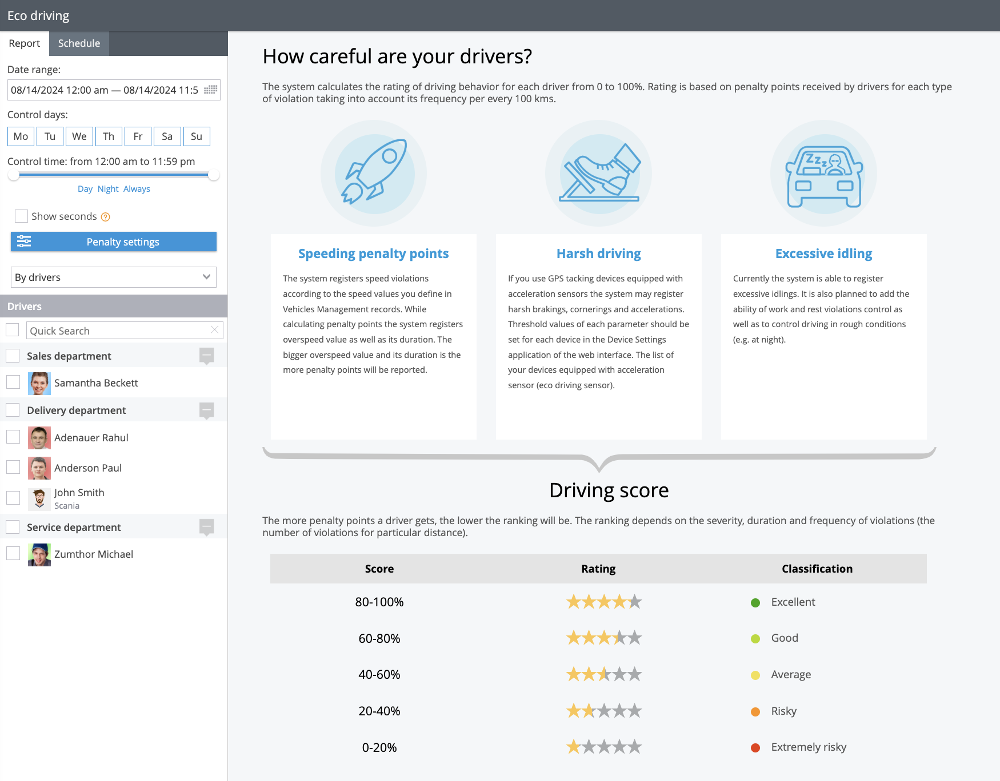

# Condução ecológica

O **Relatório de direção ecológica** A Navixy é uma ferramenta poderosa projetada para analisar e melhorar o comportamento de direção dos motoristas de sua frota. Ao atribuir uma pontuação entre 0 e 100 a cada motorista, o sistema fornece uma métrica clara do desempenho de direção com base nos pontos de penalidade acumulados por várias violações de direção. Essas infrações são avaliadas de acordo com sua frequência e gravidade a cada 100 quilômetros rodados, garantindo uma avaliação abrangente dos hábitos de cada motorista.

Para acessar o relatório Eco Driving, navegue até a seção **Aplicativo de gerenciamento de frota** e selecione o **Guia "Eco-Driving".**

## Entendendo os pontos de penalidade

Os pontos de penalidade são um componente essencial do relatório Eco Driving, permitindo que você avalie o impacto de diferentes tipos de violações no desempenho do motorista. O sistema rastreia três categorias principais de violações ao volante: excesso de velocidade, direção brusca e marcha lenta excessiva. Cada tipo de violação contribui para a pontuação geral, sendo que pontuações mais baixas indicam violações mais frequentes ou graves.

## Personalização do relatório

O relatório Eco Driving pode ser adaptado para atender às suas necessidades específicas, permitindo que você defina seus próprios critérios sobre o que constitui uma violação e sua gravidade. É possível atribuir diferentes pontos de penalidade a várias infrações, o que permite priorizar determinados aspectos do comportamento ao volante de acordo com os padrões da sua organização.

**Principais recursos**

- **Infrações por excesso de velocidade:** Monitore os casos em que os motoristas excedem os limites de velocidade estabelecidos, com penalidades ajustadas com base na extensão e na duração do excesso de velocidade.
- **Condução severa:** Rastreie manobras agressivas, como frenagem brusca, aceleração ou curvas fechadas, com limites personalizáveis baseados nos dispositivos da sua frota.
- **Excesso de marcha lenta:** Identificar e penalizar os motoristas por longos períodos em marcha lenta, o que pode desperdiçar combustível e reduzir a eficiência do veículo.

Cálculos no relatório Eco Driving

O relatório Eco Driving da Navixy foi projetado para avaliar e pontuar o comportamento de direção dos funcionários com base em um conjunto de critérios. A pontuação de cada motorista varia de 0 a 100 e é influenciada pelos pontos de penalidade atribuídos a várias violações.

Abaixo estão explicações detalhadas de como esses pontos de penalidade são calculados e como eles afetam a pontuação geral do motorista. Esses cálculos e relatórios detalhados permitem que os gerentes de frota avaliem o comportamento do motorista de forma abrangente, promovendo práticas de direção mais seguras e eficientes em toda a frota.

### Infrações por excesso de velocidade

As violações por excesso de velocidade são penalizadas com base no quanto o motorista excede o limite de velocidade e por quanto tempo. Você pode definir um limite de velocidade universal ou usar limites de velocidade específicos para cada veículo.

**Cálculo de penalidades por excesso de velocidade:**

Os pontos de penalidade por excesso de velocidade são calculados usando a seguinte fórmula:

`Time Factor × Penalty Points = Total Penalty Points`

Por exemplo, se um veículo exceder o limite de velocidade em 21 km/h por um período de 1 minuto e 37 segundos, o sistema excluirá o primeiro minuto (não penalizado) e calculará a penalidade para os 37 segundos restantes. Se a penalidade por exceder o limite de velocidade em 20-30 km/h for definida em 10 pontos, a fórmula será:

`0.616 × 10 = 6.16 penalty points`

### Violações severas ao volante

Eventos de direção severa, como aceleração rápida, frenagem brusca e curvas fechadas, são registrados por rastreadores GPS equipados com sensores de aceleração. A gravidade de cada evento de direção severa pode ser personalizada, e os pontos de penalidade são atribuídos de acordo.

**Cálculo de penalidades por direção perigosa**

Cada evento de direção severa incorre automaticamente em um número predefinido de pontos de penalidade. Esses pontos são deduzidos da pontuação geral do motorista com base na frequência desses eventos.

### Violações de marcha lenta excessiva

A marcha lenta excessiva é monitorada quando um veículo permanece parado com o motor ligado por um longo período. Os pontos de penalidade são atribuídos com base no tempo que o veículo fica em marcha lenta além de um limite predefinido.

**Cálculo de penalidades por inatividade**

Por exemplo, se um veículo ficar em marcha lenta por 8 minutos e 14 segundos e o limite for definido em 5 minutos, o cálculo da penalidade excluiria os 5 minutos iniciais e penalizaria apenas os 3 minutos e 14 segundos restantes. Se a penalidade para a marcha lenta for definida em 5 pontos por minuto, o cálculo seria o seguinte:

`3.23 × 5 = 16.17 penalty points`

### Total para a página do período

A seção "Total para o período" fornece uma visão geral de todas as penalidades e pontuações para cada motorista ou veículo durante o período selecionado. Ela inclui uma representação gráfica e tabelas detalhadas.

**Gráfico do valor da penalidade**

Esse gráfico exibe os pontos de penalidade cumulativos, codificados por cores de acordo com o tipo de infração (vermelho para excesso de velocidade, azul para direção brusca e verde para marcha lenta).

**Gráfico de classificação**

Este gráfico mostra as pontuações de cada motorista ou dispositivo, calculadas por 100 quilômetros percorridos. As pontuações são ajustadas com base nas penalidades, proporcionando uma compreensão clara do desempenho de cada motorista.

### Tabelas com informações detalhadas

Cada tipo de violação é subdividido em tabelas detalhadas, oferecendo informações sobre eventos específicos, como excesso de velocidade, direção brusca e marcha lenta.

#### Tabela de velocidade

Esta tabela lista todos os eventos de excesso de velocidade, com pontos de penalidade atribuídos com base na velocidade mais grave excedida durante o evento.

#### Mesa de direção severa

Os eventos registrados em uma janela de 5 minutos são agrupados e as penalidades são calculadas para cada grupo.

#### Tabela de intervalos ociosos

Esta tabela fornece detalhes sobre cada instância de marcha lenta com o motor ligado, incluindo a duração e os pontos de penalidade correspondentes.

## Análise de resultados

O relatório Eco Driving fornece dados gráficos e tabulares, facilitando a visualização rápida dos motoristas com bom desempenho e dos que precisam de treinamento adicional. A interface gráfica usa um código de cores para distinguir entre os diferentes tipos de violações, enquanto as tabelas oferecem uma análise detalhada das penalidades por motorista ou dispositivo.

### Configurações e personalização

Você pode ajustar o relatório Eco Driving para se concentrar em períodos de tempo específicos, dias da semana ou horários do dia mais relevantes para a sua operação. Além disso, o sistema permite que você escolha se deseja gerar relatórios com base em motoristas individuais ou nos veículos que eles usam, proporcionando flexibilidade, dependendo de suas preferências de rastreamento.

### Agendamento do relatório Eco Driving

O relatório Eco Driving na Navixy pode ser programado para ser executado automaticamente em intervalos específicos, permitindo monitorar e avaliar regularmente o comportamento de direção sem intervenção manual. Esse recurso garante que você receba insights consistentes e oportunos sobre o desempenho da sua frota, ajudando-o a identificar tendências e a resolver problemas de forma proativa.

Para agendar o relatório, navegue até a guia "Schedule" (Agendar) na seção Eco Driving, defina a frequência desejada e especifique os destinatários. O sistema gerará o relatório de acordo com suas configurações e o entregará diretamente em sua caixa de entrada ou o disponibilizará para download na plataforma.

### Aplicações práticas

O relatório Eco Driving é particularmente útil para empresas que precisam monitorar de perto o comportamento dos motoristas, como as de transporte de passageiros, transporte de materiais perigosos ou serviços de emergência. Ao analisar esse relatório, as organizações podem estender a vida útil dos veículos, reduzir a probabilidade de acidentes e garantir que os veículos sejam usados de forma eficiente e responsável.

De modo geral, o relatório Eco Driving é um recurso essencial para qualquer gerente de frota que pretenda manter altos padrões de segurança do motorista, eficiência e conformidade regulamentar.