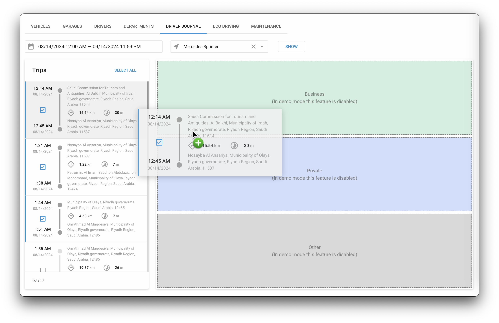

# Registro do motorista

## Visão geral

O **Registro do motorista** O recurso Navixy é uma ferramenta poderosa para o gerenciamento de frotas, oferecendo rastreamento e classificação detalhados das viagens dos veículos.

Esse recurso permite que os gerentes de frota monitorem e classifiquem as viagens, fornecendo informações valiosas sobre o uso do veículo, as finalidades da viagem e o comportamento do motorista. Com a categorização precisa das viagens, as organizações podem melhorar a precisão dos relatórios, otimizar as operações da frota e garantir a conformidade com várias regulamentações. Isso permite identificar mais facilmente quando um dispositivo é usado para fins comerciais ou particulares.

## Como usar o diário do motorista

O recurso Diário do motorista está localizado no aplicativo Fleet Management. Para acessá-lo, navegue até a guia Diário do motorista.

### Seleção do status da viagem

O Diário do motorista permite que você atribua status às viagens para categorizá-las como viagens de negócios, particulares ou outros tipos de viagens. Essa categorização é crucial para as organizações que precisam diferenciar entre o uso de veículos relacionados ao trabalho e o uso pessoal.

Para atribuir um status às viagens, siga estas etapas:

1. **Selecione um intervalo de tempo de viagem:** Comece escolhendo o período de tempo específico que deseja analisar. Isso permite que você se concentre nas viagens que ocorreram dentro desse período.
2. **Selecione um veículo:** Escolha o objeto na lista suspensa. Essa seleção exibirá todas as viagens associadas a esse veículo específico dentro do intervalo de tempo escolhido.
3. **Exibir viagens:** Clique no botão **Mostrar** para gerar a lista de viagens para o veículo e o período de tempo selecionados.

### Atribuição de status a viagens

Quando as viagens forem exibidas, você poderá atribuir um status de duas maneiras:

1. **Atribuição de status de viagem única:** Você pode atribuir um status a uma viagem individual arrastando-a para a área de status apropriada no lado direito da tela. Por exemplo, arraste uma viagem para a área "Business" se ela estiver relacionada ao trabalho ou para "Private" se for uma viagem pessoal.
2. **Atribuição de status de viagens múltiplas:** Se você precisar atribuir o mesmo status a várias viagens de uma só vez, selecione as viagens marcando as caixas de seleção ao lado de cada viagem. Depois de selecionar as viagens, clique no botão **Adicionar ao diário** botão. Essa ação permitirá que você escolha o status desejado para todas as viagens selecionadas simultaneamente.

### Gerenciamento e revisão de dados de viagem

O Diário do motorista também oferece uma visualização resumida que exibe informações importantes sobre cada viagem, como a distância percorrida, a duração e os locais de início e fim. Esse resumo é crucial para os gerentes de frota que precisam analisar os padrões de uso do veículo e o comportamento do motorista.

Ao categorizar e gerenciar as viagens de forma eficaz, os gerentes de frota podem gerar relatórios precisos para fins fiscais, faturamento ou auditorias internas. A capacidade do Driver Journal de diferenciar entre viagens de negócios e particulares garante a conformidade com as políticas da empresa e os requisitos regulamentares.