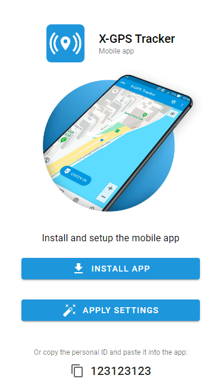

# Ativar o aplicativo rastreador X-GPS

O [Aplicativo X-GPS Tracker](https://x-gps.app) transforma um smartphone ou tablet em um rastreador GPS, fornecendo rastreamento em tempo real para a equipe de campo, como motoristas, entregadores, técnicos de serviço, trabalhadores da construção civil, representantes de vendas e muito mais. Utilizando uma combinação de sinais de navegação por satélite (GPS), GSM e redes Wi-Fi, o aplicativo determina com precisão a localização do proprietário do dispositivo, mantendo um baixo consumo de energia, dependendo das configurações.

Além disso, o aplicativo X-GPS Tracker permite que os funcionários de campo informem sua localização, status e conclusão de tarefas em tempo real. Ele permite que os usuários compartilhem suas localizações, façam upload de fotos e preencham formulários, facilitando para as empresas o acompanhamento do progresso de sua força de trabalho, o gerenciamento eficiente de tarefas e a garantia de que as operações de campo ocorram sem problemas.

A ativação do aplicativo X-GPS Tracker na plataforma Navixy envolve duas etapas gerais: convidar um funcionário e configurar o aplicativo no lado do funcionário.

## Etapa 1: Enviar um convite a um funcionário

Convide um funcionário para instalar o aplicativo X-GPS Tracker primeiro. Você pode fazer isso a partir da Navixy Web Interface ou do aplicativo X-GPS Monitor.

### **Usando a interface da Web da Navixy:**

1. Faça login na sua conta de usuário da Navixy
2. No menu à esquerda, clique no ícone "Activate Device" (Ativar dispositivo)
3. Selecione a opção "X-GPS Tracker".
4. Crie um rótulo para o dispositivo (por exemplo, "Driver John Smith")
5. Insira o número de telefone e/ou o endereço de e-mail de seu funcionário para o qual deseja enviar um convite

### **Usando o aplicativo X-GPS Monitor:**

Abra o aplicativo X-GPS Monitor em seu dispositivo móvel

1. Selecione "Activate Device" (Ativar dispositivo) no menu
2. Escolha a opção "X-GPS Tracker".
3. Insira as informações de contato para enviar o convite

## Etapa 2: Aceite o convite e configure o aplicativo

### Receber o convite

O funcionário receberá um convite por texto (SMS) ou e-mail, dependendo da configuração. O convite inclui:

- Um identificador pessoal de 12 dígitos
- Um link para baixar o aplicativo X-GPS Tracker

### Faça o download e instale o aplicativo

Peça ao seu funcionário para prosseguir com o convite, que também envolve o download do aplicativo X-GPS Tracker no dispositivo móvel do funcionário:

1. Visite o [App Store (iOS)](https://apps.apple.com/us/app/x-gps-tracker/id1612047534) ou [Google Play Store (Android)](https://play.google.com/store/apps/details?id=com.navixy.xgps.tracker)
2. Procure por "X-GPS Tracker" (não confunda com o X-GPS Monitor, que é outro aplicativo)
3. Faça o download e instale o aplicativo em seu dispositivo móvel

### Configurar o aplicativo

Ao iniciar o aplicativo, o funcionário precisará inserir o identificador de 12 dígitos do convite para concluir a configuração. Depois disso, são necessárias apenas mais algumas etapas para concluir a configuração:

1. No aplicativo X-GPS Tracker, inicie a função de rastreamento
2. Certifique-se de que o aplicativo tenha as permissões necessárias para acessar a localização do seu dispositivo

### Ajuda e suporte

Seguindo as etapas acima, você pode ativar e usar com sucesso o aplicativo X-GPS Tracker com a plataforma Navixy, permitindo que você rastreie e gerencie seu dispositivo móvel com eficiência. Se tiver algum problema, consulte o suporte técnico do seu provedor de serviços.

> [!INFO]
> Se o funcionário tiver problemas, peça que ele tente clicar na opção "Apply Settings" (Aplicar configurações) do e-mail.