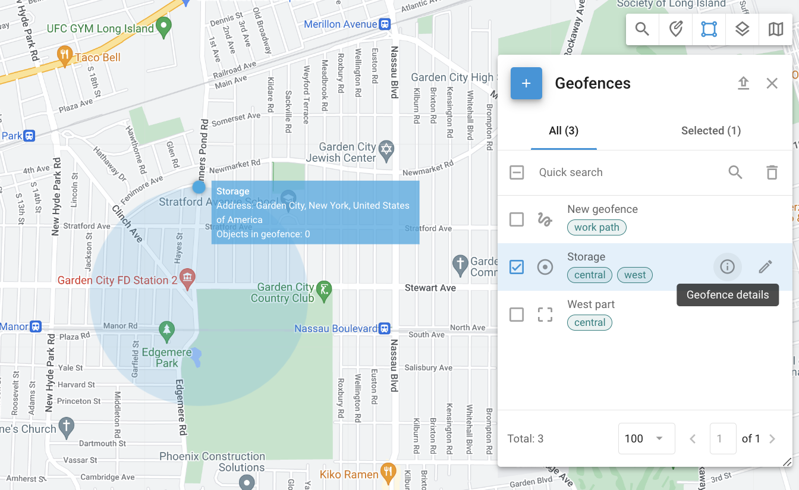

# Cercas geográficas

## Visão geral

As geofences são perímetros virtuais que permitem que o sistema monitore se um objeto cruzou a fronteira da geofence ("dentro" ou "fora"). Esses eventos são registrados, permitindo que os usuários gerem relatórios de geofence e [receber alertas](../../regras-e-notificacoes/monitoramento-de-movimento/entrada-ou-saida-de-geofence.md). As cercas geográficas também podem ser relacionadas a [regras para eventos](../../../guia-do-usuario/regras-e-notificacoes.md) em áreas específicas, como receber alertas de excesso de velocidade somente em uma cidade ou ao longo de uma rota.

### Exibir detalhes da cerca geográfica

Quando você pressiona o ícone "i" (informações) ao lado de uma geocerca, são exibidas informações detalhadas sobre a geocerca selecionada.

- **Tags**: As tags associadas à geocerca, como "central", ajudam a categorizar e organizar as geocercas para facilitar a identificação e o gerenciamento.
- **Localização**: A localização geográfica da geofence. Por exemplo: Condado de Queens, Nova York, Estados Unidos da América.
- **Objetos**: Uma lista de dispositivos dentro da geocerca.

### Objetos rastreados dentro de uma geocerca

Ao clicar com o botão esquerdo do mouse em uma geofence no mapa, os usuários podem visualizar o número de objetos rastreados dentro dela. Para acessar a ferramenta Geofences, clique no ícone Polygon (Polígono) na barra de ferramentas do mapa. Aqui, você pode criar, importar ou editar cercas geográficas e exibir as cercas geográficas desejadas no mapa marcando as caixas de seleção.

## Tipos de cercas geográficas

Há três tipos essenciais de cercas geográficas disponíveis:

### Geofence de círculo

Uma geofence circular é uma área geográfica com um determinado centro e uma forma circular com um raio mínimo de 50 metros. Os usuários podem definir o raio e o centro do círculo.

### Geofence poligonal

Uma geofence poligonal é uma área definida por um polígono arbitrário com vários vértices (até 500), o que permite a criação de formas complexas. Esse tipo de geofence é particularmente útil para definir com precisão áreas de formato irregular, como bairros, parques ou qualquer zona específica que não se encaixe em um limite circular simples.

### Geofence de rota

Uma cerca geográfica de rota cria um perímetro virtual entre dois ou mais pontos. Esse tipo de geofence é particularmente útil para monitorar [aderência às rotas planejadas](../../regras-e-notificacoes/programacao-e-despacho/desvio-da-rota.md) e garantir que os veículos não se desviem do caminho pretendido. A geocerca de rota é definida por uma série de pontos que criam uma rota contínua, com um raio especificado que determina o desvio permitido do caminho.

## Como criar uma cerca geográfica

1. Localize a área desejada no mapa usando a ferramenta "Address search".
2. Escolha a ferramenta "Geofences" clicando no botão **Quadrado** no canto superior direito do mapa.
3. Clique no botão "Add geofence" (Adicionar cerca geográfica) e selecione o tipo de cerca geográfica.
4. Desenhe a cerca geográfica no mapa:
  - **Círculo**: Mova o círculo com o mouse, pressionando o centro. Altere o tamanho arrastando a borda.
  - **Polígono**: Comece com um pentágono e ajuste-o arrastando os vértices ou adicionando novos vértices.
  - **Rota**: Selecione os pontos inicial e final. O sistema criará a rota. Adicione mais pontos arrastando a rota e ajuste o tamanho da vizinhança.
5. Especifique o nome da cerca geográfica e salve-a. As cercas geográficas criadas podem ser editadas ou excluídas.

Criação de uma cerca geográfica de corredor

Siga estas etapas para criar uma cerca geográfica de corredor:

1. **Abra as configurações de Geofence** na interface da Web de rastreamento.
2. **Selecione a opção "New geofence" (Nova cerca geográfica)** para começar a criar uma nova geofence de rota.
3. **Dê um nome à sua geofence** e adicione tags relevantes para facilitar a identificação.
4. **Definir o raio** da rota. Esse raio determina a distância que um veículo ou ativo pode se desviar do caminho antes que um desvio de rota seja detectado.
5. **Definir os pontos de rota**: Adicione o ponto de partida, vários pontos intermediários e o ponto final da rota. Cada ponto é definido por suas coordenadas geográficas.
6. **Modo manual**: Se necessário, é possível ajustar os pontos manualmente para obter um controle preciso do caminho da rota.

Criação de cercas geográficas poligonais

Para criar uma cerca geográfica poligonal:

1. Localize a área desejada no mapa.
2. Escolha a ferramenta "Geofences" clicando no ícone de quadrado no canto superior direito do mapa.
3. Clique no botão "Add geofence" (Adicionar cerca geográfica) e selecione "Polygon" (Polígono) como o tipo de cerca geográfica.
4. Inicialmente, a cerca geográfica aparecerá como um pentágono. Ajuste a forma arrastando os vértices ou adicionando novos vértices para ajustar a área desejada.
5. Dê um nome à sua cerca geográfica e salve-a. Você pode editar ou excluir as cercas geográficas criadas conforme necessário.

## Editar detalhes da cerca geográfica

Para localizar a funcionalidade de edição, clique no ícone de lápis ao lado da geocerca que deseja editar na ferramenta Geofences. Ao editar uma geofence, você pode personalizar vários elementos para aprimorar a organização e o monitoramento:

- **Etiqueta de geofence**: Atribua ou edite o nome da cerca geográfica para facilitar a identificação.
- **Tags**: Adicione ou modifique tags para categorizar e organizar cercas geográficas. Tags como "central" e "oeste" ajudam a classificar e gerenciar várias cercas geográficas.
- **Cor**: Altere a cor da cerca geográfica para melhor visualização no mapa. Isso é particularmente útil ao gerenciar várias cercas geográficas, pois cores diferentes podem diferenciar rapidamente as várias zonas. A ferramenta de seleção de cores permite escolher uma cor específica e visualizar seu código HEX.

## Importação de cercas geográficas

Quando você precisa adicionar um grande número de cercas geográficas, é mais rápido importá-las de um arquivo em vez de criá-las manualmente. Você pode importar cercas geográficas de arquivos Excel ou KML.

### Importação de cercas geográficas circulares do Excel

1. Escolha a ferramenta "Geofences".
2. Pressione o botão "Circle geofences import" (Importar cercas geográficas de círculo).
3. Faça o download do exemplo de arquivo fornecido.
4. Adicione informações sobre suas cercas geográficas ao arquivo, conforme especificado no exemplo.
5. Faça o upload do arquivo editado para o serviço de monitoramento.
6. Se seu arquivo tiver cabeçalhos, ative a opção "Use headers from file" (Usar cabeçalhos do arquivo).
7. Verifique os campos do cabeçalho e clique em Next.
8. Verifique os registros e clique em Proceed (Continuar).
9. Quando a importação for concluída, as novas cercas geográficas aparecerão na lista.

### Importação de cercas geográficas poligonais do KML

1. Escolha a ferramenta "Geofences".
2. Pressione o botão "Geofences import from KML" (Importação de cercas geográficas do KML).
3. Clique no botão "Browse" (Procurar) para selecionar o arquivo KML necessário em seu computador.
4. Altere o raio padrão, se necessário.
5. Clique em "Upload".
6. Quando a importação for concluída, as novas cercas geográficas aparecerão na lista. Observe que o raio padrão é usado apenas para cercas geográficas de rota. Para outros tipos, essa etapa pode ser ignorada.

> [!INFO]
> Recomendamos utilizar o Google Earth e exportar suas cercas geográficas para um arquivo KML. Observe que há um limite de 500 pontos por geofence.