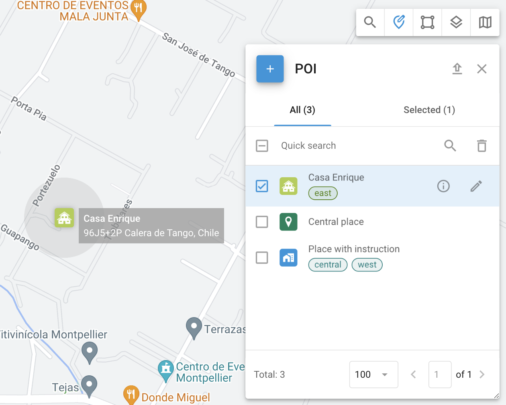

# Locais (POIs)

## Visão geral

Os locais, também conhecidos como pontos de interesse (POI), são um recurso essencial do gerenciamento de frotas e do rastreamento de ativos por GPS. As organizações podem criar uma lista detalhada de Locais, incluindo locais importantes, como escritórios e depósitos, bem como vários locais cruciais para as operações de logística. Os locais melhoram a eficiência operacional otimizando o planejamento de rotas e simplificando as atribuições de tarefas para os funcionários de campo.

### Usos práticos dos locais

- **Encontrar locais:** Localize rapidamente os objetos digitando o nome do local ou a etiqueta.
- **Criação de rotas e cercas geográficas:** Use o Places para estabelecer rotas e desenhar cercas geográficas.
- **Atribuição de tarefas:** Simplifique a atribuição de tarefas usando nomes de locais em vez de endereços completos.

## Criação e edição de locais

Para acessar a ferramenta Local, clique no ícone POI na barra de ferramentas no lado superior direito do mapa.

### Criar locais

Ao criar ou editar um Local, você pode especificar os seguintes detalhes:

- **Label:** Atribua um nome para facilitar a identificação, como "Escritório" ou "Armazém".
- **Ícone:** Escolha em uma biblioteca de ícones ou carregue seus próprios ícones.
- **Endereço:** Digite o endereço manualmente ou selecione-o no mapa.
- **Raio:** Defina o raio do local para determinar sua área de influência.
- **Tags:** Adicione tags para melhorar a organização e facilitar a pesquisa.
- **Descrição:** Inclua qualquer informação adicional sobre o local.  

> [!INFO]
> Os campos de local podem ser ajustados no [Campos personalizados](../../conta/campos-personalizados.md) seção

### Ver detalhes do local

Ao clicar no ícone "i" ao lado de um local, você pode visualizar informações detalhadas.

### Editar locais

Para editar um local, clique no ícone de edição. Você pode personalizar os seguintes elementos:

## Importação de locais de um arquivo do Excel

Quando você precisar adicionar um grande número de Locais rapidamente, use a importação do arquivo Excel.

1. **Acesse a ferramenta Local:** Escolha a ferramenta "POI".
2. **Locais de importação:** Clique no botão "Import POI" (Importar POI).
3. **Faça o download do arquivo de exemplo:** Faça o download do exemplo de arquivo Excel fornecido.
4. **Preencha os detalhes:** Insira as informações conforme especificado no exemplo.
5. **Fazer upload de arquivo:** Salve o arquivo em seu computador e, em seguida, clique em "Select" (Selecionar) na janela Place Import (Local de importação) e localize o arquivo.
6. **Verificar dados:** Depois de clicar em "Next" (Avançar), verifique os nomes das colunas e corrija as incompatibilidades.
7. **Importação completa:** Verifique se todos os dados estão corretos e, em seguida, prossiga. Seus Locais aparecerão na lista.