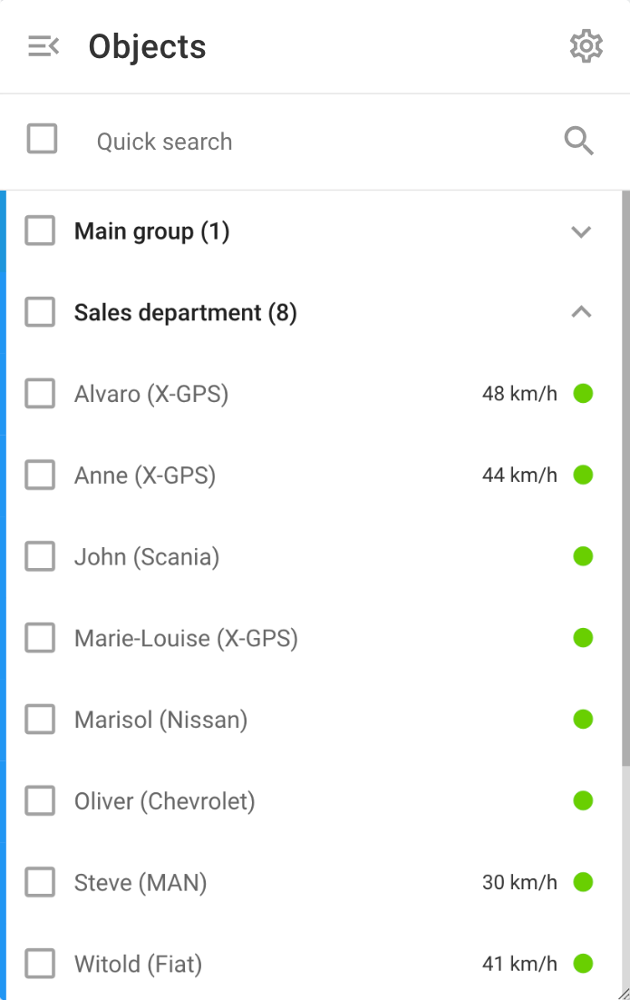

# Lista de objetos

A lista de Objetos na plataforma fornece uma visão geral de todos os ativos rastreados, permitindo que os usuários monitorem seus ativos com eficiência.

## Recursos da lista de objetos

- **Grupos:** Os objetos podem ser organizados em grupos para facilitar o gerenciamento. Essa organização pode representar a estrutura de sua empresa em termos de unidades de negócios regionais ou grupos de veículos especializados.
- **Pesquisa rápida:** Use a barra de pesquisa rápida para encontrar objetos específicos rapidamente, digitando seu nome ou outras informações de identificação, como [Tags](../conta/tags.md) ou o IMEI.
- **Visibilidade do objeto:** Os proprietários podem ver todos os objetos da organização da conta. Um usuário da equipe da organização pode ver apenas os objetos que criou pessoalmente ou que não foram criados. [aqueles atribuídos pelo proprietário](../conta/usuarios-e-funcoes/acesso-restrito.md).

### **Objetos na lista**

- **Etiqueta do objeto:** Cada objeto deve ser etiquetado para facilitar a identificação, mostrando o nome do objeto e qualquer outra informação relevante.
- **Indicadores de status:** O ponto no lado direito da lista de objetos mostra o status do dispositivo. Para obter mais informações, consulte [aqui](lista-de-objetos/estado-da-conexao.md).
- **Detalhes do objeto:**
  - **Clicar em um objeto** focaliza o mapa no objeto.
  - **Clicar no ícone de informações ("i")** ao lado de um objeto enquanto passa o mouse na Navixy Object List exibe uma visualização detalhada do objeto selecionado.
  - **Menu do botão direito do mouse ("⋮"):** fornece acesso rápido para compartilhar a localização do objeto, alterar seu ícone, abrir regras de alerta, acessar as configurações do dispositivo e visualizar relatórios relacionados ao objeto.

