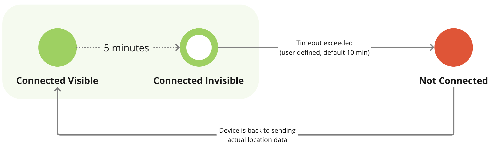

# Estado da conexão

Cada dispositivo GPS na plataforma tem um status que indica seu estado atual de conexão com o servidor. Esses status são codificados por cores e visíveis na seção [lista de objetos](../lista-de-objetos.md). Esse estado não significa necessariamente que o dispositivo está quebrado, é apenas uma visualização do tempo dos dados que a plataforma recebe de um dispositivo.

Os indicadores codificados por cores oferecem uma maneira rápida e fácil para os usuários avaliarem o status de seus dispositivos GPS em um piscar de olhos.

A tabela a seguir descreve os possíveis status dos dispositivos GPS, fornecendo uma descrição de cada status e o que ele significa sobre a conexão e a atividade do dispositivo. Essas informações ajudam os usuários a entender a condição em tempo real de seus dispositivos, identificar quaisquer problemas e tomar as medidas adequadas para garantir o desempenho ideal.

| Status | Descrição |
| --- | --- |
| Dispositivos ativados |     |
|  | **Online**   O dispositivo GPS do objeto está conectado e tem informado as coordenadas conforme o esperado. |
|  | **GPS não atualizado**  O dispositivo GPS do objeto está conectado ao servidor, mas não transmitiu nenhum dado ou coordenada por pelo menos 5 minutos. Os possíveis motivos incluem:  - A última atualização do GPS foi há mais de 5 minutos - Os dados recebidos da memória do dispositivo têm registros de data e hora desatualizados - Perda de sinal de GPS (por exemplo, sob um telhado, em um túnel, em um estacionamento subterrâneo) - Dispositivo em modo de economia de energia ou de suspensão, enviando as últimas coordenadas conhecidas ou pacotes de pulsação - A configuração do fuso horário do dispositivo é diferente de UTC+0 |
|  | **Off-line**  O dispositivo de GPS do objeto não enviou nenhuma informação para a plataforma, pois o [tempo especificado pelo usuário](../../dispositivos-e-configuracoes/widget-de-estado-da-conexao.md) (o padrão é 10 minutos). Os possíveis motivos incluem:  - Sinal de celular fraco - Dispositivo em modo de suspensão profunda - Roaming não ativado no cartão SIM - Limite de dados do SIM ou saldo do cartão SIM esgotado - O dispositivo não está mais apontando para a plataforma |
|  | **Suspenso**  Durante o período de suspensão, nenhum dado do dispositivo é aceito pela plataforma, e os dados desse período não estarão disponíveis mesmo após o término da suspensão. Para retomar o serviço, recarregue seu saldo ou entre em contato com o suporte. O dispositivo será automaticamente desbloqueado em até 15 minutos após o pagamento. |
| **Dispositivos adicionados, mas ainda não ativados** |     |
|  | **Ativando agora**  O dispositivo GPS foi adicionado recentemente. Esse status será exibido até que a ativação termine, o que normalmente leva de 2 a 3 minutos (exceção: para o aplicativo móvel X-GPS Tracker, esse status se estende indefinidamente). |
|  | **A ativação demora mais do que o esperado**  O dispositivo GPS foi adicionado, mas nenhuma conexão foi estabelecida com a plataforma até o momento. Podem ser necessárias ações adicionais. Consulte os artigos sobre problemas de ativação para solucionar o problema. |
|  | **Necessidade de configuração manual**  O dispositivo GPS requer [configuração manual](https://squaregps.atlassian.net/wiki/spaces/USERDOCSOLD/pages/2909016770/Manual+device+activation) pois não é compatível com [ativação automática](../../inicio-rapido/ativar-o-dispositivo-gps.md). Siga as instruções de configuração do dispositivo ou entre em contato com a equipe de suporte do seu provedor de serviços para obter assistência.  Dicas:  - O endereço e a porta do servidor são fornecidos nas informações detalhadas ("i") e também são fornecidos no [Site da Navixy](https://navixy.com/device) - Defina o fuso horário do dispositivo como UTC+0h para o processamento correto do registro de data e hora dos dados. |
|  | **Nenhum dado recebido do dispositivo**   A plataforma não recebeu nenhum dado do dispositivo GPS depois que ele foi ativado ou depois de substituir um dispositivo com defeito. |

## Sequência de estados de conexão

O diagrama abaixo ilustra a sequência de status de conexão para um dispositivo GPS ativado com sucesso na plataforma, mostrando as transições entre diferentes estados com base nos dados recebidos e no tempo decorrido.

Aqui está a explicação detalhada:

- Inicialmente, o dispositivo é **Online**O status do GPS, indicado por um círculo verde, significa que ele está conectado ao servidor e transmitindo coordenadas de GPS e registro de data e hora válidos. Se nenhuma nova coordenada ou dado de GPS for recebido por 5 minutos, o status mudará para **GPS não atualizado**representado por um círculo verde com um furo. Isso pode ocorrer se o dispositivo perder o sinal de GPS, entrar no modo de economia de energia ou enviar dados desatualizados de sua memória.
- Se o período de tempo limite da conexão (conforme definido por um usuário ou 10 minutos por padrão) for atingido sem o recebimento de novos dados, o status será alterado para **Off-line**mostrado como um círculo vermelho. Isso pode ocorrer se o dispositivo estiver em uma área com sinal de celular ruim, no modo de suspensão profunda ou tiver problemas como problemas no cartão SIM ou tiver atingido o limite de dados do SIM.
- Quando o dispositivo voltar a enviar coordenadas de GPS e carimbo de data/hora válidos, o status será revertido para **Online** e o ciclo se repete enquanto o dispositivo estiver funcionando, fazendo a transição entre os status com base nos dados recebidos e no tempo decorrido.

Essa sequência ajuda os usuários a monitorar a conectividade em tempo real e o status da transmissão de dados de seus dispositivos GPS, garantindo que medidas oportunas possam ser tomadas caso surja algum problema.