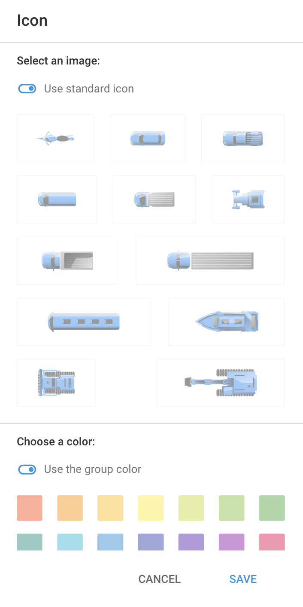

# Ícones de objetos

Os ícones associados a cada objeto fornecem dicas visuais importantes sobre o estado atual do objeto, como em movimento, parado ou estacionado.

Além dos ícones padrão, você também pode escolher entre nossa seleção de ícones. Esses ícones são particularmente úteis ao gerenciar muitos objetos, pois aprimoram a identificação visual e a organização, permitindo que você diferencie rapidamente os objetos e ainda monitore com eficiência seus status.

## Ícones padrão

Dependendo do estado atual do objeto (em movimento, parado, estacionado), seu ícone no mapa mudará de acordo. A transição de um status para outro está intimamente relacionada à função ***"Detecção de estacionamento"*** configurações do dispositivo GPS associado ao objeto.

Abaixo estão os diferentes ícones e seus significados:

| **Ícone** | **Status de movimentação e descrição** |
| --- | --- |
|  | **Em movimento**   O rastreador está em movimento e a viagem está sendo registrada. |
|  | **Parado (ainda não estacionado)**   O rastreador parou, sua velocidade é zero, mas a viagem ainda não foi concluída. |
|  | **Estacionado**   A viagem terminou e o rastreador está estacionado. |
|  | **Localização aproximada (sem sinais de GPS)**, **usando LBS)**   Não há sinal de GPS, e a localização é determinada por estações de base de celular e/ou pontos de acesso Wi-Fi. Não há trilhas, estacionamento ou paradas registradas nesse status devido à baixa precisão das coordenadas. |

## Ícones selecionados

A escolha do ícone pode melhorar a identificação visual, permitindo a rápida diferenciação entre vários objetos no mapa, e aprimorar a organização por meio de ícones específicos para diferentes tipos de ativos. Eles também facilitam o monitoramento eficiente, permitindo o reconhecimento imediato do tipo de um objeto, o que leva a uma tomada de decisão e a tempos de resposta mais rápidos.

Para alterar o ícone de um objeto na plataforma Navixy, siga estas etapas:

1. **Navegue até a Lista de objetos:** Abra a seção "Objetos" no menu principal.
2. **Clique com o botão direito do mouse no objeto desejado:** Localize o objeto para o qual você deseja alterar o ícone. Clique com o botão direito do mouse no nome do objeto para abrir o menu de contexto.
3. **Selecione "Change Icon" (Alterar ícone):** No menu do botão direito do mouse, selecione a opção "Change icon" (Alterar ícone). Isso abrirá a caixa de diálogo de seleção de ícones.

4. **Escolha um novo ícone:** Na caixa de diálogo de seleção de ícones, escolha um novo ícone entre as opções disponíveis. Confirme sua seleção para aplicar o novo ícone ao objeto.

Se você optar por usar um de nossos ícones selecionados, o estado do objeto será exibido ao lado do rótulo do objeto.

