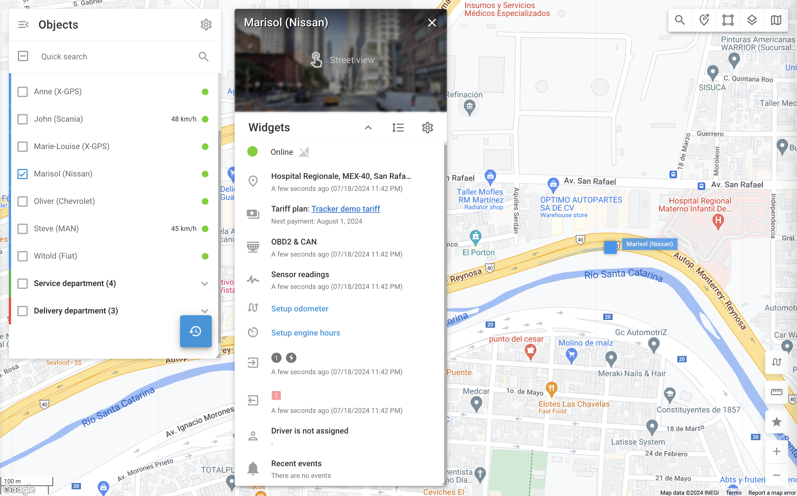

# Visualização detalhada do objeto

A visualização detalhada do objeto oferece uma visão aprofundada dos seus ativos, permitindo melhor monitoramento e gerenciamento. Ao oferecer informações abrangentes, como localização, status, dados do sensor e atividades recentes, esse recurso permite que você tome decisões informadas e responda rapidamente a qualquer problema.

Para acessar a exibição detalhada de um objeto específico, clique duas vezes no objeto na lista ou passe o mouse sobre ele e clique no botão exibido 

 ícone.

Abaixo está uma explicação dos vários componentes disponíveis na visualização detalhada do objeto.

- **Cabeçalho:** Nome do objeto e uma opção de Street View, quando disponível.
- **Widgets que exibem dados telemáticos de GPS e veículos** - As informações disponíveis dependem da funcionalidade e da configuração do dispositivo GPS/sensor:
  - [Status da conexão](estado-da-conexao.md): Indica a conectividade do dispositivo com a plataforma
  - Informações de localização: Mostra a última localização conhecida com um endereço (ou coordenadas GPS) e registro de data e hora
  - Plano: Exibe o plano atual do dispositivo e a próxima data de pagamento
  - Dados OBD2 e CAN: Mostra os dados mais recentes recebidos do sistema de diagnóstico a bordo do veículo e do barramento CAN, se configurado.
  - Leituras do sensor: Exibe as leituras recentes do sensor e seus registros de data e hora
  - Odômetro: Permite que os usuários visualizem e corrijam os dados do odômetro
  - Horas do motor: Permite que os usuários visualizem e corrijam os dados de horas do motor
  - Entradas: Indica o estado da ignição e de outros sensores (por exemplo, o sensor da porta do veículo)
  - Saídas: Permite controlar dispositivos conectados a um rastreador GPS (por exemplo, imobilizador remoto de veículos)
- **Widgets que apresentam informações adicionais sobre o objeto** - dependendo de sua configuração:
  - Atribuição de driver: Indica se um driver está atribuído ao objeto
  - Eventos recentes: Lista todos os alertas recentes relacionados ao objeto