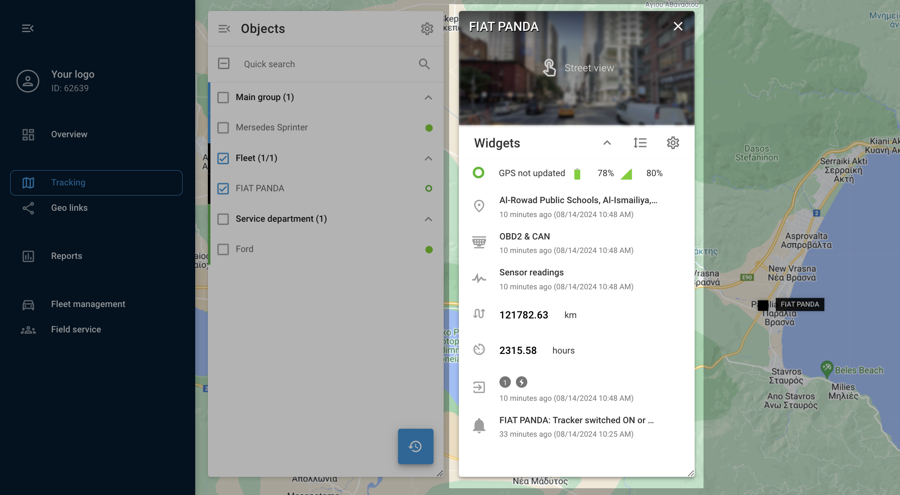

# Widget de objeto

Na plataforma Navixy, o widget de objeto é um hub que fornece informações detalhadas e ferramentas para gerenciar objetos e os dispositivos e sensores GPS associados.

Para acessar esse painel, basta pressionar o botão "info" ou clicar duas vezes em um dispositivo no painel [Lista de objetos](/wiki/pages/createpage.action?spaceKey=USERDOCSOLD&title=Object%20list). Uma vez aberto, o painel exibe dados abrangentes sobre o objeto selecionado, incluindo status atual, localização GPS e dados de telemetria. Além disso, ele oferece várias ferramentas de gerenciamento operacional, dependendo do dispositivo, todas convenientemente localizadas em um único lugar.

## Personalização de widgets

A lista de widgets no painel de controle do dispositivo é altamente personalizável para atender às suas necessidades. Você pode expandir ou recolher facilmente todos os widgets para obter uma visualização abrangente ou compacta. Para fazer isso, use o botão "Show all" (Mostrar tudo) para expandir todos os widgets e o botão "Hide all" (Ocultar tudo) para recolhê-los. Você pode personalizar quais widgets são exibidos clicando no ícone de engrenagem e desmarcando as caixas ao lado dos widgets que deseja ocultar. Se preferir uma ordem diferente para seus widgets, clique no botão "Change order" (Alterar ordem) ao lado da engrenagem para arrastá-los e reorganizá-los como achar melhor.

Widgets - visualização detalhada (exemplo)

### Explicação dos principais widgets

- **Status do dispositivo**: Exibe detalhes importantes, como o modelo do dispositivo, ID, status da conexão, status de movimento, nível da bateria, intensidade do sinal GSM e muito mais. Esse widget também fornece informações sobre se o dispositivo está em modo de roaming.
- **Localização**: Fornece informações detalhadas sobre a localização atual do rastreador, incluindo o endereço, a latitude, a longitude, a velocidade e a altitude.
- **OBD2 E CAN**: Se o rastreador estiver conectado ao barramento CAN ou ao conector OBD2 do veículo e os sensores forem criados, esse widget exibirá dados como nível de combustível, velocidade do motor, temperatura do líquido de arrefecimento e códigos de problemas de diagnóstico (DTC).
- **Leituras do sensor**: Se os sensores estiverem integrados, isso mostrará dados de sensores configurados nas configurações do dispositivo, como temperatura ou níveis de combustível. Esse widget também permite marcar os sensores favoritos para acesso rápido.
- **Odômetro**: Exibe a quilometragem do dispositivo. Você pode ajustar manualmente a quilometragem clicando no botão "Edit" (Editar).
- **Horas do motor**: Mostra o tempo total de funcionamento do motor. Assim como o odômetro, as horas do motor podem ser ajustadas clicando no botão "Edit" (Editar).
- **Entradas e saídas**: Exibe o estado dos sensores conectados e permite que você controle as saídas, como a ignição, enviando comandos diretamente do widget.
- **Motorista**: Fornece informações sobre o driver atribuído e permite que você altere o driver diretamente no widget.
- **Status de trabalho**: Exibe e permite alterações no status atribuído do dispositivo, como "In Transit" (Em trânsito) ou "Idle" (Ocioso).
- **Eventos recentes**: Mostra alertas recentes e permite que você oculte eventos específicos da exibição.
- **Cadeado eletrônico**: Para dispositivos com um recurso de bloqueio inteligente, esse widget permite gerenciar o estado do bloqueio, inclusive bloquear ou desbloquear remotamente o dispositivo.

Ao usar esses widgets, você pode personalizar e controlar totalmente a forma como interage com os dispositivos GPS, garantindo que todos os dados e controles relevantes estejam ao seu alcance. Esse nível de personalização e acessibilidade ajuda a gerenciar sua frota de forma mais eficaz e com maior precisão.