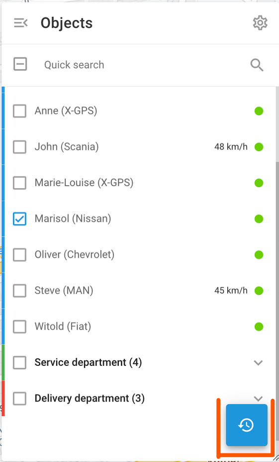

# Histórico da viagem

O histórico de viagens na Navixy permite que você revise as atividades e rotas passadas realizadas pelos veículos da sua frota. Esse recurso fornece um registro detalhado das viagens, incluindo registros de data e hora, locais, distâncias e duração, ajudando-o a monitorar a atividade do veículo e otimizar o gerenciamento da frota.

Para visualizar o histórico de viagens na Navixy, selecione os objetos de seu interesse e clique no botão de histórico. Você será solicitado a escolher um intervalo de data e hora. Selecione o intervalo de datas desejado para prosseguir.

## História resumida das viagens

Depois de selecionar um intervalo de datas, a visualização do Histórico exibe um resumo das viagens e eventos para os objetos escolhidos. Cada registro de viagem inclui detalhes importantes:

- **Carimbo de data/hora**: Mostra a hora de início da viagem.
- **Distância percorrida**: Indica a distância total percorrida durante a viagem.
- **Duração**: Exibe o tempo total da viagem.

Usando o histórico resumido, você pode obter rapidamente uma visão geral da atividade e do histórico de viagens de sua frota para o período selecionado.

## Histórico detalhado das viagens

Ao clicar em um registro de viagem na visualização resumida do histórico de viagem, você verá uma análise detalhada da viagem. Isso inclui:

- **Horários de início e término**: Os horários exatos em que a viagem começou e terminou.
- **Distância percorrida**: A distância total percorrida durante a viagem.
- **Duração**: O tempo total gasto na viagem.
- **Paradas**: Informações detalhadas sobre cada parada, incluindo o local e a duração da parada.

Cada segmento da viagem é listado com endereços e registros de data e hora precisos, permitindo que você analise minuciosamente o movimento e as paradas de sua frota durante o período selecionado. Essa visão detalhada ajuda a monitorar a atividade do veículo, entender o comportamento do motorista e otimizar as rotas.

## Recursos de conveniência

| Recurso | Descrição |
| --- | --- |
| **Métodos de esquema de cores** | Você pode escolher diferentes esquemas de cores para visualizar os dados da viagem:  - Colorir manualmente: Atribua cores manualmente a diferentes viagens. - Cores por trilhas: Codifique automaticamente as viagens por cores com base em suas trilhas. - Cor por status: Diferencie as viagens por seu status, como em movimento ou paradas. - Cor por velocidade: Visualize as viagens com base nas variações de velocidade. |
| **Alterar a cor do segmento de viagem** | Personalize a cor de segmentos de viagem específicos para destacar determinadas seções para uma melhor análise visual. |
| **Animar a reprodução da viagem** | Use o botão de reprodução para animar viagens no mapa, mostrando o movimento do objeto ao longo do tempo. Ajuste a velocidade de reprodução com opções como x1, x3, x10, x30, x100 e x300. Esse recurso é útil para entender os padrões e as durações das viagens. |
| **Download de viagens como arquivo KML** | Faça o download dos dados de viagem como arquivos KML para uso em outros aplicativos GIS, permitindo análises e compartilhamentos adicionais. |
| **Imprimir viagens selecionadas** | Imprima relatórios de viagem detalhados diretamente da interface para documentação ou compartilhamento com os membros da equipe. |
| **Alternar entre a exibição reduzida e a detalhada** | Alterne entre uma visualização resumida e uma visualização expandida detalhada das viagens para ver mais ou menos informações, conforme necessário. |
| **Definir a largura da trilha** | Ajuste a largura das trilhas exibidas no mapa. Isso é útil em aplicativos como agricultura para visualizar com mais clareza a cobertura do campo por trilhas de trator. |
| **Outras configurações de visualização** | As configurações adicionais incluem a exibição de paradas, dados LBS, agrupamento de pontos de dados para maior clareza, uso de filtros inteligentes para reduzir o ruído e divisão de viagens por paradas para análise detalhada. |

## Tipos de trilha

Há diferentes tipos de rastreamento, dependendo da tecnologia usada para determinar os locais e o modo de rastreamento definido na configuração do dispositivo.

- **Trilhas contínuas**: Esses são os rastros mais comuns, normalmente usados em aplicativos de rastreamento de veículos. Elas são representadas como polilinhas com pontos de início e fim bem definidos.
- **Faixas de intervalo**: Para rastreadores GPS autônomos, a localização é frequentemente atualizada em intervalos relativamente longos, como uma vez por hora ou uma vez por dia. Esses rastros são mostrados como pontos de referência numerados (1, 2... N). Para ajudar na visualização, eles são conectados com linhas cinzas transparentes, que podem não representar com precisão o caminho real.
- **Locais de LBS**: Quando os dados de localização são determinados usando tecnologias LBS alternativas, como sinais GSM ou Wi-Fi, pode haver falta de precisão. Esses locais são visualizados com círculos, em que o raio indica a precisão.
- **Pontos de referência agrupados**: Quando um ativo permanece no mesmo local por um longo período, várias mensagens de intervalo ou de LBS podem bagunçar o mapa. Para melhorar a legibilidade, o servidor consolida essas mensagens em um único marco agrupado, mostrando apenas um ponto no mapa. A hora de início/fim e a duração serão adicionadas à nota desse ponto de referência.