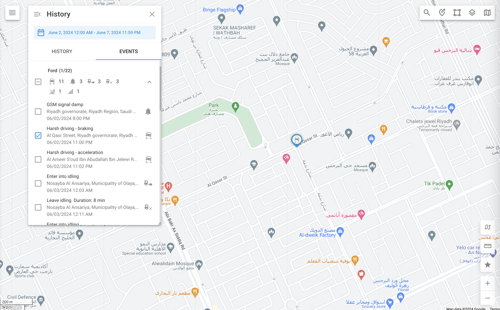

# Histórico de eventos

A guia Event (Evento) na exibição History (Histórico) fornece um registro detalhado de todos os eventos relacionados aos objetos selecionados durante um período especificado. Esses eventos variam de acordo com o tipo de rastreador e as atividades monitoradas, oferecendo uma visão abrangente do status operacional da sua frota e de quaisquer problemas com os ativos rastreados.

Para visualizar o histórico de eventos de um dispositivo específico, selecione os objetos que deseja revisar e clique no botão de histórico (a seta circular na parte inferior direita da lista de objetos). Você será solicitado a selecionar um intervalo de data e hora. Depois de escolher o intervalo desejado, vá para a caixa de diálogo Histórico e selecione o botão **"Eventos"** guia.

Para visualizar eventos de todos os dispositivos, clique na guia Alertas na barra lateral:

## Lista de eventos

A lista de eventos exibe uma sequência cronológica de eventos para cada objeto. Cada entrada inclui:

- **Notificação de evento**: A mensagem de notificação criada nas configurações de Alerta. Ela deve fornecer detalhes sobre o evento específico.
- **Carimbo de data/hora**: A data e a hora em que o evento ocorreu.
- **Localização**: Onde o evento ocorreu, se aplicável.
- **Detalhes do evento:** Outras informações, dependendo do tipo de evento monitorado, como um limite de temperatura.

## Tipos de eventos

Os tipos de eventos exibidos são determinados pelos eventos que estão sendo monitorados. A Navixy pode detectar e registrar uma ampla gama de eventos, desde notificações básicas de movimento e parada até alertas de sensores mais complexos e lembretes de manutenção. Para obter mais detalhes sobre a configuração e o gerenciamento desses eventos, consulte a seção [Regras e notificações](../../../guia-do-usuario/regras-e-notificacoes.md) seção.

## Ações com eventos

- **Revisar os detalhes do evento**: Percorra a lista de eventos para revisar informações detalhadas sobre cada evento.
- **Filtrar eventos**: Aplique filtros para restringir os tipos de eventos ou se concentrar em objetos específicos.