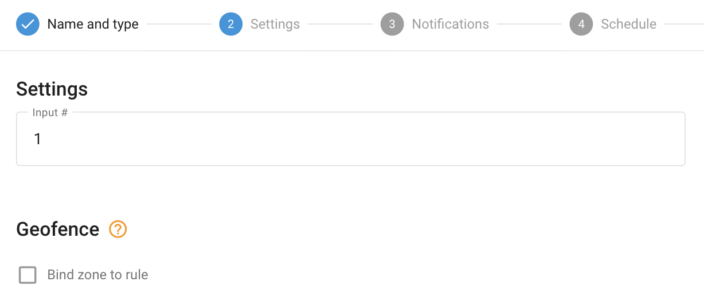

# Acionamento de entrada

O acionamento de entrada (ou alteração de entrada) refere-se a uma alteração no status de uma entrada em um dispositivo de rastreamento de veículos. Essa entrada pode ser conectada a vários sensores ou interruptores no veículo, como sensores de porta, status da ignição ou outros componentes do veículo. Quando a entrada muda de estado, por exemplo, de ligada para desligada ou vice-versa, o dispositivo GPS detecta essa mudança e pode acionar um evento ou notificação de acordo.

> [!INFO]
> O tipo de alteração de entrada da regra se aplica a entradas discretas que assumem duas posições lógicas (0 ou 1). Para entradas que indicam valores contínuos (por exemplo, entradas analógicas que mostram uma faixa de tensão), há um tipo de regra específico chamado Parâmetro na faixa.

## Visão geral

Muitos rastreadores GPS de veículos vêm equipados com entradas que podem ser conectadas a diferentes ferramentas, como um sensor de abertura do rastreador de carro, status da ignição ou um botão de emergência. Ao configurar o sistema adequadamente, os usuários podem receber notificações para acionamentos de entrada por meio da interface do usuário, notificações push, SMS ou e-mail.

A regra foi criada para monitorar entradas discretas específicas e notificar os usuários sempre que houver uma alteração em seu status. Essas entradas discretas só podem ter dois valores: 0 ou 1, daí o termo "discreto". A regra aguarda a transição do input especificado de verdadeiro (1) para falso (0), ou vice-versa, e gera notificações para cada alteração detectada.

Essa funcionalidade permite que os usuários se mantenham informados sobre o status das ferramentas ou dos sensores conectados, fornecendo atualizações em tempo real sobre vários eventos, por exemplo, a ativação de um botão SOS. A capacidade de receber notificações oportunas aprimora os recursos de monitoramento e facilita respostas rápidas a situações ou eventos críticos detectados por entradas discretas.

## Configurações de regras

#### Número de entrada

O campo de número de entrada especifica o número do hardware ou do hardware virtual da entrada que está sendo usada. Para determinar qual entrada corresponde a uma funcionalidade específica, consulte a documentação do fabricante do rastreador GPS. O número da entrada deve corresponder ao sensor discreto criado no widget "Device and Settings" → "Sensors and Buttons".

## Detalhes da operação do sistema

### Detalhes da operação do sistema

- **Reiniciar o cronômetro**: O alerta "Inputs change" tem um cronômetro de reinicialização de 10 segundos, garantindo que o alerta não seja acionado mais do que uma vez a cada 10 segundos. Se ocorrer um evento durante esse período de reinicialização, ele será omitido pela plataforma, inclusive nos relatórios.
- **Atribuições de vários rastreadores**: Vários rastreadores podem ser atribuídos a uma única regra. O número de entrada especificado nas configurações da regra é usado como fonte de dados para cada rastreador. Por exemplo, se a 2ª entrada for escolhida e vários rastreadores forem selecionados, a regra notificará o usuário sempre que qualquer um dos rastreadores selecionados enviar uma alteração em sua entrada nº 2.
- **Validade do evento**: Se a plataforma identificar um evento de entrada (1 verdadeiro/nível alto ou 0 falso/nível baixo) de um pacote de dados do rastreador sem coordenadas válidas, ela contará o evento como válido e o exibirá, independentemente de o evento ter ocorrido dentro ou fora das cercas geográficas delimitadas. A lógica dos botões de opção Inside/Outside é ignorada nesse caso, pois exibir um evento controverso mais uma vez é melhor do que omiti-lo.
- **Alertas seletivos**: Os usuários podem optar por receber alertas de acionamento de entrada somente para alterações específicas na entrada (por exemplo, de 1 para 0 ou de 0 para 1), desmarcando o texto da notificação para o respectivo campo para o qual não desejam receber alertas. Por exemplo, os usuários podem configurar alertas para receber notificações somente para alterações de "ON para OFF" e ignorar eventos de "OFF para ON".

