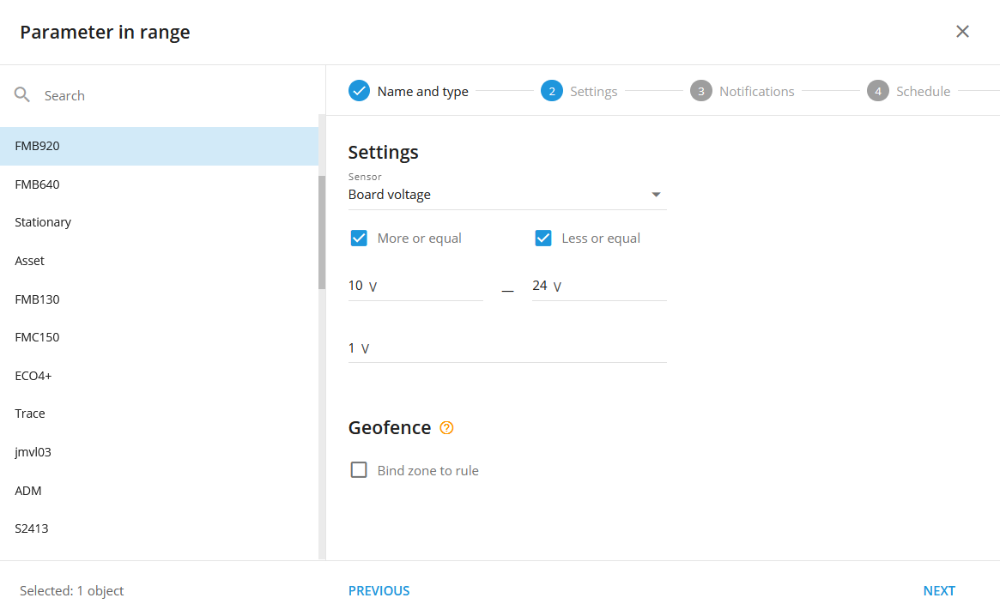

# Parâmetro no intervalo

## Descrição

Essa regra foi projetada especificamente para o uso de sensores de medição e tem a finalidade de gerar notificações quando os dados do sensor recebidos pela plataforma estiverem dentro ou fora do intervalo especificado. A regra monitora constantemente as leituras do sensor e dispara notificações sempre que os valores dos dados ultrapassam os limites definidos. Ao configurar essa regra, os usuários podem receber alertas em tempo real sobre as medições do sensor, o que lhes permite manter-se informados sobre quaisquer desvios ou alterações nos valores medidos. Esse recurso aprimora os recursos de monitoramento e permite respostas proativas com base nos dados do sensor, garantindo o gerenciamento e o controle eficientes dos parâmetros medidos. Por exemplo, se um usuário precisar monitorar a temperatura ou a tensão em uma faixa específica, a regra pode ajudar a definir a faixa e notificar o usuário sempre que as unidades ultrapassarem os limites especificados.

## Configurações

**Sensor:**

A fonte de dados para alertas. Só pode ser especificada uma única medição ou sensor virtual (somente para sensores virtuais com "Método de cálculo: Valor de origem"). Portanto, cada rastreador requer uma regra separada.

**Mais ou igual:**

O parâmetro descreve o limite inferior do intervalo.

**Menor ou igual:**

Esse parâmetro descreve o limite mais alto do intervalo.

**Limite de valor:**

- é um buffer que é adicionado ao "**Mais ou igual**" e "**Menor ou igual**" de ambos os lados de cada parâmetro. Esse valor ajuda a plataforma a distinguir entre **IN** e **SAÍDA** O sistema permite que o usuário tenha uma faixa mais ampla de estados, mesmo em casos de dados "soltos" (como ruído ou imprecisões do sensor). Ele faz isso criando um intervalo maior em torno dos pontos "10" e "24", permitindo maior tolerância e reduzindo o risco de alertas falsos. É difícil obter um sensor analógico que atinja o valor exato especificado e, ao mesmo tempo, as imprecisões acionam o evento com muita frequência. Pode haver dois casos de ocorrências de valores recebidos. O comportamento da plataforma dependerá da regra (evento) **estado** em um determinado momento. O evento tem dois estados:

1. **IN** alcance
2. **SAÍDA** alcance

Caso#1, Do **IN** para o **SAÍDA** Estado:

Sempre que o evento (a regra) estiver no **IN** esse estado só será alterado para o estado de **SAÍDA** quando o valor de entrada estiver fora do intervalo (#**4**), os buffers externos (#**3**).

Caso#2, Do **SAÍDA** para o **IN** Estado:

Sempre que o evento (a regra) estiver no **SAÍDA** esse estado só será alterado para o estado de **IN** quando o valor de entrada atinge **no intervalo** (#**1**), mas fora dos buffers internos (#**2**).

Se o parâmetro "Value threshold" não for especificado, ele se tornará igual a 0,03 (valor absoluto) por padrão. Portanto, como no exemplo acima, o espaço dos buffers seria de 9,97 a 10, de 10 a 10,03, de 23,97 a 24 e de 24 a 24,03.

**Geofence:**

Preencha a seção se a regra precisar funcionar apenas dentro/fora das cercas geográficas selecionadas.

**Vincular a zona à regra:**

Ativa a vinculação de regras de geofence.

**Botão do mapa:**

Mostra as cercas geográficas vinculadas no mapa.

**Sensor virtual como uma fonte para uma regra de parâmetro no intervalo:**

Os sensores virtuais permitem o controle de valores de campo de estado, enquanto os sensores de medição permitem apenas o controle de dados que não sejam de estado, como nível de combustível, tensão etc. Os usuários ainda podem selecionar uma entrada de dados não-estatais no sensor virtual e utilizá-la na regra.

No caso de um sensor virtual ser selecionado como fonte de dados, o usuário especifica o intervalo de acordo com o valor (original) da fonte do sensor virtual:

Isso pode ser útil se os usuários precisarem especificar uma fonte de campo de estado dentro de uma regra de intervalo de parâmetros. Digamos que haja um rastreador com um intervalo de código de evento de 1-100 e que seja necessário controlar os códigos de 20 a 30. Crie o parâmetro na regra de intervalo e especifique o código do evento como uma fonte para o sensor virtual:

> [!INFO]
> A notificação "Parameter in range" (Parâmetro no intervalo) pode conter um ou todos os valores especificados no intervalo da regra, mas não inclui traduções do sensor virtual. Por exemplo, se ocorrerem eventos com valores de 20 a 30, cada evento individual dentro desse intervalo acionará uma notificação separada de "Parâmetro no intervalo", independentemente de valores específicos estarem ausentes na tabela do sensor virtual mencionada acima.

Por exemplo, vamos considerar um caso de uma empresa de logística. A empresa envia vários caminhões em diversas rotas, e há uma seção crítica com possíveis problemas, como tráfego intenso ou acidentes. Para monitorar essa área de risco de forma eficaz, eles configuram uma regra de "Parâmetro no intervalo" com sensores virtuais usando o "código de evento" como fonte de dados. Eles definem um intervalo de 20 a 30 para eventos nessa seção específica da estrada. Sempre que um caminhão encontra um evento dentro desse intervalo crítico (20-30), ele recebe notificações. Isso permite ações rápidas para resolver possíveis problemas, garantindo segurança e eficiência em suas operações. Essa abordagem permite que eles se mantenham informados sobre eventos críticos que os sensores tradicionais não conseguiam abordar, aumentando o controle e a tomada de decisões.

> [!INFO]
> Se um usuário alterar o método de cálculo de um sensor virtual especificado como a fonte de dados em uma regra "Parameter in range" para qualquer método diferente de "Source value", a regra redefinirá sua fonte e deixará de funcionar.

## Notificações

**Notificação de emergência:**

é usado para eventos importantes. Uma mensagem na tela e o sinal sonoro só podem ser desativados clicando na notificação. Observe que alguns navegadores podem bloquear o som da notificação até que a atividade do usuário seja registrada na página.

**Notificações por push:**

Receba notificações push no aplicativo móvel e na interface da Web.

**Adicione o nome da cerca geográfica à notificação:**

Adiciona nomes das cercas geográficas especificadas ao texto da notificação. Essa opção está disponível somente quando o botão de rádio de vinculação de geocerca "Inside" é selecionado na guia "Settings" (Configurações).

**Notificações por SMS:**

Lista de destinatários para notificações por SMS quando o evento ocorrer.

**Notificações por e-mail:**

Lista de destinatários para notificações por e-mail quando o evento ocorrer.

## Cronograma

Defina uma programação para quando a regra será executada. Se a sua programação indicar que o evento não deve ser executado em algum dia ou período de tempo, ele não aparecerá como uma notificação na interface do usuário e as notificações por SMS ou e-mail não serão enviadas. Além disso, você pode escolher um modelo padrão para agendamento rápido.

## As especificações da plataforma:

- Sempre que a plataforma identifica um **IN** **alcance** ou um **SAÍDA** **alcance** de um pacote de dados do rastreador sem coordenadas válidas, a plataforma conta o evento como válido e o exibe, independentemente de o evento ter ocorrido dentro ou fora das cercas geográficas delimitadas. A lógica do **Interior/Exterior** Os botões de opção também são ignorados nesse caso. Esse comportamento se deve ao fato de que mostrar um evento controverso mais uma vez é melhor do que omiti-lo.
- A regra suporta apenas um dispositivo por regra. Isso se deve ao fato de que várias fontes diferentes de sensores de medição não podem ser cruzadas com vários rastreadores, tabelas de calibração e outros aspectos de medição e filtragem de dados.
- O alerta "Parameter in range" tem um cronômetro de redefinição de 10 segundos, o que significa que o evento de alerta não ocorrerá com mais frequência do que uma vez a cada 10 segundos. Se esse tipo de evento ocorrer durante o tempo em que a regra estiver aguardando a redefinição, esse evento será omitido pela plataforma, incluindo os relatórios.

## Relatórios de eventos

Para visualizar as datas em que os eventos foram recebidos, você pode criar o relatório "Relatório sobre todos os eventos".

Para obter uma representação gráfica do uso de um sensor de medição em um período de tempo, use o relatório "Measuring sensors" (Sensores de medição).