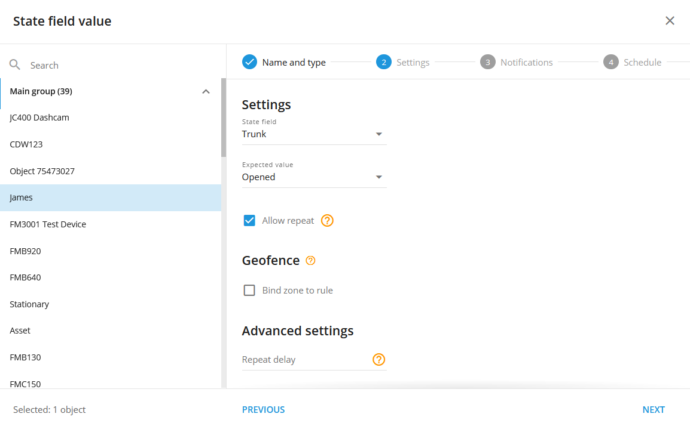
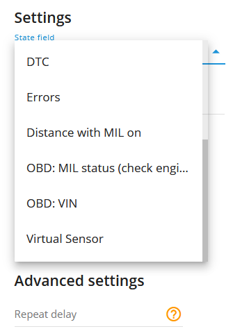
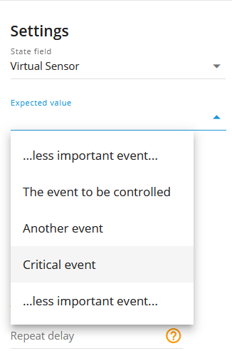
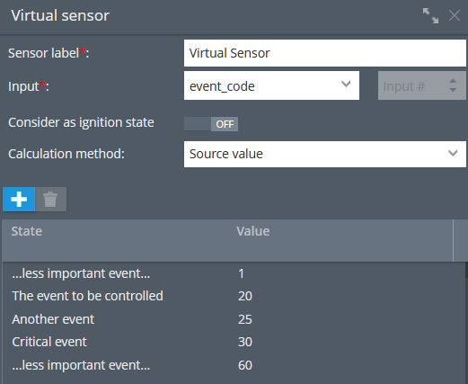

# Valor do campo de estado

## Descrição

O tipo de alerta "State field value" foi projetado para monitorar o status de vários estados de objetos, como portas, freio de mão, airbag, bem como estados de eventos especiais, como ADAS (Advanced Driver Assistance Systems), DTC (Diagnostic Trouble Codes) e erros. Quando a plataforma receber o valor esperado no campo de status para um determinado estado, o usuário receberá uma notificação.

Ao utilizar o alerta "State field value" (Valor do campo de estado), os usuários podem se manter informados sobre estados críticos de objetos e ocorrências de eventos em tempo real. Essa funcionalidade aprimora os processos de segurança, proteção e manutenção, garantindo que ações imediatas sejam tomadas quando estados ou eventos específicos forem detectados.

Os usuários podem gerar relatórios de eventos que resumem as ocorrências de estados ou eventos específicos durante um período definido. Por exemplo, eles podem analisar a frequência de aberturas de portas, instâncias de acionamento de airbag ou a ocorrência de ativações do ADAS. Esses relatórios ajudam a identificar padrões, tendências ou anomalias nos dados, facilitando o planejamento da manutenção, as avaliações de segurança e as melhorias operacionais.

# Configurações

Para uma configuração rápida da notificação de mudança de estado:

- Escolha o campo de estado necessário e defina um valor esperado para ele. Por exemplo, campo de estado = Tronco, valor esperado = Aberto.
- Não ative a opção "Allow repeat" (Permitir repetição) e deixe o campo "Repeat delay" (Repetir atraso) vazio. Nesse caso, você será notificado somente se o valor for alterado.

Para uma configuração rápida da notificação de alteração de evento:

- Escolha o campo de estado necessário e defina um valor esperado para ele. Por exemplo, campo de estado = event\_code, valor esperado = 7 (alarme de excesso de velocidade para dispositivos da Howen Technologies). Para cada código de evento, deve ser criada uma regra de campo de estado separada. Todos os valores esperados podem ser encontrados no site do fabricante do dispositivo ou podem ser obtidos diretamente com o fabricante por meio de uma solicitação à sua equipe de suporte.
- Ative a permissão de repetição para receber notificações para os mesmos valores e defina o atraso de repetição (com que frequência os mesmos valores de entrada acionarão a notificação de evento da regra). Por exemplo, se você quiser receber notificações de excesso de velocidade no máximo a cada 30 minutos, defina o atraso de repetição como 1800 segundos.

**Campo estadual:**

Aqui o usuário especifica o campo a ser monitorado. Em nosso exemplo, é o Tronco. Assim, quando o Tronco é Aberto, conforme definimos no seletor de valor esperado, a plataforma gera um evento de notificação. A caixa de seleção "Allow repeat" (Permitir repetição) também afeta o comportamento, mas essa configuração é descrita abaixo neste artigo.

**Valor esperado:**

Os campos de estado padrão (por exemplo, porta-malas, porta, cinto de segurança etc.) têm variantes de valor intuitivamente esperadas. Em geral, são Opened/Closed (Aberto/Fechado) ou Locked/Unlocked (Bloqueado/Desbloqueado). No entanto, se você quiser receber uma notificação de campo de estado sobre algumas ocorrências de eventos especiais, o usuário deverá saber qual código de evento seria enviado pelo dispositivo para que a plataforma saiba o que esperar no campo de entrada event\_code.

Por exemplo, uma chave de hardware tem um valor personalizado que a plataforma esperará e notificará o usuário depois que o valor A1DD3FC3452904D chegar ao campo hardware\_key.

**Permitir a repetição:**

Se não estiver selecionada, o evento será acionado repetidamente somente se houver outro valor de entrada recebido antes do valor esperado no momento E se o valor esperado for recebido, mas em um novo pacote de dados. Por exemplo, se a caixa de seleção estiver desmarcada, sempre que recebermos a chave de hardware do exemplo acima (A1DD3FC3452904D), a plataforma não acionará a notificação do evento até que um valor de chave de hardware diferente seja recebido E o valor esperado seja recebido novamente.

É assim que funciona a opção "Permitir repetição" se não estiver selecionada:

- 09:00 AM A última chave recebida A1DD3FC3452904D
- 09:15 AM A plataforma recebe um pacote de dados com o mesmo valor de hardware\_key (A1DD3FC3452904D). Nenhuma notificação é acionada
- 09:20 AM Chegou um novo valor de hardware\_key. Digamos, B99978233FDD1. Nenhuma notificação é gerada porque esse valor não é esperado. Mas o comutador interno está pronto agora para gerar uma notificação quando a chave A1DD3FC3452904D chegar.
- 09:30 AM A plataforma recebe um pacote de dados com o valor A1DD3FC3452904D hardware\_key. A notificação é acionada agora.

Em suma, as notificações serão geradas somente em caso de alteração, mas se o valor esperado chegar depois de outro valor.

Se a opção for selecionada, o cenário será:

- 09:00 AM A última chave recebida A1DD3FC3452904D
- 09:15 AM A plataforma recebeu um pacote de dados com o mesmo valor de hardware\_key (A1DD3FC3452904D). Dessa vez, a notificação é acionada.
- 09:25 AM A plataforma recebeu um pacote de dados com o mesmo valor de hardware\_key (A1DD3FC3452904D). A notificação é acionada novamente desta vez.
- 09:34 AM Chegou um novo valor de hardware\_key. Digamos, B99978233FDD1. Nenhuma notificação é acionada, pois a chave B99978233FDD1 não é a esperada.
- 09:45 AM A plataforma recebeu um pacote de dados com o valor esperado de hardware\_key (A1DD3FC3452904D). A notificação é acionada dessa vez.

Em resumo, se o valor esperado no campo de estado definido anteriormente chegar à plataforma, ela gerará o evento de notificação.

Observe que, se a opção "Allow Repeat" (Permitir repetição) estiver selecionada, o evento não ocorrerá mais vezes do que o temporizador "Repeat delay" (Atraso de repetição) permite. Para o tipo de regra do valor do campo de estado, o temporizador de reinicialização padrão é de 5 minutos e pode ser ajustado usando o campo "Repeat delay" (Atraso de repetição).

**Vincular a zona à regra:**

Ativa a vinculação de regras de geofence.

**Botão do mapa:**

Mostra as cercas geográficas vinculadas no mapa.

**Repetir o atraso:**

Define um cronômetro de redefinição personalizado em segundos para notificações de eventos. Por exemplo, se você quiser ser notificado no máximo uma vez a cada 30 minutos, defina o campo como 1800 (segundos).

**Trabalhando com sensores virtuais:**

A regra de campo de estado permite a seleção não apenas de campos de estado, mas também de sensores virtuais.  
Ao selecionar o sensor virtual apropriado e especificar o evento desejado na tabela de sensores virtuais, os usuários podem receber notificações e incluir o evento em relatórios. Isso permite que as empresas personalizem e controlem os eventos sobre os quais desejam ser informadas, adaptando o sistema de monitoramento às suas necessidades específicas. Essa flexibilidade aumenta a capacidade de rastrear e gerenciar eventos críticos ou personalizados, fornecendo insights valiosos e facilitando a tomada de decisões baseadas em dados para várias operações comerciais. Todos os eventos de valores esperados são personalizados e podem ser criados de acordo com as necessidades dos usuários. Para obter mais detalhes sobre o Virtual Sensors, consulte a seção [Sensores virtuais](https://www.navixy.com/docs/user/web-interface-docs/devices-doc/sensors-and-buttons/virtual-sensors/) artigo.

## Notificações

**Notificação de emergência:**

é usado para eventos importantes. Uma mensagem na tela e o sinal sonoro só podem ser desativados clicando na notificação. Observe que alguns navegadores podem bloquear o som da notificação até que a atividade do usuário seja registrada na página.

**Notificações por push:**

Receba notificações push no aplicativo móvel e na interface da Web.

**Adicione o nome da cerca geográfica à notificação:**

Adiciona nomes das cercas geográficas especificadas ao texto da notificação. Essa opção está disponível somente quando o botão de rádio de vinculação de geocerca "Inside" é selecionado na guia "Settings" (Configurações).

**Notificações por SMS:**

Lista de destinatários para notificações por SMS quando o evento ocorrer.

**Notificações por e-mail:**

Lista de destinatários para notificações por e-mail quando o evento ocorrer.

## Cronograma

Defina uma programação para quando a regra será executada. Se a sua programação indicar que o evento não deve ser executado em algum dia ou período de tempo, ele não aparecerá como uma notificação na interface do usuário e as notificações por SMS ou e-mail não serão enviadas. Além disso, você pode escolher um modelo padrão para agendamento rápido.

## As especificações da plataforma:

- O alerta "Campo de estado" tem um cronômetro de reinicialização de 5 minutos, o que significa que o evento de alerta não ocorrerá com mais frequência do que uma vez a cada 5 minutos. Se esse tipo de evento ocorrer durante o tempo em que a regra estiver aguardando a redefinição, esse evento será omitido pela plataforma, incluindo os relatórios.
- A regra suporta apenas um dispositivo por regra. Isso se deve ao fato de que várias fontes diferentes de campos de estado não podem ser cruzadas com vários rastreadores.