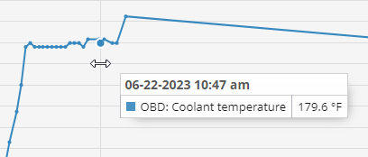
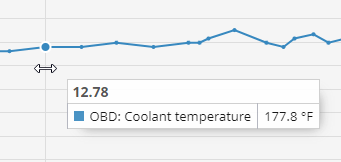

# Relatório de leituras CAN / OBDII do veículo

O **Relatório de leituras do veículo** O Navixy oferece informações detalhadas sobre os dados recebidos dos instrumentos de seu veículo por meio de sensores CAN/OBD ou sensores virtuais durante um período selecionado. Esse relatório inclui informações como quilometragem, RPMs do motor, velocidade, consumo de combustível, temperatura do líquido de arrefecimento e outras métricas críticas, ajudando os gerentes de frota e operadores de veículos a monitorar e otimizar o desempenho do veículo.

## Requisitos para gerar o relatório

Para gerar o **Relatório de leituras do veículo**Para obter o certificado de conclusão de curso, os seguintes pré-requisitos devem ser atendidos:

- **Compatibilidade de dispositivos:** O dispositivo deve ser compatível com as leituras CAN/OBD na plataforma. Você pode verificar se um tipo específico de sensor é suportado revisando a lista de entradas suportadas para o seu [modelo de dispositivo](https://www.navixy.com/devices/).
- **Capacidade do veículo:** O veículo deve ser capaz de transmitir os dados CAN/OBD necessários para o modelo de dispositivo instalado. Isso pode ser confirmado com o fabricante do veículo.
- **Transmissão de dados ativa:** O dispositivo e os sensores devem ser configurados para transmitir dados e enviá-los ativamente para a plataforma.
- **Configuração do sensor:** O CAN/OBD ou os sensores virtuais devem ser configurados corretamente na plataforma.

## Parâmetros do relatório

O relatório usa vários parâmetros para personalizar a saída:

- **Intervalo de detalhes:** Exibe as leituras recebidas na tabela de detalhes de dados em incrementos de 30 minutos, 1 hora, 3 horas ou 6 horas. O gráfico exibirá todos os pontos recebidos do sensor.
- **Eixo X no gráfico:** Escolha se deseja exibir as informações no gráfico em relação ao tempo ou à quilometragem.
- **Gráfico suave:** Aplique suavização ao gráfico para filtrar os valores de pico e calcular a média dos dados quando houver uma variação significativa.

Para cada dispositivo, você precisa selecionar o sensor para o qual deseja gerar um relatório. Somente os dispositivos com CAN/OBD configurado ou sensores virtuais aparecerão na lista. Se um sensor virtual usar um método de cálculo diferente de [valor da fonte](../../dispositivos-e-configuracoes/sensores-de-veiculos/sensores-virtuais.md)Se o sensor de medição não for um sensor de medição, o relatório indicará "Este não é um sensor de medição".

## Visualizações

### Gráfico com as leituras do sensor

O **gráfico** exibe as leituras do CAN/OBD ou do sensor virtual em um formato visual, proporcionando uma visão clara das tendências de dados ao longo do tempo ou da distância.

- **Passar o mouse sobre os pontos:** Ao passar o mouse sobre um ponto do gráfico com o eixo X definido como hora, você verá a hora exata e o valor do sensor registrado. Se o eixo X estiver definido como quilometragem, você verá o valor do sensor junto com a quilometragem em que foi registrado.

### Tabela de dados estatísticos

O relatório inclui um **tabela de dados estatísticos** que resume as leituras do sensor por dia.

**Colunas na tabela de dados estatísticos:**

- **Data:** A data específica para os dados registrados.
- **Mínimo:** O valor mais baixo registrado pelo sensor nessa data.
- **Máximo:** O valor mais alto registrado pelo sensor nessa data.
- **Valor médio:** A média de todas as leituras do sensor para essa data.

Observação: As unidades de medida variam de acordo com o tipo de sensor que está sendo usado.

### Tabela de detalhamento de dados

O **tabela de detalhamento de dados** apresenta as leituras do sensor em intervalos de tempo especificados, começando no horário definido e passando para o próximo incremento. Por exemplo, se o relatório usar incrementos de 30 minutos, os dados na linha 00:00 referem-se ao tempo entre 00:00 e 00:30.

- **Interpretação da tabela:** Se aparecer "No data" (Sem dados), isso indica que nenhuma leitura foi recebida durante esse intervalo de tempo. Os possíveis motivos incluem:
  - O dispositivo não enviou dados do sensor virtual ou CAN/OBD durante esse período devido às configurações do sensor.
  - O dispositivo não estava transmitindo dados, possivelmente por ter sido desligado ou desconectado do objeto.