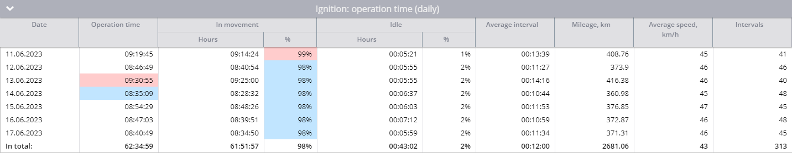

# Relatório de tempo de trabalho do equipamento

O **Tempo de trabalho do equipamento** na Navixy fornece dados essenciais sobre o tempo de atividade de qualquer equipamento conectado aos seus veículos por meio de entradas discretas ou virtuais. Esse relatório é crucial para os gerentes de frota que precisam monitorar a eficiência operacional dos equipamentos, analisar os tempos ociosos e garantir o uso ideal dos ativos. Veja abaixo um guia detalhado sobre como esse relatório funciona, os parâmetros envolvidos e como interpretar os dados de forma eficaz.

## Visão geral

O relatório Tempo de trabalho do equipamento rastreia o tempo operacional do equipamento, distinguindo entre períodos de atividade em movimento e em marcha lenta. Esse relatório inclui estatísticas detalhadas, dados de atividade diária e representações visuais, como diagramas de atividade e histogramas, para ajudá-lo a entender e analisar os dados com facilidade.

## Como funciona o relatório

O relatório calcula o tempo de trabalho do equipamento com base nos pontos de dados recebidos pela plataforma Navixy. Ele considera o estado das entradas discretas ou dos sensores virtuais e o status do estacionamento para distribuir com precisão o tempo de trabalho entre os períodos de movimento e ocioso. Para obter cálculos precisos, as seguintes configurações e condições devem ser atendidas:

1. **Configuração de entrada discreta:**
  - A entrada discreta no dispositivo deve ser conectada corretamente e capaz de registrar o estado da entrada com precisão.
2. **Configuração do sensor virtual:**
  - [Sensores virtuais](../../dispositivos-e-configuracoes/sensores-de-veiculos/sensores-virtuais.md) com dois estados também pode ser usado. O sensor deve ser configurado corretamente para registrar esses estados.
3. **Configurações de detecção de estacionamento:**
  - As configurações de detecção de estacionamento são cruciais para diferenciar entre o tempo de operação em movimento e o tempo ocioso. Se o estado da entrada estiver "ligado" enquanto a plataforma detectar que o veículo está estacionado (por exemplo, movendo-se a menos de 3 km/h por mais de 5 minutos), esse tempo será registrado como ocioso.
4. **Tempo mínimo de permanência:**
  - A plataforma calcula o tempo de operação somente se o equipamento estiver ligado por um período mínimo, que você pode especificar (por exemplo, 60 segundos).

### Exemplo de cálculo

| Ponto | Tempo | Estado da entrada | Tempo de atividade do equipamento |
| --- | --- | --- | --- |
| 1   | 10:00:00 | Desligado | 0 minutos |
| 2   | 10:01:00 | Em  | 0 minutos (a entrada estava desligada no último ponto) |
| 3   | 10:01:32 | Em  | 0 minutos (menos de 60 segundos) |
| 4   | 10:05:32 | Desligado | 4 minutos e 32 segundos |

## Parâmetros do relatório

O relatório de tempo de trabalho do equipamento inclui vários parâmetros configuráveis que permitem adaptar o resultado para atender às suas necessidades específicas:

- **Duração mínima do período de trabalho:** Especifica o número mínimo de segundos em que um sensor discreto deve estar ligado para que o tempo seja registrado no relatório. Para sensores virtuais, o valor deve ser maior que 0.
- **Mostrar porcentagem de inatividade:** Rastreia o status do estacionamento e distribui o tempo de operação do equipamento entre movimento e marcha lenta.
- **Use o filtro inteligente:** Exclui viagens curtas do relatório. Viagens curtas são definidas como viagens de menos de 300 metros em que o dispositivo envia menos de quatro pontos de dados.
- **Seleção de dispositivo:** O relatório inclui apenas dispositivos com pelo menos um sensor discreto ou virtual configurado.

## Visualizações

### Diagrama geral de atividades

- Esse diagrama fornece uma visão geral do tempo total de trabalho do equipamento durante o período selecionado. Ele mostra quanto tempo o equipamento ficou desligado, ligado e, se o rastreamento da porcentagem de inatividade estiver ativado, diferencia entre o tempo gasto em movimento e o tempo de inatividade.
- Para sensores virtuais, o estado correspondente a um valor de 0 é mostrado em cinza, e qualquer outro valor é mostrado em vermelho.

### Histograma de atividade diária

- O histograma divide o tempo de trabalho do equipamento em segmentos diários. Se a porcentagem de inatividade for rastreada, ele também mostrará a divisão entre o tempo de movimento e o de inatividade. Passar o mouse sobre cada dia fornece uma visão mais detalhada da atividade desse dia.

### Tabela de tempo de operação diária do sensor

- Essa tabela apresenta estatísticas diárias sobre a operação do equipamento, incluindo:
  - **Data:** O dia específico para o qual as informações são calculadas.
  - **Tempo de operação (duração do estado do sensor virtual):** O tempo operacional total do dia.
  - **Intervalo médio:** A duração média em que o equipamento ficou operacional após cada ligação.
  - **Quilometragem:** A distância percorrida com o equipamento ligado.
  - **Velocidade média:** A velocidade média do dia.
  - **Intervalos:** O número de vezes que o equipamento foi ligado durante o dia.
  - **Em movimento (se a porcentagem de inatividade estiver ativada):** A duração do trabalho em movimento e sua porcentagem do tempo total de trabalho.
  - **Inativo (se a porcentagem de inatividade estiver ativada):** O tempo de operação sem movimento e sua porcentagem do tempo total de operação.

## Interpretação do relatório

Para usar efetivamente o relatório de tempo de trabalho do equipamento, considere o seguinte:

- **Análise de dados:** Use o relatório para monitorar a frequência e a eficiência com que o equipamento é usado. Identifique padrões de ociosidade excessiva ou subutilização.
- **Eficiência operacional:** Avalie o equilíbrio entre os tempos ativos e ociosos para determinar a eficiência operacional de seu equipamento.
- **Planejamento de manutenção:** O relatório ajuda no planejamento da manutenção, identificando períodos de alto uso ou partidas e paradas frequentes, que podem desgastar o equipamento mais rapidamente.
- **Gerenciamento de custos:** Recalcule os custos de combustível e lubrificante considerando os tempos ociosos juntamente com o uso ativo, o que é especialmente relevante para máquinas pesadas.