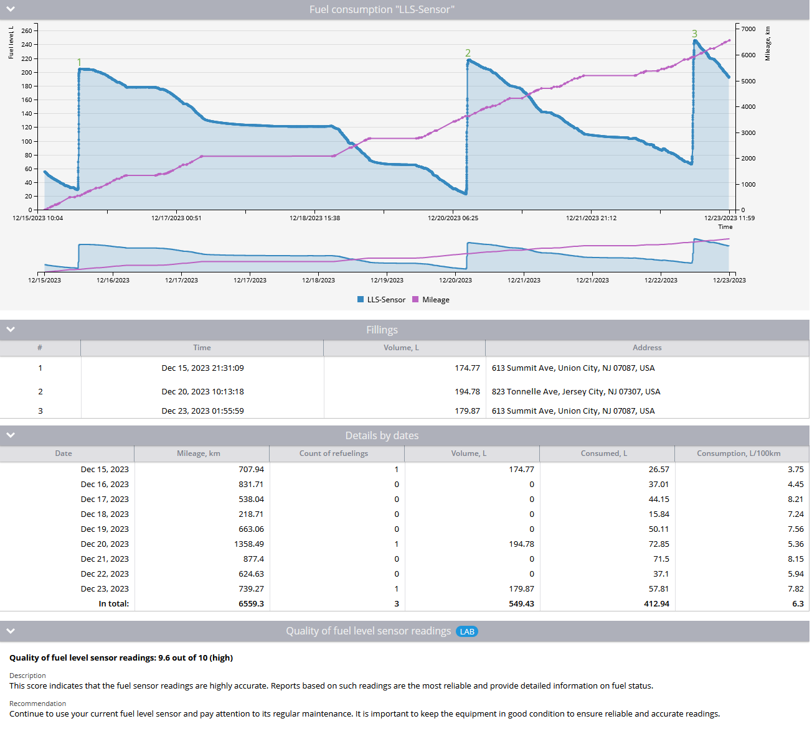

# Relatório de volume de combustível

O **Relatório de volume de combustível** A Navixy oferece insights abrangentes sobre o uso de combustível em sua frota, fornecendo dados cruciais sobre alterações no volume de combustível, eventos de reabastecimento e consumo de combustível em um período de tempo específico.

Esse relatório é essencial para os gerentes de frota que desejam monitorar a eficiência do combustível, detectar possíveis roubos de combustível e gerenciar os custos de combustível de forma eficaz. Veja abaixo um guia detalhado sobre como esse relatório funciona, os parâmetros envolvidos e como interpretar os dados.

## Visão geral

O relatório de volume de combustível é composto de várias seções:

1. **Gráfico da alteração no volume de combustível:** Uma representação visual das mudanças no nível de combustível ao longo do tempo.
2. **Tabela de recheios:** Uma lista detalhada dos eventos de reabastecimento, incluindo a hora, o volume e o local de cada abastecimento.
3. **Detalhes por tabela de datas:** Resumos diários das alterações no volume de combustível, incluindo quilometragem, contagens de reabastecimento e cálculos de consumo de combustível.
4. **Avaliação da qualidade do sensor de nível de combustívelLAB:** Um recurso experimental que avalia a precisão e a confiabilidade dos dados do sensor de combustível. Veja também: [Aprimoramento da precisão do gerenciamento de combustível com o Índice de Qualidade do Sensor de Combustível](https://www.navixy.com/blog/enhancing-fuel-management-accuracy-with-fuel-sensor-quality-index/).

## Principais recursos e casos de uso

O relatório de volume de combustível pode ser usado em vários cenários:

- **Monitoramento do consumo de combustível:** Rastreie o uso de combustível e identifique padrões ou anomalias que possam indicar ineficiências ou possível roubo de combustível.
- **Avaliação da precisão do sensor:** Avalie o desempenho dos sensores de nível de combustível para garantir uma coleta de dados confiável.
- **Detecção de fraude de combustível:** Identificar padrões ou locais incomuns de reabastecimento que possam indicar atividade fraudulenta.

## Parâmetros do relatório

Para gerar um relatório de volume de combustível preciso, certifique-se de que as seguintes configurações estejam definidas corretamente:

1. **Calibração do sensor de nível de combustível:**
  - Para um único sensor de nível de combustível, verifique se a tabela de calibração está preenchida de acordo com as recomendações do fabricante. Além disso, defina os limites para a filtragem de emissões na seção "Advanced" (Avançado) abaixo da tabela de calibração.
  - Para veículos com vários tanques, calibre cada sensor separadamente e crie um sensor agregado com unidades de volume definidas como litros ou galões. Evite usar "Opção personalizada" na configuração de unidade de medida do sensor.
  - Para sensores que informam os níveis de combustível como uma porcentagem, a calibração também é necessária, com os volumes mínimo e máximo de combustível especificados.
2. **Processamento de dados do sensor:**
  - A plataforma coleta dados brutos de dispositivos e sensores de combustível, que são então filtrados com base nos valores ignorados definidos nas configurações do sensor. A plataforma registra os dados conforme recebidos, sem modificá-los.
3. **Geração de gráficos:**
  - A plataforma gera um gráfico dos valores armazenados com base nos parâmetros do relatório. As configurações do sensor de combustível, incluindo os valores de limite, são aplicadas a esse gráfico.
4. **Suavização automatizada:**
  - O processo de suavização do gráfico é totalmente automatizado, com todas as configurações de suavização e filtragem aplicadas automaticamente para produzir um gráfico legível e de fácil utilização.

## Seções detalhadas do relatório

1. **Gráfico de alteração do volume de combustível:**
  - Esse gráfico apresenta as leituras do sensor de nível de combustível ao longo do tempo. Se forem usados vários sensores, o gráfico exibirá apenas os dados do sensor agregado. Os eventos de reabastecimento são numerados e plotados em seus pontos correspondentes no gráfico.
2. **Tabela de recheios:**
  - A tabela lista todos os eventos de reabastecimento durante o período selecionado, incluindo a data, a hora, o volume de combustível e o local.
3. **Detalhes por tabela de datas:**
  - Fornece resumos diários de dados, incluindo:
    - **Data:** O dia específico para o qual os dados são calculados.
    - **Quilometragem:** A distância percorrida nesse dia.
    - **Contagem de reabastecimentos:** Número de eventos de reabastecimento.
    - **Volume:** Volume total de combustível reabastecido.
    - **Consumido:** Consumo real de combustível do dia, calculado como `initial fuel level + volume of refuelings - final fuel level`.
    - **Consumo por 100 km:** Consumo de combustível por 100 km, calculado como `(initial fuel level + volume of refuelings - final fuel level) / mileage * 100`.
4. **Avaliação da qualidade da leitura do sensor de combustívelLAB:**
  - Esta seção avalia a qualidade das leituras do sensor de combustível, fornecendo uma pontuação quantitativa (1,0 a 10,0) e uma classificação qualitativa (baixa, média, alta) com base no ruído e na precisão dos dados do sensor.
  - O sistema pode exibir uma mensagem indicando dados insuficientes para a avaliação da qualidade se o sensor tiver sido instalado recentemente ou se o período de coleta de dados for muito curto.

## Insights do relatório

O Relatório de Volume de Combustível pode revelar percepções críticas, tais como:

- **Detecção de fraude de combustível:** Identificação de discrepâncias entre os eventos de reabastecimento relatados e o uso real de combustível, especialmente em postos de combustível.
- **Eficiência operacional:** Analisar o consumo de combustível em relação à quilometragem para identificar possíveis ineficiências ou áreas para redução de custos.
- **Monitoramento do desempenho do sensor:** Avaliar regularmente a precisão e a confiabilidade dos sensores de combustível para garantir que os dados usados para a tomada de decisões sejam confiáveis.