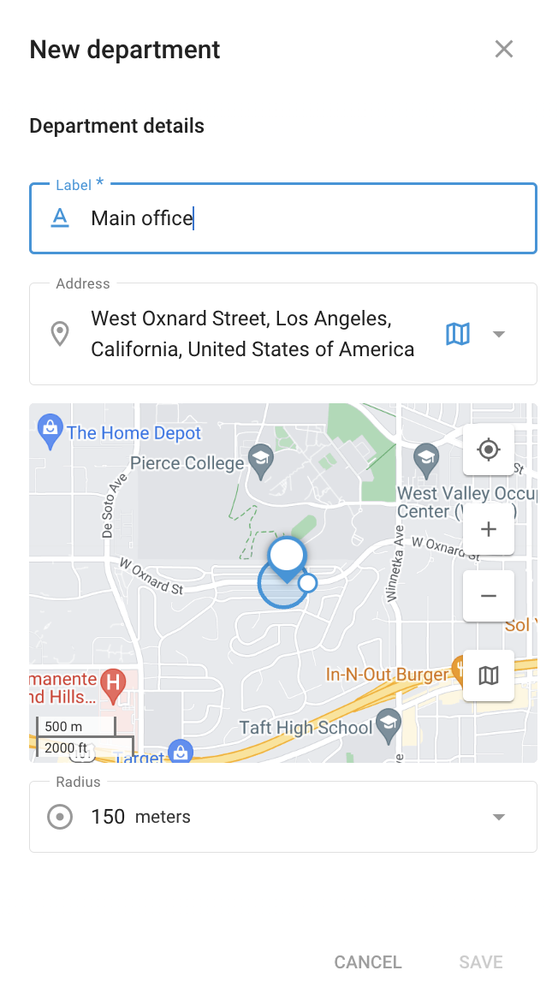

# Departamentos - Serviço de campo

O **Departamentos** na seção **Serviço de campo** permite organizar sua força de trabalho de forma eficaz, categorizando os funcionários em departamentos específicos. Essa estrutura organizacional ajuda a simplificar as atribuições de tarefas, os relatórios e o gerenciamento geral das operações de campo.

## Gerenciamento de departamentos

Na seção Departamentos, é possível criar, visualizar e gerenciar diferentes departamentos da sua organização. Cada departamento pode ser rotulado adequadamente, como "Departamento de entrega" ou "Departamento de vendas", para refletir a função específica da equipe.

#### Criação de um novo departamento

1. **Navegue até a guia Departamentos**: Comece indo para a seção Departamentos no aplicativo Field Service.
2. **Clique no botão "+".**: Para criar um novo departamento, clique no botão "+".
3. **Insira os detalhes do departamento**:
  - **Rótulo**: Forneça um nome para o departamento, como "Escritório principal" ou "Departamento de serviços".
  - **Endereço**: Insira a localização física do departamento ou use o mapa para selecionar uma localização precisa.
  - **Raio**: Defina um raio em torno da localização do departamento. Isso ajuda a atribuir tarefas com base na proximidade do departamento.
4. **Salvar**: Depois de preencher os detalhes necessários, clique em "Save" (Salvar) para criar o departamento.

### Detalhes do departamento

Depois que um departamento for criado, ele será listado na seção Departamentos, onde é possível visualizar seus detalhes, como o rótulo e o endereço. Essa seção também permite editar ou excluir departamentos, conforme necessário.

Ao usar a seção Departamentos de forma eficaz, é possível garantir que as tarefas sejam atribuídas às equipes apropriadas, aumentando a eficiência e a produtividade das operações de serviço de campo.