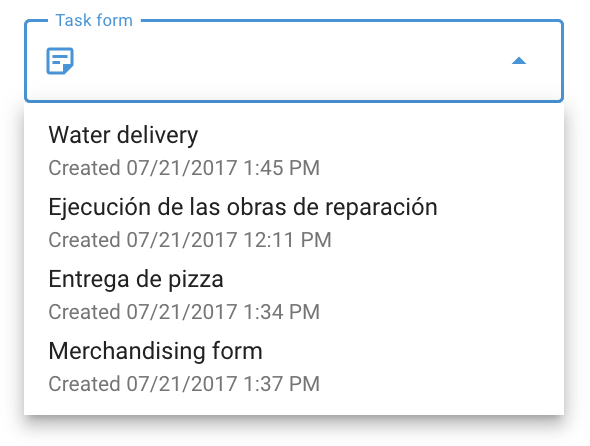

# Formulários

**Formulários** são documentos eletrônicos que podem ser anexados às tarefas, permitindo que os funcionários enviem os resultados das tarefas diretamente por meio do Rastreador X-GPS aplicativo móvel. Esses formulários podem incluir vários tipos de campos, como campos de texto para pedidos de clientes, relatórios de inspeção e seções de mídia para upload de fotos e vídeos.

## Primeiros passos

### Criar um formulário

Para começar a usar formulários na Navixy:

1. Inicie o aplicativo Field service no menu principal.
2. Clique na guia "Forms" (Formulários) para abrir a interface de gerenciamento de formulários.
3. Inicie o processo de criação do formulário clicando no ícone "+".
4. Escolha os componentes necessários (por exemplo, campos de texto, caixas de seleção, listas suspensas, data, classificação, imagem, anexo de arquivo, assinatura e separadores de seção) no lado esquerdo da tela. Personalize o formulário de acordo com o fluxo de trabalho e as tarefas específicas de sua empresa.

Esse processo permite que você crie quantos formulários forem necessários, garantindo que eles sejam adaptados às tarefas que seus funcionários realizam.

Há duas opções de alternância disponíveis ao criar um formulário:

- **"Usar por padrão ao criar uma tarefa"**: Se ativado, esse formulário será automaticamente anexado a novas tarefas, a menos que outro formulário seja selecionado. Na lista de formulários, esse formulário será marcado com um sinal de "estrela".
- **"Enviar formulário somente na zona"**: Se ativado, o formulário só poderá ser enviado quando o funcionário estiver em uma zona geográfica predefinida, garantindo que o relatório de tarefas ocorra no local correto.

Depois de salvos, os formulários criados podem ser acessados na lista de formulários.

### Anexar um formulário a uma tarefa

Para anexar um formulário a uma tarefa, siga estas etapas:

1. Abra a janela de criação de tarefas: navegue até a guia Tarefas e clique no botão "+" para criar uma nova tarefa.
2. No campo "Task form" (Formulário de tarefa), escolha o formulário que você criou anteriormente na lista suspensa.
3. Forneça outros detalhes da tarefa, como a seleção do funcionário responsável por concluí-la.
4. Finalize a criação da tarefa clicando em "Salvar".

O funcionário selecionado receberá a tarefa com o formulário anexado no aplicativo móvel X-GPS Tracker, garantindo que toda a documentação necessária esteja disponível durante a execução da tarefa.

### Preenchimento de um formulário no X-GPS Tracker

Os funcionários são obrigados a preencher formulários durante ou após a conclusão de uma tarefa. Veja como eles podem preencher e enviar um formulário:

1. Abra o aplicativo móvel X-GPS Tracker em um dispositivo móvel.
2. Vá para a seção "Tasks" (Tarefas) para visualizar a lista de tarefas atribuídas.
3. Selecione a tarefa que precisa ser concluída.
4. Clique no formulário dentro da descrição da tarefa e preencha todos os campos obrigatórios.
5. Depois que todos os campos são preenchidos, o formulário é enviado automaticamente para o serviço de monitoramento, marcando a tarefa como concluída.

### Configuração de notificações para envio de formulários

Para garantir notificações oportunas quando um formulário for enviado, configure os alertas seguindo estas etapas:

1. Navegue até a seção "[Regras e notificações](../../guia-do-usuario/regras-e-notificacoes.md)" na plataforma.
2. Comece a criar uma nova regra de notificação clicando no botão "Add rule" (Adicionar regra).
3. Selecione os objetos (por exemplo, veículos, funcionários) aos quais essa regra se aplicará.
4. Escolha "[Desempenho da tarefa](../regras-e-notificacoes/programacao-e-despacho/desempenho-da-tarefa.md)" na lista de eventos e prosseguir.
5. Na seção "Rule options" (Opções de regra), marque a caixa de seleção "Form submitted" (Formulário enviado).
6. Na guia "Notifications" (Notificações), escolha como deseja ser notificado (por exemplo, SMS, e-mail).

Essas configurações garantem que você fique informado sobre o progresso da tarefa e os envios de formulários em tempo real.

### Visualização de formulários preenchidos

Você pode revisar e comparar os formulários preenchidos para avaliar o desempenho dos funcionários e os resultados das tarefas:

1. Navegue até o aplicativo "Serviço de campo".
2. Clique na guia "Forms" (Formulários) para visualizar todos os formulários disponíveis.
3. Passe o mouse sobre o formulário que deseja revisar e clique em "Submissions" (Envios) no lado direito.
4. Escolha o envio de formulário específico na lista na parte inferior.

**Funcionalidade de envios:**

- **Faça o download dos formulários:** Exporte os formulários nos formatos Excel, CSV ou PDF.
- **Filtragem:** Use filtros para restringir os envios com base em parâmetros como data de criação da tarefa ou nome do funcionário.
- **Personalização da tabela:** Adicione ou oculte colunas e campos de formulário para se concentrar nos dados mais relevantes.

### Relatório de dados do formulário de tarefas

O relatório "Task form data" (Dados do formulário de tarefas) fornece informações sobre o desempenho dos funcionários com base nos formulários preenchidos. Para gerar esse relatório:

1. Ir para o [Relatórios](../../guia-do-usuario/relatorios.md) seção.
2. Clique no botão "Create report" (Criar relatório).
3. Escolha a opção "Dados do formulário de tarefa".
4. Marque os objetos relevantes (por exemplo, funcionários, tarefas) para os quais você precisa do relatório.
5. Especifique o período de tempo para o relatório.
6. Clique no botão "Build report" (Criar relatório) para gerar o relatório.

**Detalhes do relatório:**  
O relatório mostra estatísticas de formulários, incluindo a frequência e os tipos de componentes selecionados. Esses dados o ajudam a avaliar o desempenho dos funcionários e os resultados das tarefas com mais eficiência.