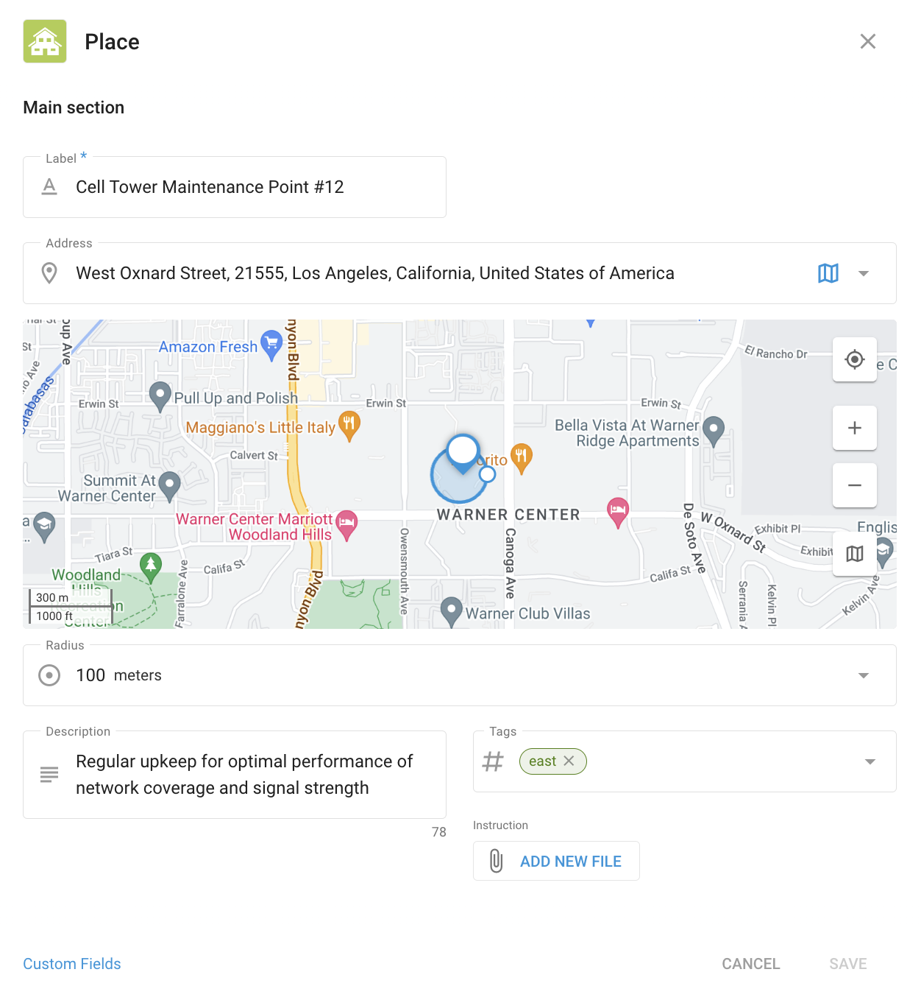
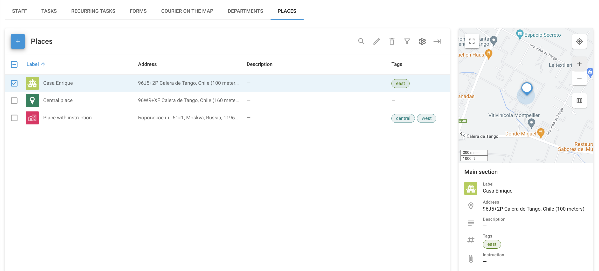

# Locais - Serviço de campo

**Locais** no **Serviço de campo** pode ser usado para organizar e gerenciar os principais locais que sua equipe de campo precisa visitar, como endereços de clientes, instalações da empresa ou outros pontos de interesse importantes. Isso ajuda a simplificar as atribuições de tarefas, otimizar as rotas e garantir operações de campo eficientes.

Ao entrar na seção Places (Locais), você verá uma lista de todos os locais disponíveis juntamente com seus detalhes, inclusive os campos personalizados que você adicionou.

## Criação e gerenciamento de locais

Ao criar um novo Local no aplicativo Field Service da Navixy, você pode inserir todas as informações necessárias para facilitar a identificação e o gerenciamento. Comece dando um nome ao Local, especificando seu endereço ou selecionando sua localização no mapa. Você também pode adicionar detalhes como uma descrição, tags e quaisquer instruções relevantes para o local.

### Campos personalizados

Os campos personalizados permitem que você adicione detalhes extras que não são cobertos pelas opções padrão. Esses campos são adaptados às necessidades de sua empresa, garantindo que você tenha todas as informações importantes na ponta dos dedos. Por exemplo:

- **Tipo de equipamento**: Registre quais equipamentos estão no local, como "antena 4G" ou "gerador de energia".
- **Cronograma de manutenção**: Observe com que frequência o site precisa de manutenção, como "Mensalmente" ou "Trimestralmente".
- **Código de acesso**: Armazene todos os códigos de segurança ou instruções necessárias para acessar o site.
- **Contato do gerente**: Inclua os detalhes de contato da pessoa responsável pelo local.

O uso de campos personalizados garante que todas as informações necessárias sejam organizadas e facilmente acessíveis, tornando as operações de campo mais eficientes.